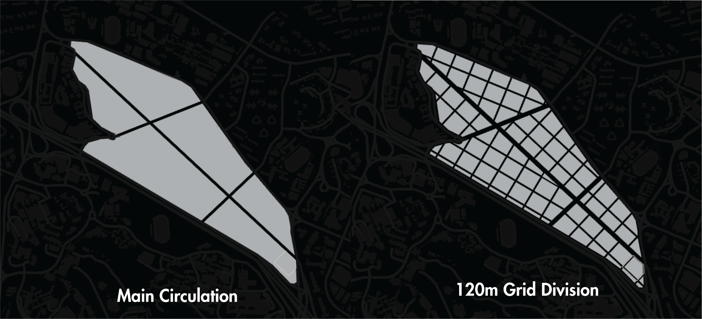
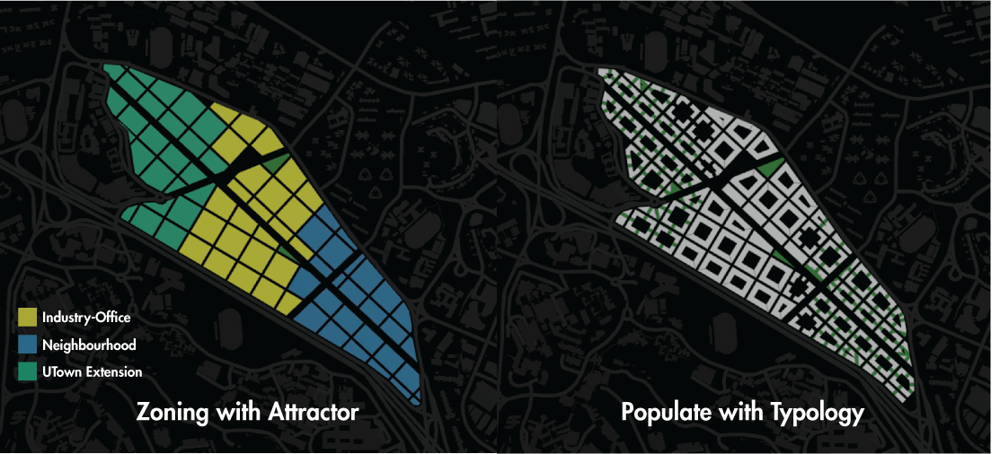
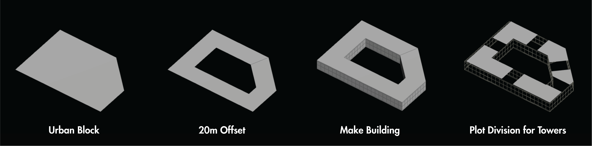
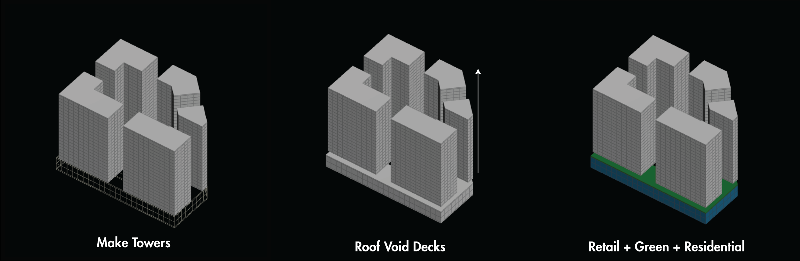
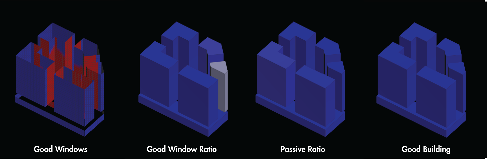
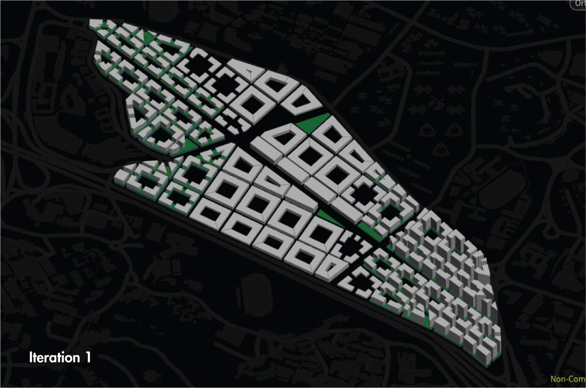
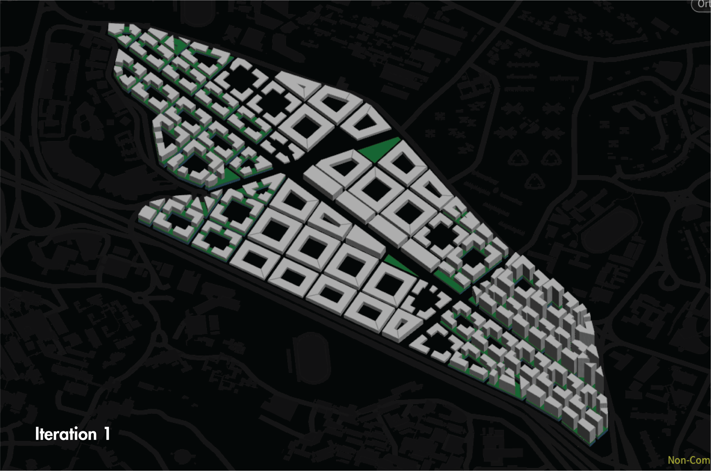
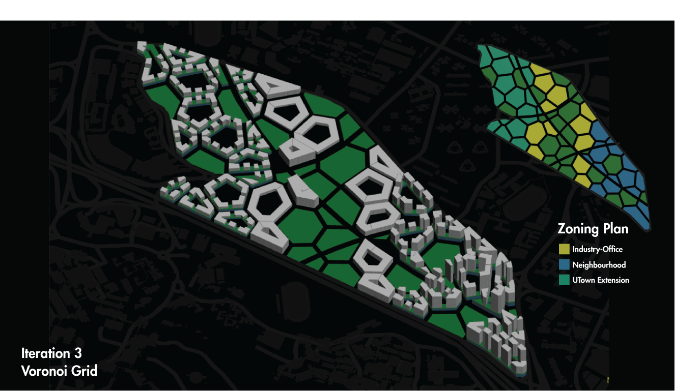
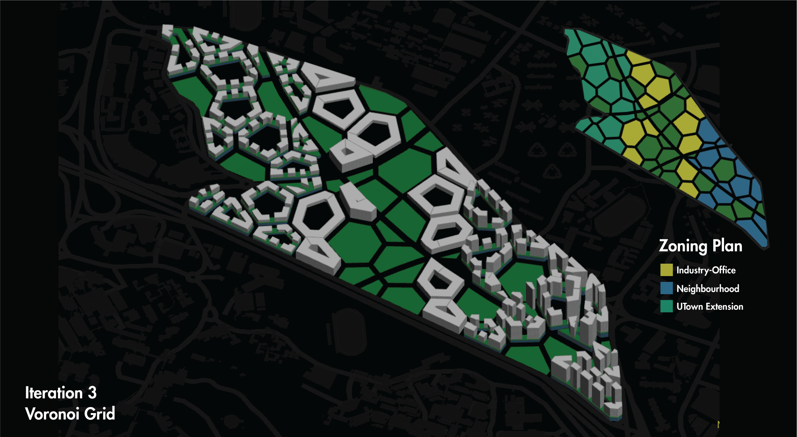
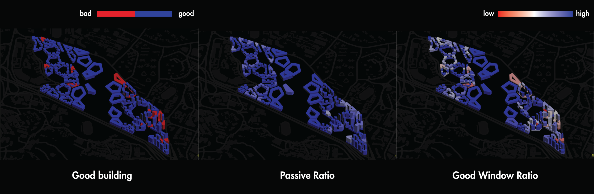

# Iteration 1 Simulating a traditional gridded city

1.	Site
2.	

3.	Cut the main circulation from the site
4.	Divide the plot into 120mx120m blocks (these blocks are highly walkable)
5.	Calculate parameters (distance to mrt and utown and aye etc.
6.	Splitting zones
7.	Propose Building Typology
a.	courtyard Podium + Tower type (for wind flow, performance and density)
b.	Courtyard
8.	Populate with typology
9.	Analyse
10.	Other possible iterations (Different Plot Size. Different Road Width, Greenery ratio, high etc.)
11.	conlusion

Main Parameters:

Density of program varies according to:
Distance to Transport Nodes (existing MRT and BUS)
Proximity to Utown

Reduce congestion of traffic towards nodes. 

Industry building growth pattern
Greenspace ratio

