# XYLEM

The last algorithm uses a different thinking compared to the rest. Rather than manually drawing road connections like the previous two examples, a more efficient road system could be generated using Shortest Path SOP in Houdini. Shortest paths to certain key nodes in the site can be carved out and used as both roads and commercial spaces. This approach creates a high performing megastructure that could not be designed with conventional methods.

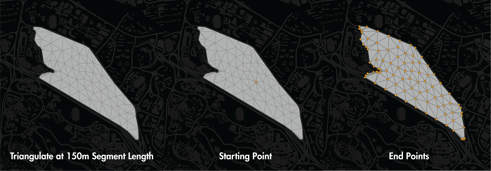
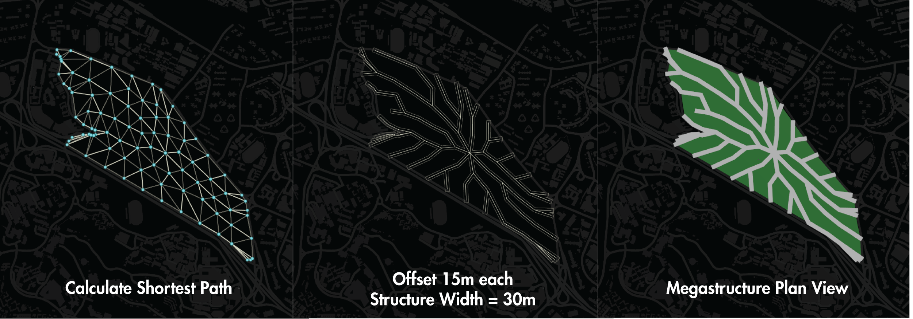
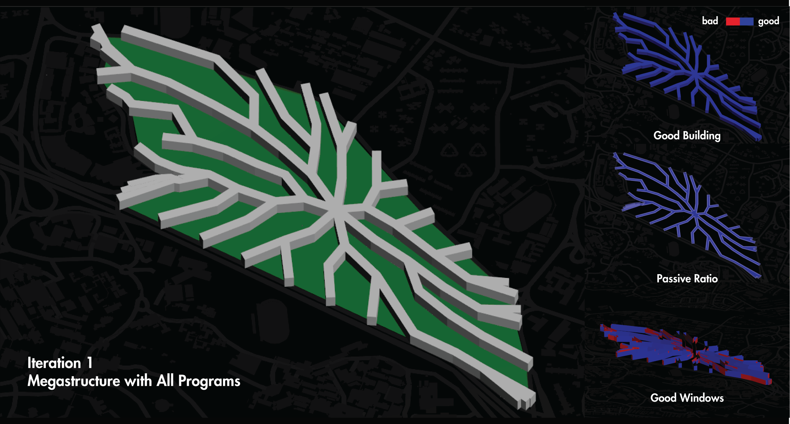
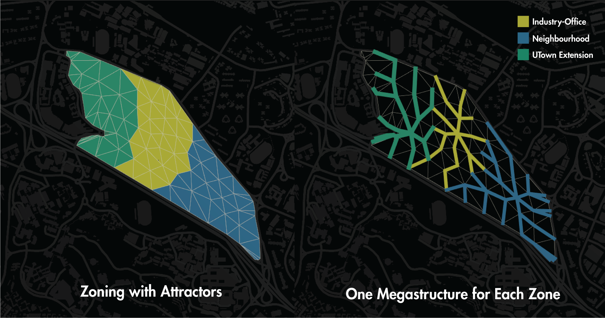
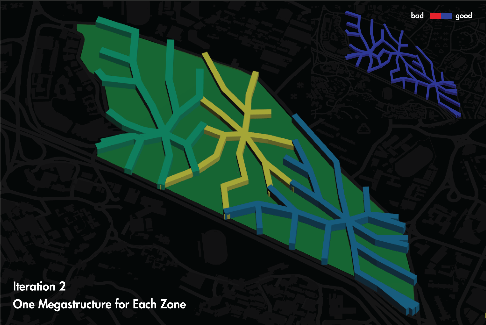
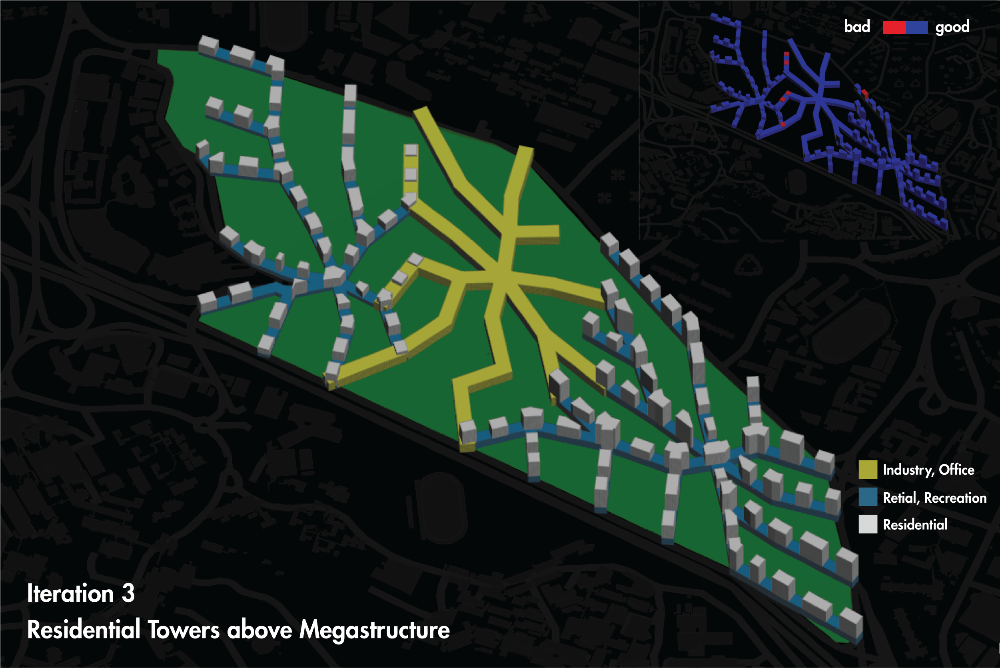
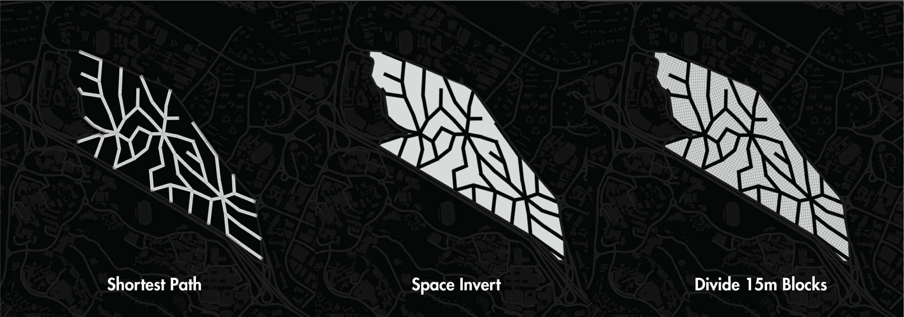
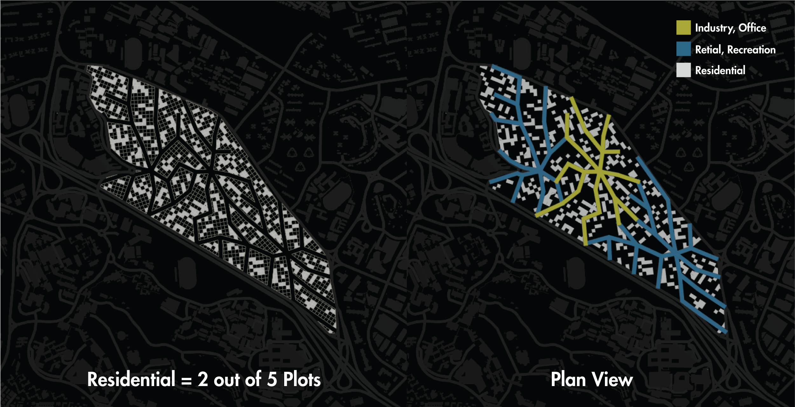
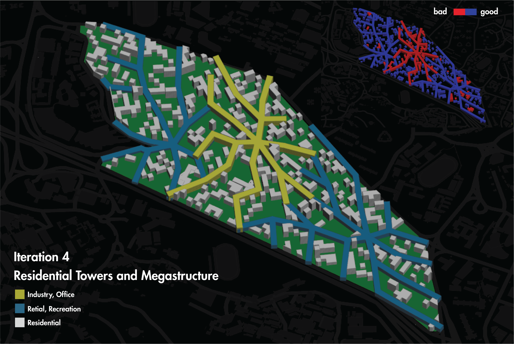
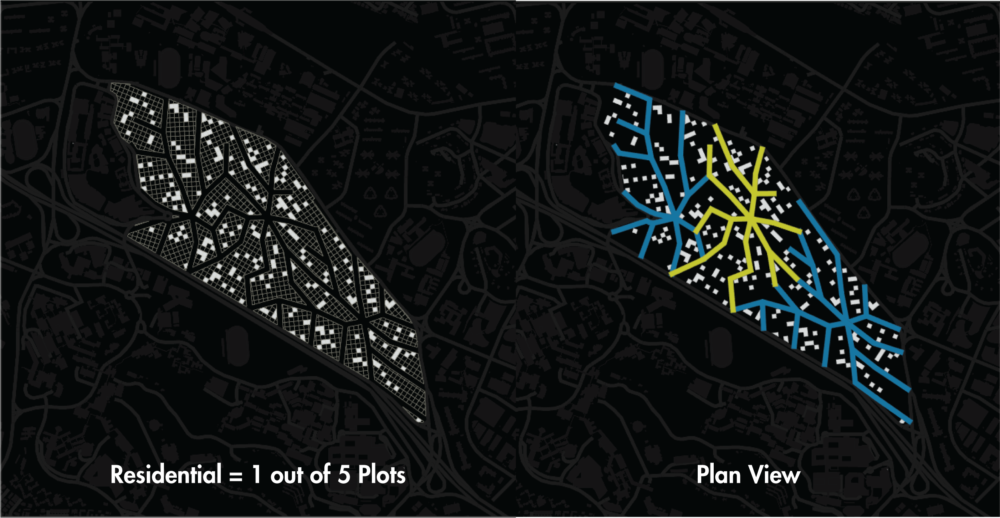
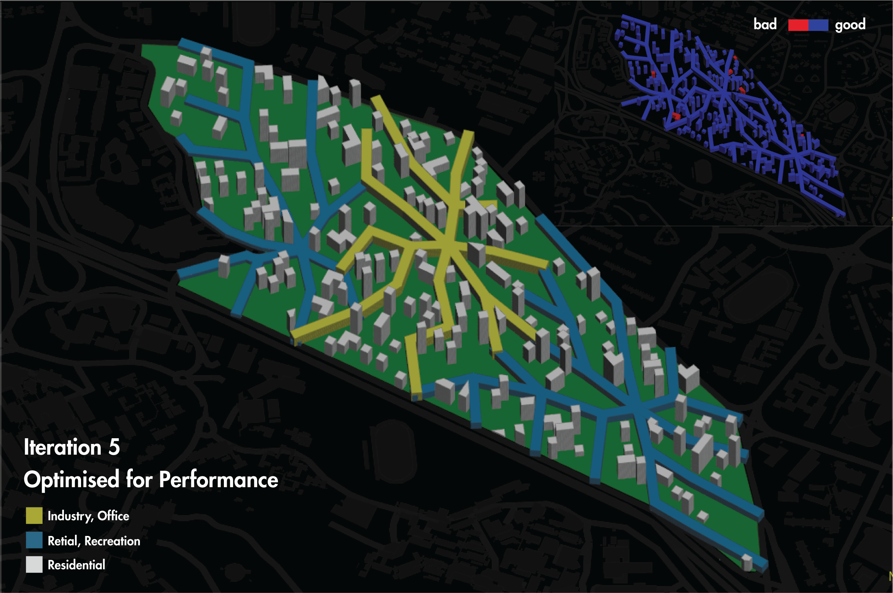
