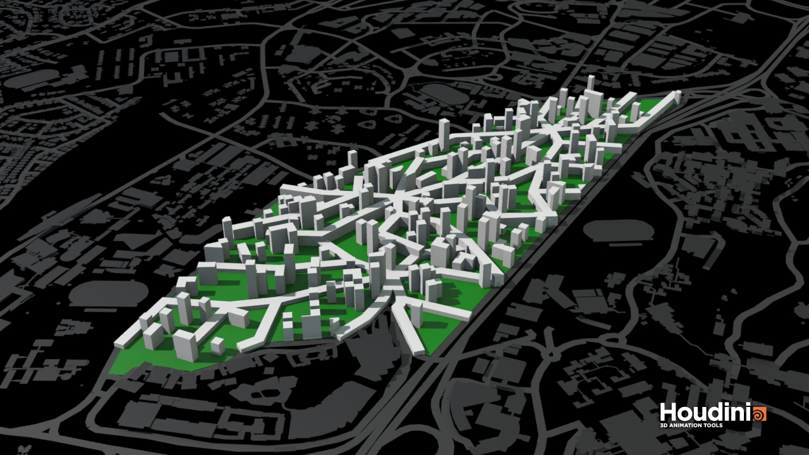
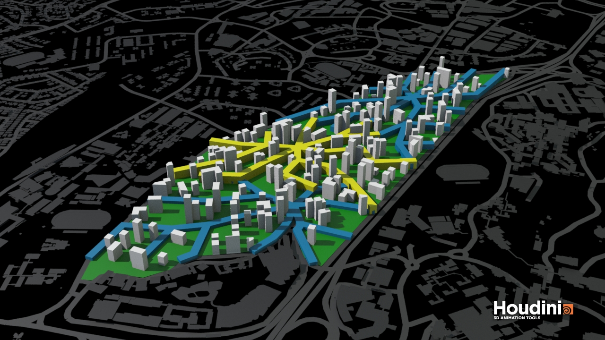

# XYLEM

The last algorithm uses a different thinking compared to the rest. Rather than manually drawing road connections like the previous two examples, a more efficient road system could be generated using Shortest Path SOP in Houdini. Shortest paths to certain key nodes in the site can be carved out and used both as roads and commercial spaces. This approach creates a high performing megastructure that could not be designed with conventional methods. 

This algorithm also included functions completed in the previous two examples. This shows that functions can be transfered as modules and immediately applied in different con

The algorithm is constructed in the following steps:

1.	We first triangulate the site into segments of 150m. This offers a good balance between number of turns in the path and the distance between two braches. A starting point is chosen in the center of the site. All vertices are treated as end points. 

2.	The algorithm then carves out the shortest path that connects all boundary points to the start point. Every connection on the fringe of the site represents a potential entry to the site.
3.	Rather than using the path as roads, we offset it to have a width of 30m and extruded the surface so that all program requirement of 75,000 would fit into a continuous, 9 stories tall megastructure.

4.	Building analysis has returned positive. Upon further testing, we could push the passive threshold to 0.65 and good window threshold to 0.2. This is a substantial increase from the default parameter. Passive ratio in the structure is high because of the slender width compared to  building footprint and the windows return positive results due to the longest branches sprawl from west to east and therefore create windows facing north and south.

5.	Like the previous two examples, we allocate zones according to attractor factors. Each zone now has an individual starting point that connects to the rest of the site.

6.  The three functional zones join together to create a non-stop experience of living, shopping, working, and production.

7. The current structure is reminiscent of the podium typology introduced in POLYGON. By planting the typology function as a module into this algorithm, we obtain a podium-tower typology with residential in the towers and others in the megastructure. 

8.

