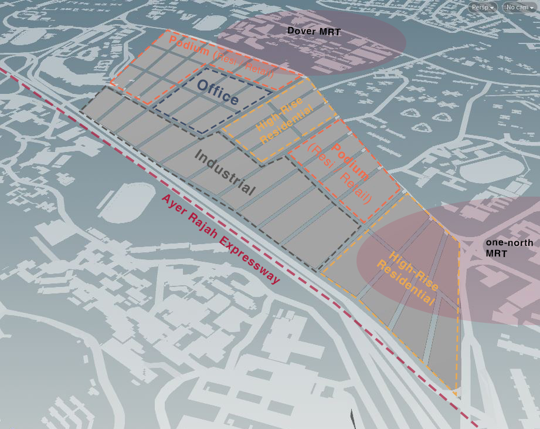
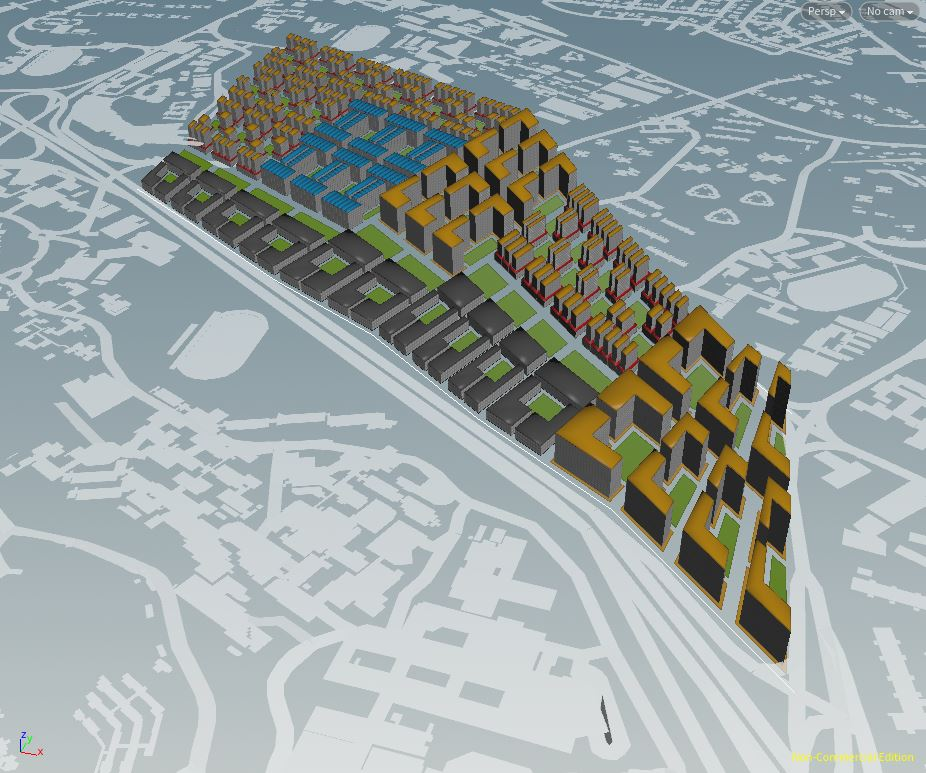
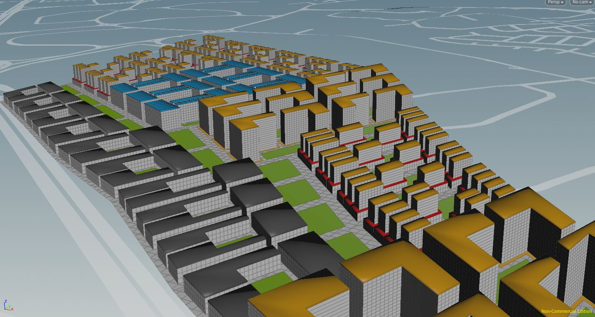
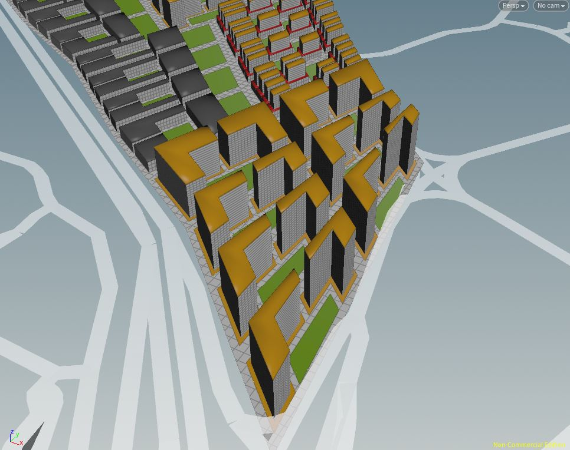
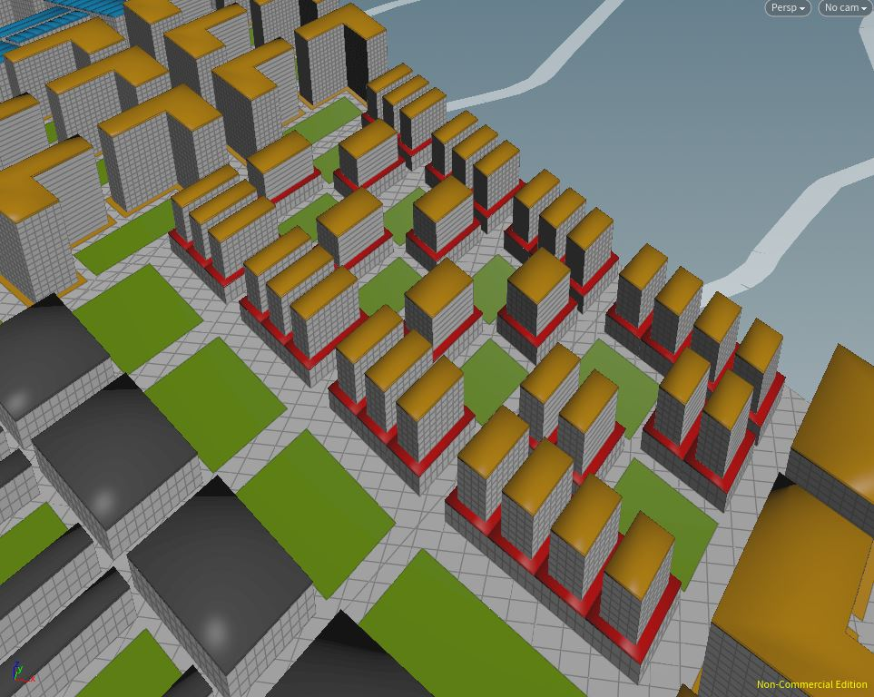
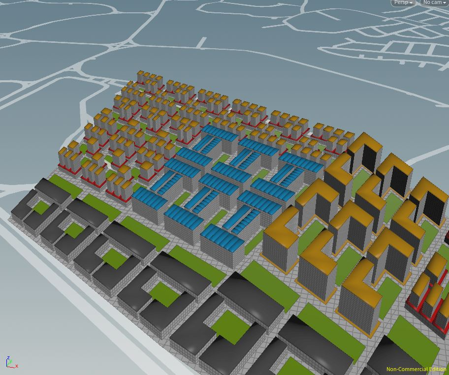
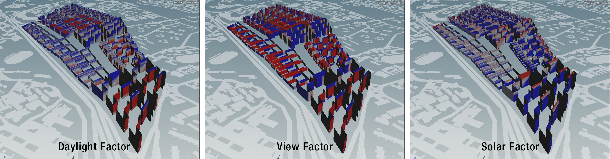
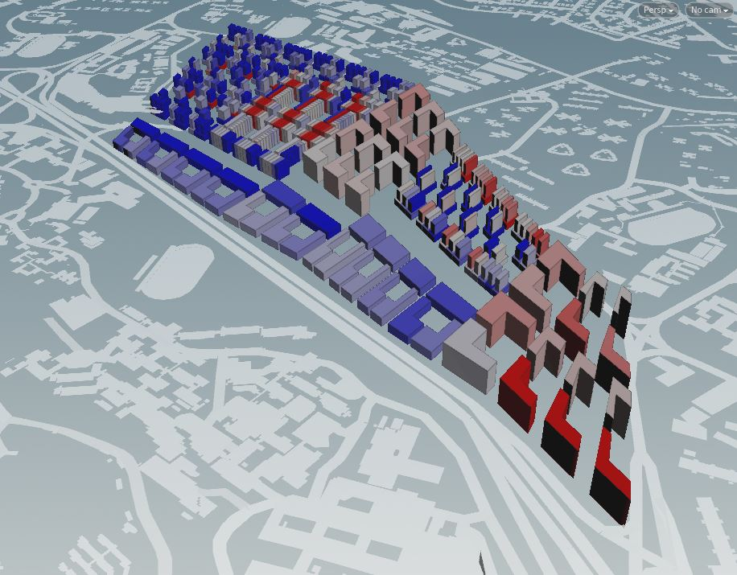
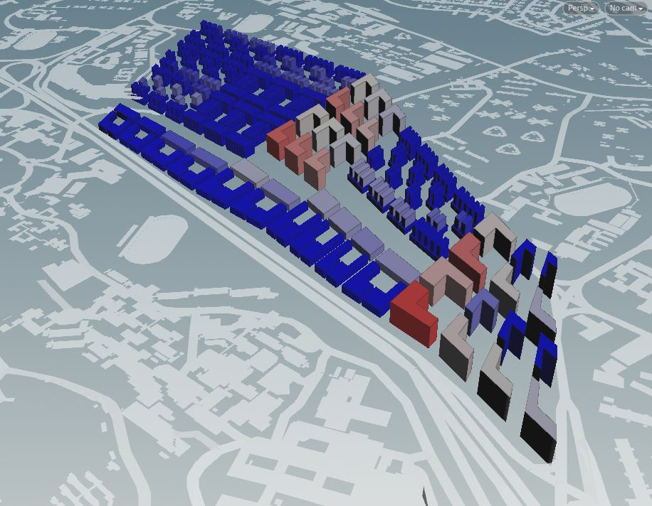
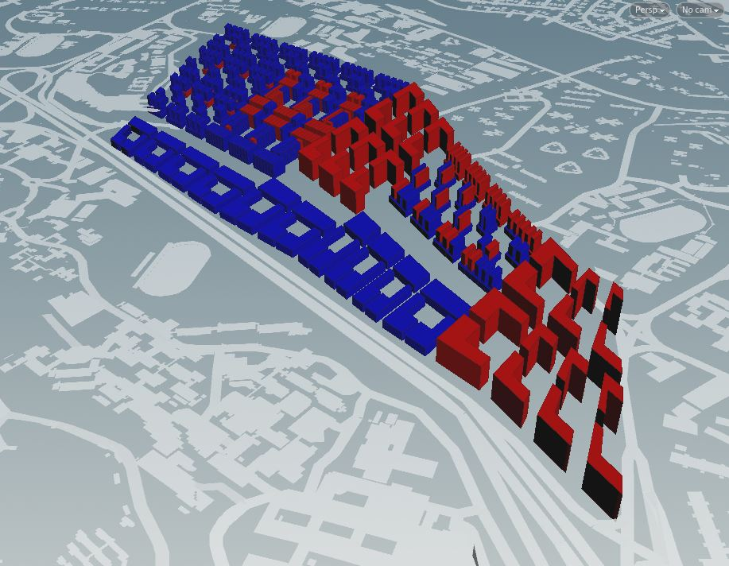

# Iteration 1

  

 _Figure 1a: Plot Division in relation to adjacent MRT Stations_

In Iteration 1, programs are arranged responding to adjacent programs and proximity to transport nodes. A 500m radius was drawn from the 2 MRT stations on site, highlighting greatest area of accessibility towards the north portion of the plot (Figure 1a). This information influenced the subsequent planning of commercial and residential programs consolidating towards the west portion.

  

 _Figure 1b: Overview of Iteration 1_

 _(Grey: Industrial, Yellow: Residential, Red: Retail, Blue: Offices, Green: Parks)_
 
# Industrial Buffer and Green Spine

  

 _Figure 1c: Concrete and Green Buffer Zones_
 

Industrial buildings acts as a physical buffer between the Ayer Rajah Expressway (AYE) and the rest of the programs on site (Figure 1c). Forming a concrete screen to alleviate issues such as noise pollution. Layout of the industrial block follows a single story volume, with an internal courtyard green space. This is to facilitate loading / unloading of heavy equipment as well as of provision of green spaces for workers. An additional green spine segregates the industrial and residential functions. Providing a intermediate recreational zone for residents and workers of the district.

# Residential / Retail

  

 _Figure 1d: High-rise Residential Towers with Private Green_
 
 
   

 _Figure 1e: Retail / Residential Podium with Community Plaza_
 
Residential programs (Yellow) are located primarily along Dover road and north Buona Vista road, for greater accessibility to Dover, one-north MRT Stations. Residential typology comes in the form of podium blocks as well as high rise towers (Figure 1c). 
For podium blocks (Figure 1d), retail programs (Red) occupy the first 2 floors, with residential on the top 7 floors. The mix of high rise and low rise residential accommodations within the site, in turn influences the intimacy of community spaces created (private green, community parks). 

# Office

  

 _Figure 1f: Office Within Residential and Commercial Programs_
 

Office developments are positioned between residential and retail programs (Figure 1f). The three programs form a mutually beneficial relationship due to their close proximity. The estimated workforce of 30000 workers can reside with the neighbouring residential units, with close access to necessities from retail outlets as well.

# Performance Analysis

 

 _Figure 1g: Good Window Factors_
 
 
  

 _Figure 1h: Overall Good Window Ratio Results_
 
 
  

 _Figure 1i: Passive Ratio Results_
 
 
 

 _Figure 1j: Good Building Results_
 

Industrial, offices, podium typologies demonstrates good results for both passive ratio and good window. However high rise residential tower exhibit shortfalls in these both aspects (Figure 1i, 1j). In particular high rise residential towers displayed an average good window ratio of 0.04 and passive ratio of 0.32. This result is exceptionally bad and far off from the desired good building thresholds (good window threshold > 0.1, passive ratio > 0.5). This result is attributed to the large floor area of the towers, forming a larger active area as compared to passive area. In subsequent iterations (Figure 1k), plot sizes were reduced and proximity between towers were adjusted to produce more optimal buildings. The following iterations from 1.1 to 1.3 demonstrates the process to achieve a realistic tower height to good window results.

 

 _Figure 1k: Tower Height vs Good Window Results_

