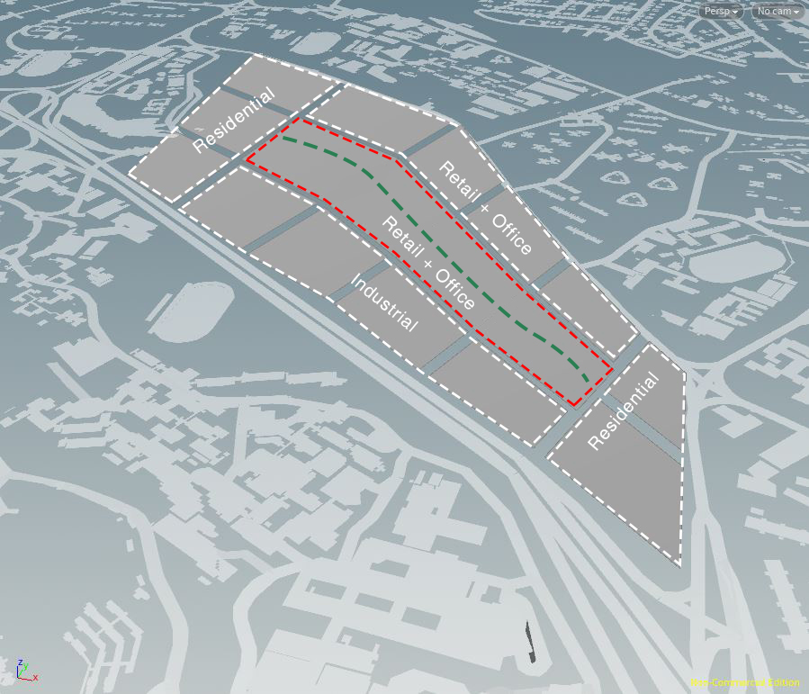
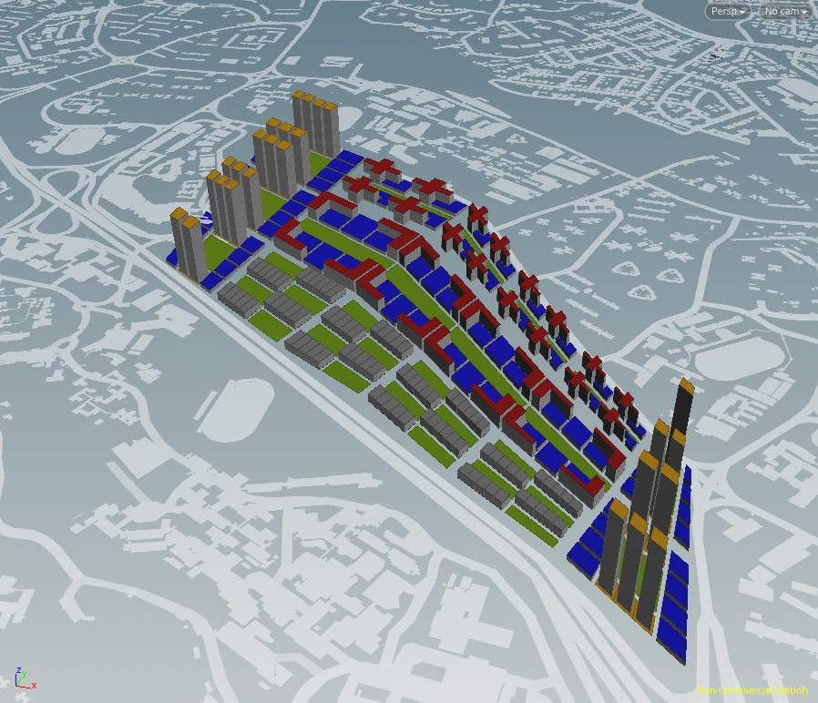
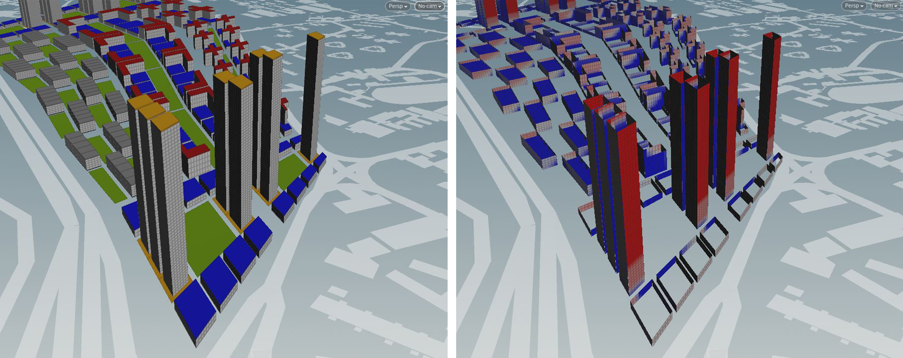
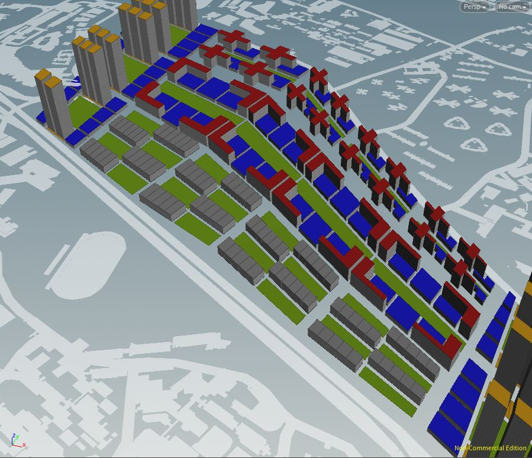

# Iteration 2

 

 _Figure 2a: Plot Allocation_
 
 
  

 _Figure 2b: Iteration 2 overview_
  
  
For Iteration 2 I wanted to devise a clearer plot allocation that also suggest circulation route within the site (Figure 2a). The central zone forms a ring road being the main circulation path for vehicular traffic. Secondary roads branch out from the central main road, towards the outer ring of programs. This filtration of traffic in a radial pattern creates specific parcels of lands around the periphery that contains programs related to existing programs on site.
1. Central Zone: contains mainly commercial retail programs and a green park which stretches the entire length of the plot.

2. Residential: Located at the west and east ends of the site, with close proximity to existing MRT stations. Its location at both ends also allows residents to access the band of programs in the middle of the site.

3. Industrial: Stretches along the length of the AYE.

## Residential
 

 _Figure 2c: Residential Tower and Solar Factor Evaluation_

To reduce residential sprawl within the site, I decided to utilise high rise tower typologies for residential blocks. In Iteration 2, the towers form the perimeter of a plot, coupled with low rise office blocks as well. The juxtaposition of high and low typologies aim to allow optimal views and daylight factor. However an undesirable solar factor is observed in this case, specifically in the east-west face of the tower. Subsequent iterations will aim to resolve this issue by rotating the block form to reduce solar exposure.

## Industries
 

 _Figure 2d:  Industrial and Commercial District_
 
Arranged in strips, the industrial and commercial clusters connect both ends of residential apartments. Industrial closest to the AYE, followed by retail and office programs above. The respective strips comprises of low rise typologies and a continuous green corridor throughout. The intention was to allow each unit block to have access to open plazas and green spaces, which could also function as exhibition showcase venues and collaborative platforms. Opening along the central area creates access points for the top and bottom bands, allowing programs and circulation to permeate the site.
