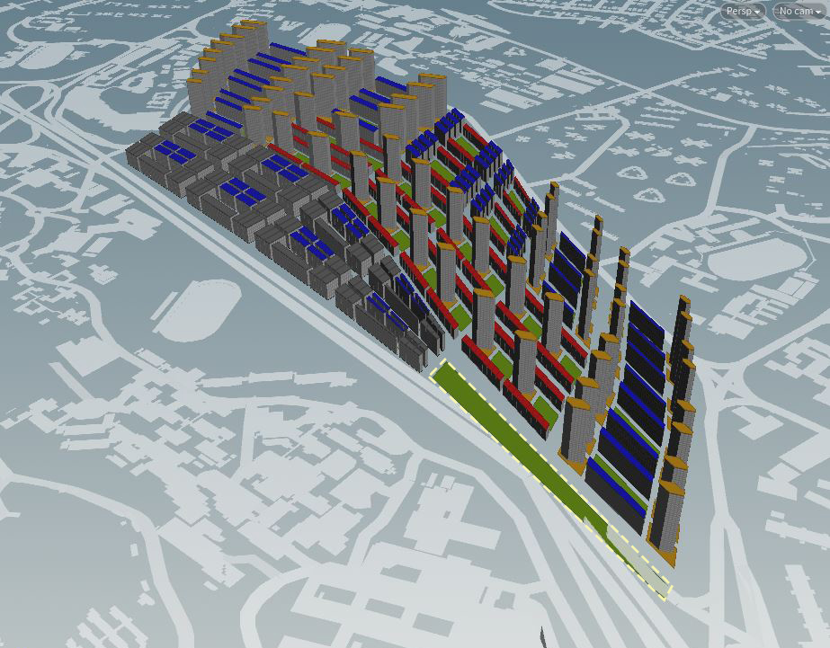

# Iteration 3

 

 _Figure 3a: Plot Allocation_
 

For Iteration 3, I wanted to introduce ways in which the site can connect to adjacent estates as well as within internal clusters. Here the plot is divided into 4 key clusters.
Work-Live Zone is located nearest to the respective MRT Stations, facilitating residents who take the public transport.
R&D Zone required larger volume buildings, and is located adjacent to the AYE, forming a buffer for the rest of the site. Plot of land required for industrial is reduced from previous iterations, allocating more spaces for the other zones. 
The Collaboration Zone, in the middle, contains a program mix of residential, retail and offices. This zone is designed as a collaborative platform, connecting the adjacent clusters on site as well as direct linkage from NUS itself. Thereby establishing a common ground for research, business and industrial collaboration.

With these plot zones in mind, I then proceeded to introduce typologies within each respective cluster, fulfilling the hybrid program mix. 
_(Grey: Industrial, Yellow: Residential, Red: Retail, Blue: Offices, Green: Parks)_

 

 _Figure 3b: Strip Typology with Ring Road_

__Work-Live Zone__
Programs include residential units and office blocks. High Rise residential towers were placed adjacent to office spine blocks, forming a connecting bridge for the towers. Central area is used as a park or recreational space, thereby forming a buffer space for sunlight and views to permeate the block forms. Improving from Iteration 2, the towers orientation is rotated to reduce East-West facing surfaces, thereby improving solar factor and good window ratio (Figure 3d).

 

 

__Research and Development Zone__
 
Key Programs include Industrial warehouse and office spaces for researchers, forming a symbiotic relationship between production and research activities. The industrial complex have a higher floor height of 10m and the form a ‘U’ shape facing AYE. The office blocks encloses the ‘U’ form, allowing workers to transit from production to office spaces and vice versa.

a

__Collaboration Zone__
 
In the collaboration zone, programs include retail, office and short-term accommodation. Here, the housing tower typologies remain consistent, however they follow the arrangement of a spine. Extending across the length of the entire site, intermixed with retail and green spaces. This zone aims to foster interactions and exchange of information for the various parties on site. Therefore the zone is accessible from all sides of the site, as well as directly connecting to NUS. 

__Evaluation Results__
 

Overall, Iteration 3 displayed an improved good building results with optimal results for residential, retail and office typologies. Some industrial buildings experience shortfall in view factor due to its compact footprint and close proximity. However due to the nature of the programs being within controlled enclose environment, the impact could be negligible.
