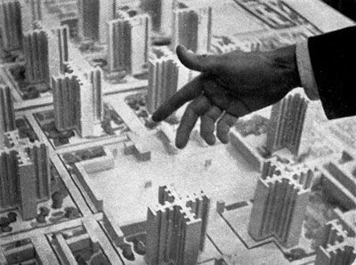
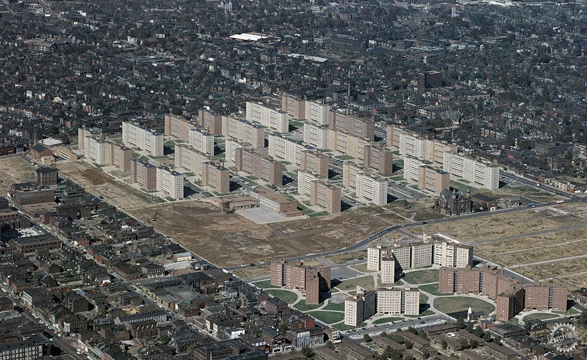
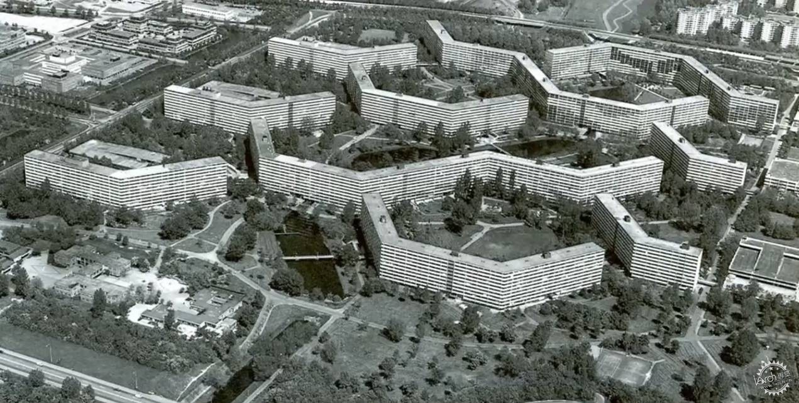
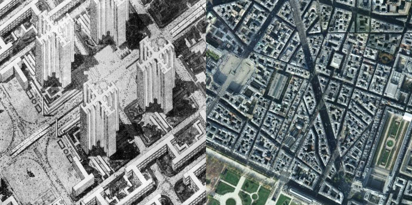
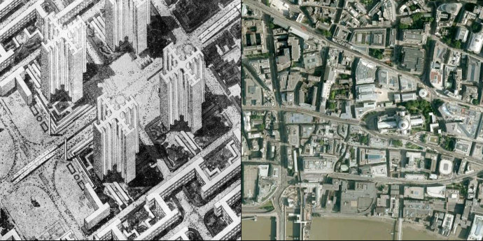
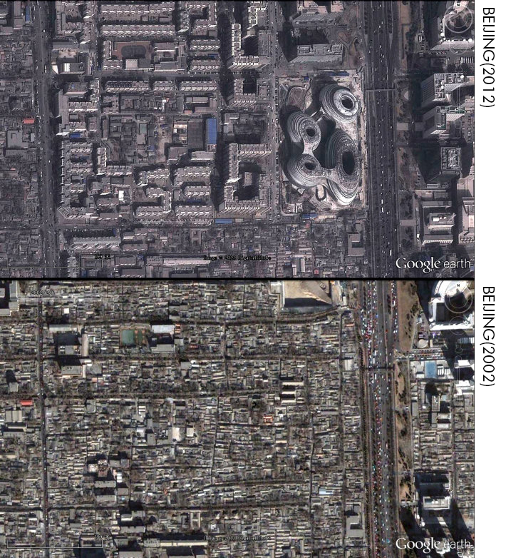
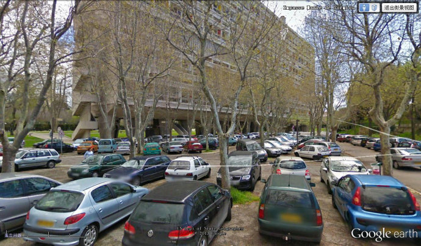

# Discussion

## Conclusion
If only take physical factor into consideration, then iteration3 will be a urban prototype that having the most residences receiving good lighting and view. The higher the density(building height),the larger superficial area it will get, good window ratio will correspondingly gets higher. The smaller it's ground floor is, the higher impact good windows will have.

At the same time, leaving more space for lighting, transportation and green. Perhaps the final form be like the towers in the Ville Radieuse.

## Discussion

Pruitt-Igoe can be seen as a perfect embodiment of Iteration3 in reality. If human beings are just like machines that can run properly as soon as having sunshine, greening, public space and other parameters meeting the conditions, then Pruitt-Igoe will not finally turned out to be demolished.
9

Coincidentally, Amsterdam's Bijlmermeer also faced the same fate. The length of the apartment once reached an astonishing 400meters, which is four times the length of mine.

Comparing this urban form with traditional neighborhoods, you will find that Ville Radieuse can only provide 4 blocks and 9 intersections, while in Paris and London, you can have at least 60 blocks and 150 intersections.

Walking in such a 800m x 800m range, you have only 9 choices in Ville Radieuse, and no matter where you turn, you will see the same high-rise green space, and in Venice, you can have more than 600 options.

 The population of Amsterdam in the picture below is similar to the population density of Ville Radieuse. If you want to reach the density of Amsterdam or Paris, the Ville Radieuse needs to reach a height of 15 stories.
 
 

Although each building is allocated near greenery, it seems that the vertical distance between people and the green space is not considered. Human beings are inert animals, and such height seems to isolate the relationship between people and the ground.

The lawn under Unité d'Habitation which is meant to be a out door social space is now a parking lot.

