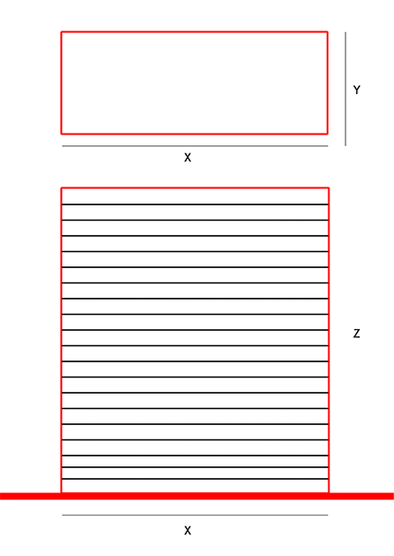
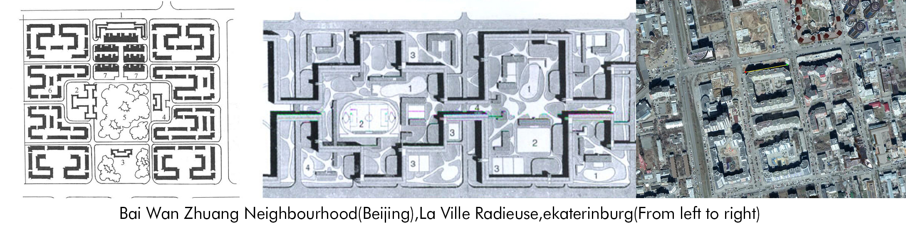
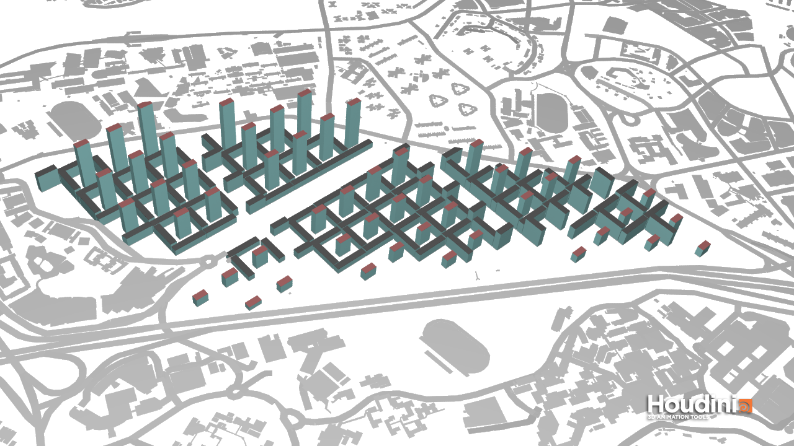
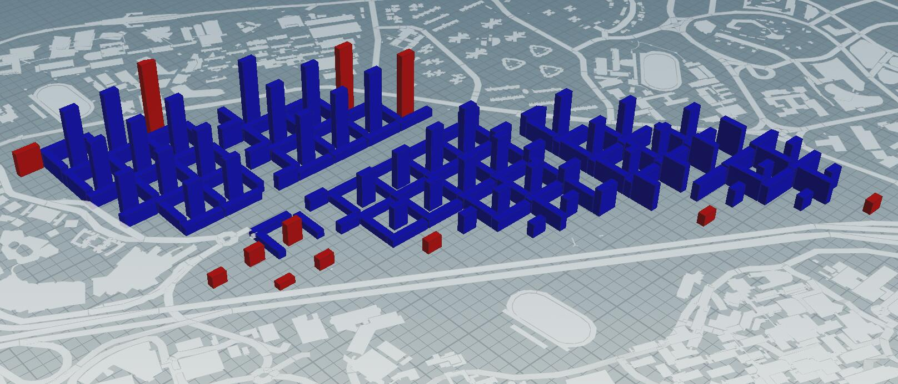
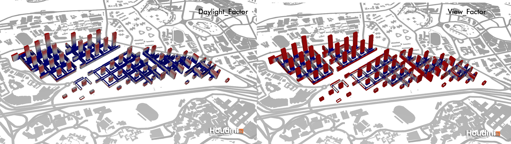

# Iteration 1

## Premise
  Assume that the bottom of buildings are all rectangulars. Take the extreme case,assume that windows along the long side are all good windows, the height of each floor is 3m, the maximum area of good windows will be 2XZ, and total area of one building will be (XYZ/ 3). If the good window ratio is larger than 0.3, the maximum length of Y will be (2XZ/(XYZ/3) > 0.3),that is ***20 Meters***. Therefore, my buildings in all the iterations will be having shortest sides shorter than 20 meters.

## Background
  The Neighborhood Unit theory can be seen as a development of the La Ville Radieuse in the automotive context. It move green spaces and other public facilities to the center of each residential units. Creating a physically and emotionally safe environment without motor vehicles. This theory has profoundly affected the planning of residential areas in the Soviet Union and China

## Generation process
I tried to restore this living mode in my scheme, the difference is that other service functions were placed in the center of each unit. Each unit is 90 meters wide and the entire site is cut through by four main roads, which are all wide boulevards. The center of each plot are all pedestrians. The central service complex includes supermarkets, three-dimensional parking, entertainments and offices.

## Evaluation
After evaluation, the results show that most of the residential buildings are bad buildings.

The main reason is that the complex inside the unit completely obscures the lighting and scenery of most windows. After the central complex was removed, the situation improved. However, due to the difficulty of the direction, residential buildings in east-west direction would receive too much sunshine every day, and still could not achieve better living conditions.

## Improvement
there are two main improvement methods. First, the service function should be arranged separately from the residence, but this does not match my starting point, so the remaining method is that the two are arranged in a straight line, or distributed up and down. Also, buildings oriented in bad directions should be removed
### P.S.
All the discussions above are based on the higher threshold, if use the low threshold( ***view_threshold>0.4,daylight_threshold>0.1,solar_threshold<0.2,For good building thresholds,,passive_threshold>0.5
good_window_threshold>0.1***)as standard, then most of the buildings will be acceptable.
