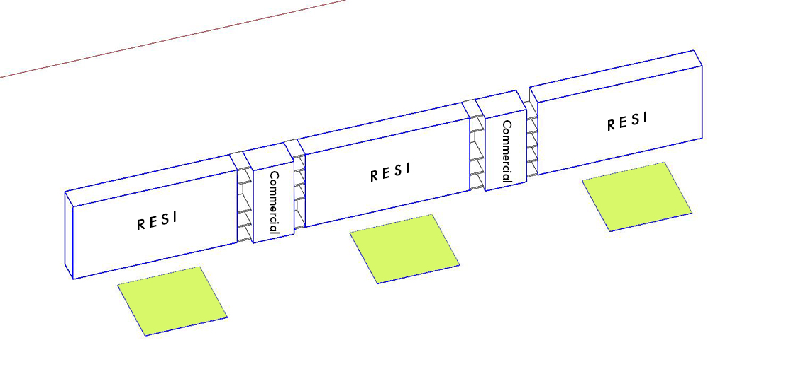
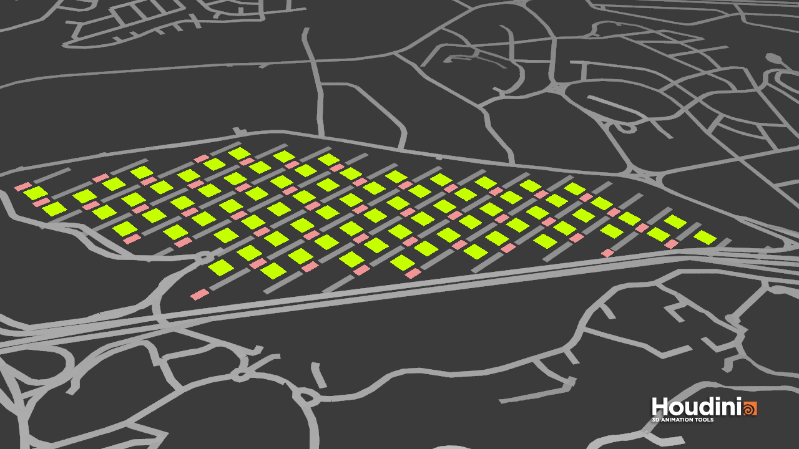
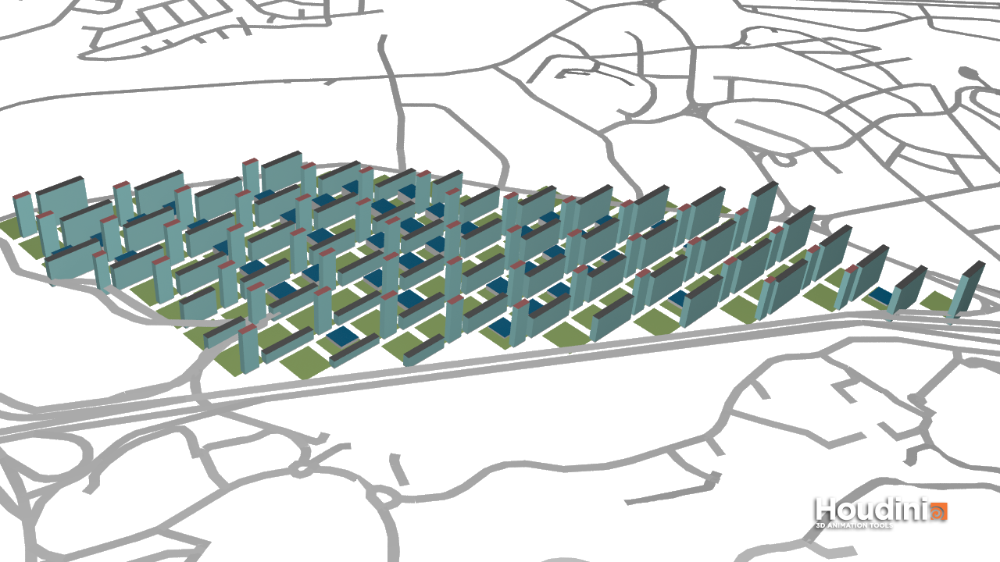
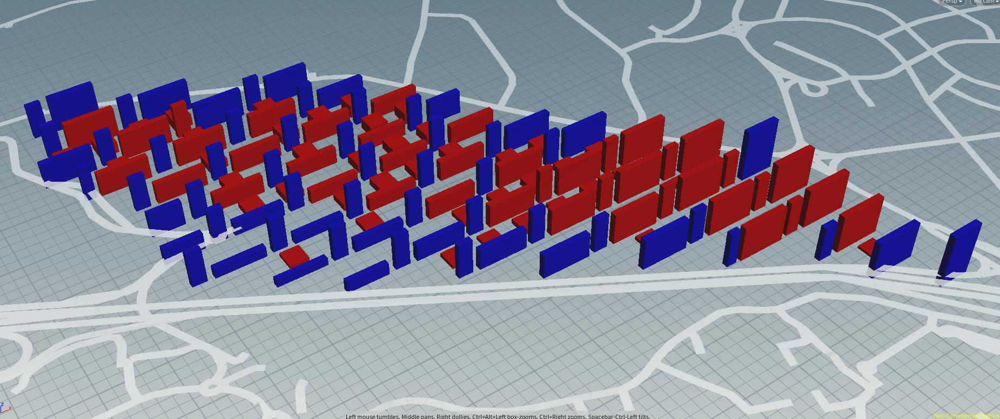
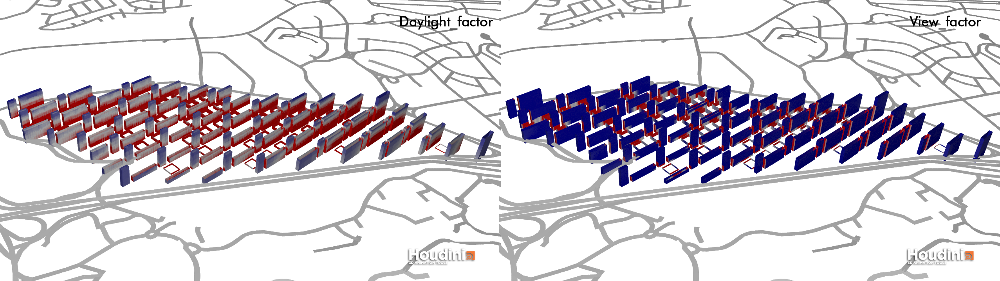

# Iteration 2

## Concept
In this iteration, I will take these requirements as key points, and the final goals are as follows:

1.Every apartment block can have its own greenery

2.Service functions are juxtaposed with residential buildings.

3.Create street hierarchy

So I decided to arrange Residential and commercial buildings in an ABAB form, which solves the problem of lacking sunshine in the previously proposed residential buildings. 

## Genration Process
The green space together with the neighborhood segment the lane boundary effectively, and supermarkets are arranged in the center of most green areas. The depth of residences is 16m, of commercial buildings is 20m, distance between two buildings is 73m. There is a corridor connection between residence and commercial.

## Evaluation

Some residential buildings have not reached the standard, mainly because of the height. For having commercial buildings underneath, the residences are higher than it should be.

Again, most of the residences' daylight and view factor are above the threshold.

## Improvement
Try to decrease the height of recidences, which is helpful for lighting and view. as for the unsatisfactory commercial part, another arrangement needs to be considered, provided that each residential building still needs a commercial building around.

### P.S.

All buildings except supermarkets are good buildings when taking higher threshold as standard.

