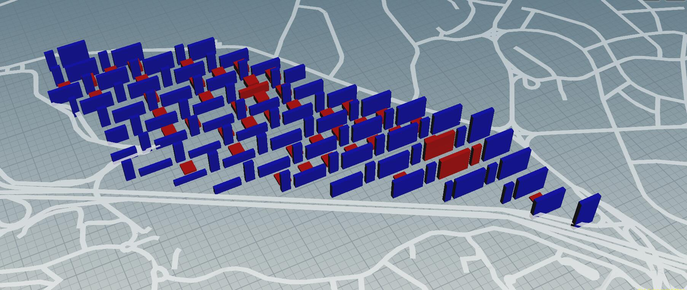

# Iteration 3

## Concept
In this iteration, I will take these requirements as key points, and the final goals are as follows:

1.Every apartment block can have its own greenery

2.Service functions are juxtaposed with residential buildings.

3.Create street hierarchy

4.Make the commercial buildings more sporadic.

So I decided to arrange Residential and commercial buildings in an ABAB form, which solves the problem of lacking sunshine in the previously proposed residential buildings. 

## Genration Process
The green space together with the neighborhood segment the lane boundary effectively, and supermarkets are arranged in the center of most green areas. The depth of residences is 16m, of commercial buildings is 20m, distance between two buildings is 73m. There is a corridor connection between residence and commercial.

## Evaluation

The broad space between buildings can ensure a good amount of lighting for most of the residences even under high standards.One defect still remaining is the lacking of daylight of the commercial buildings underneath.

Good Building Area Ratio: 77.4% 

Good Window Ratio: 51.6%

So Under this urban morphology,most buildings can meet up with the higher standard. 

The road is wide,and public spaces are evenly distributed to each apartment block.Although the commercial cannot get enough daylight, it is still acceptable for not having too much sunshine in such non-residential structures.The good window ratio of them does not reach 0.3, yet most of them are above 0.25, which is still a rather high value.

Again, most of the residences' daylight and view factor are above the threshold. Only problem is the central supermarkets. But considering that these non-residensial buildings actually do not require a high standrad of living, so it is still acceptable.

### P.S.

All buildings except supermarkets are good buildings when taking higher threshold as standard.

