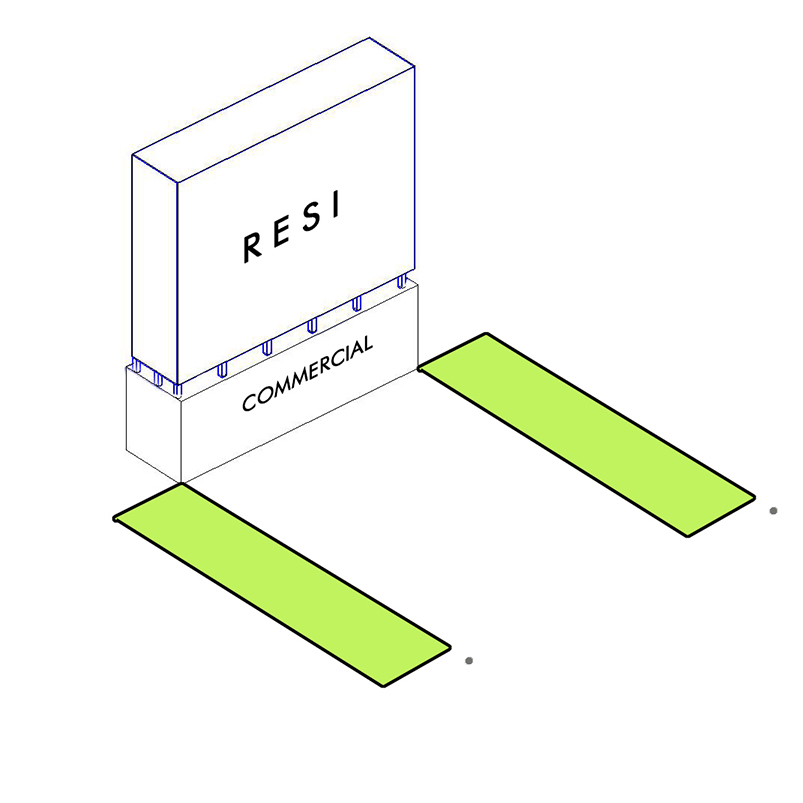
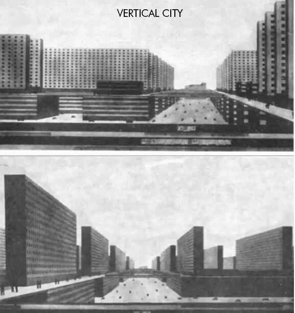
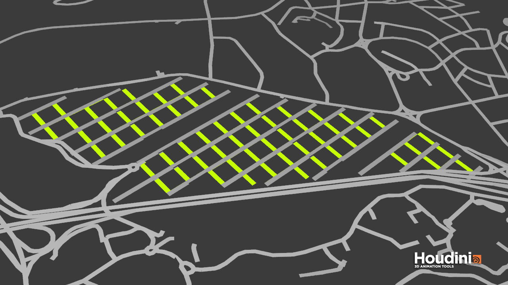
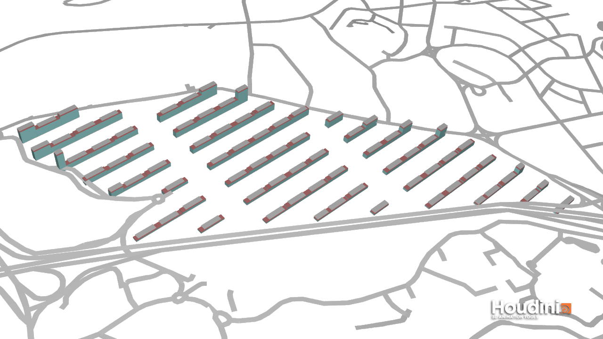
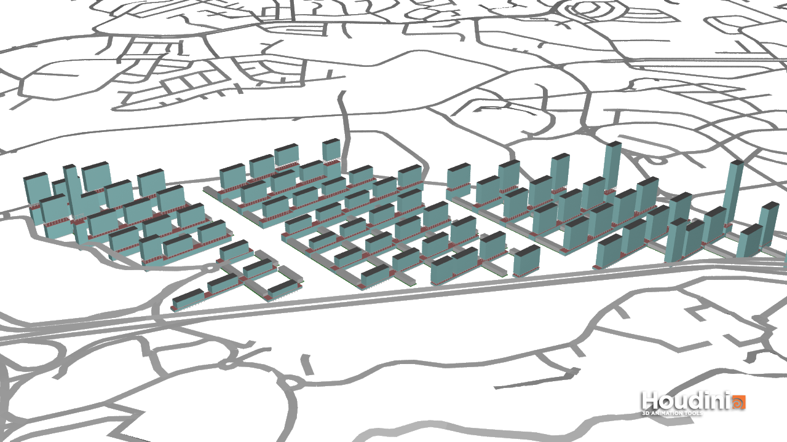
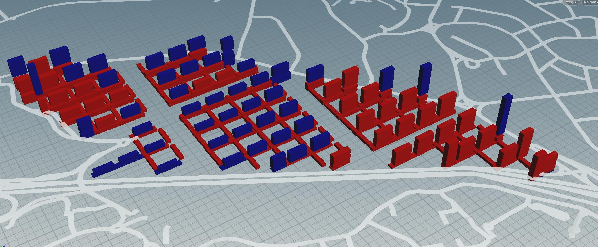
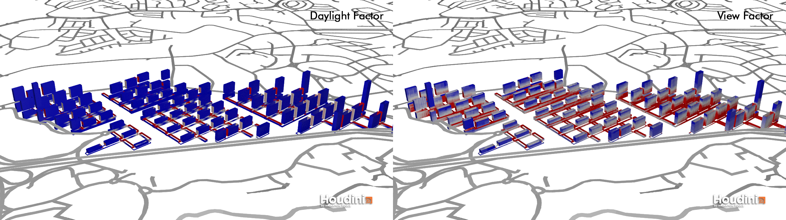
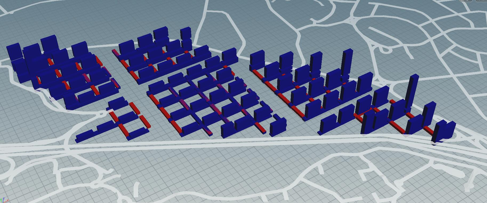

# Iteration 3

## Concept
In this iteration, I decide to adopt a new urban morphology, that is distributing service functions such as commercial, office, catering and entertainment under every apartment blocks.At the same time, the east-west facing buildings will be substituted by small shops and greenery which can ensure that each residential building has green spaces adjacent to it.

Another thing is that I try to break commercial buildings into small peaces and scatter them all over the site.

This scheme is inspired by Unité d'Habitation, each block is like a small city. Ludwig Hilberseimer’s well-known Vertical City is also took as a reference.

## Generation process
First, rectangular building bases are used to generate commercial buildings (including all service functions such as retail and entertainment).I calculated the distance between each building and AYE, and allocated commercial area based on this. The closer to AYE, the larger area will be. The highest one has 20 floors.

Second step is to move the building bottom which later will be used to generate residences upward, each one moves at a specific distance determined by the height of its corresponding commercial building. The area allocation will be affected by the three MRT stations. The closer to the MRT station, the more residents should be. The highest apartment block has 40 floors.

## Evaluation

The broad space between buildings can ensure a good amount of lighting for most of the residences even under high standards.One defect still remaining is the lacking of daylight of the commercial buildings underneath.

Take this commercial building as an example, all windows have not reached the final lighting standard,although the difference is quite low. And all other conditions are met.

Good Building Area Ratio: 77.2% 
Good Window: 50%

So Under this urban morphology,most buildings can meet up with the higher standard. 

The road is wide,and public spaces are evenly distributed to each apartment block.Although the commercial cannot get enough daylight, it is still acceptable for not having too much sunshine in such non-residential structure.The good window ratio of them does not reach 0.3, yet most of them are above 0.25, which is still a rather high value.

## P.S. Simulation of good and bad buildings using lower threshold

