# Iteration 1

The first iteration aims to find the best location, coverage and height for residential and commercial blocks as they are the most important functional spaces in a living community. Therefore, only residential and commercial urban blocks are evaluated. We assumed that the space requirements for residential to be 22sqm per person and commercial to be 13sqm per person to fulfil the need of 75000 people.

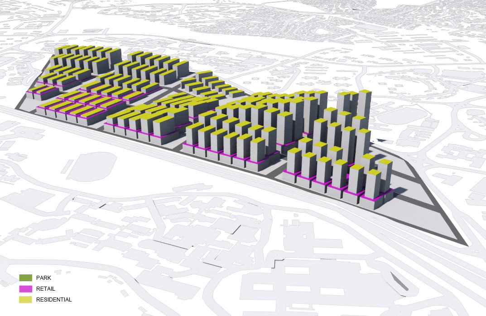
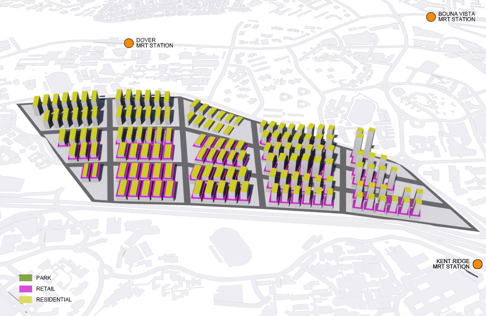

* **Distribution of Parcels** 
The site is divided into 15 parcels (3 columns and 5 rows) with area varies from 17477sqm to 59430sqm. It is developed from a grid system to provide the most efficient layout for the community.

* **Residential Usage** 
The tallest residential block has 27 levels and the minimum distance among buildings is 20m. The building footprint varies from 1000sqm to 1900sqm. 

* **Commercial Usage** 
Distance among commercial blocks in the same parcel is 6m while the height of commercial building blocks varies from 1-3 levels according to the distance from main road. The closer to Aye, the taller the commercial buildings are. The building footprint is from 1200sqm to 3500sqm.

## Data
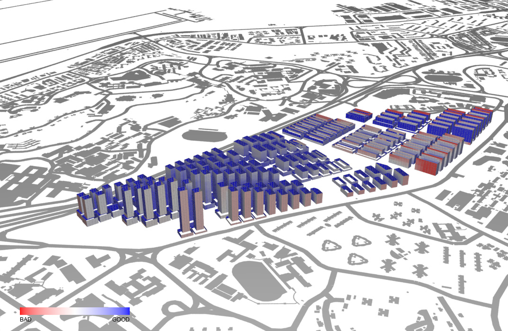
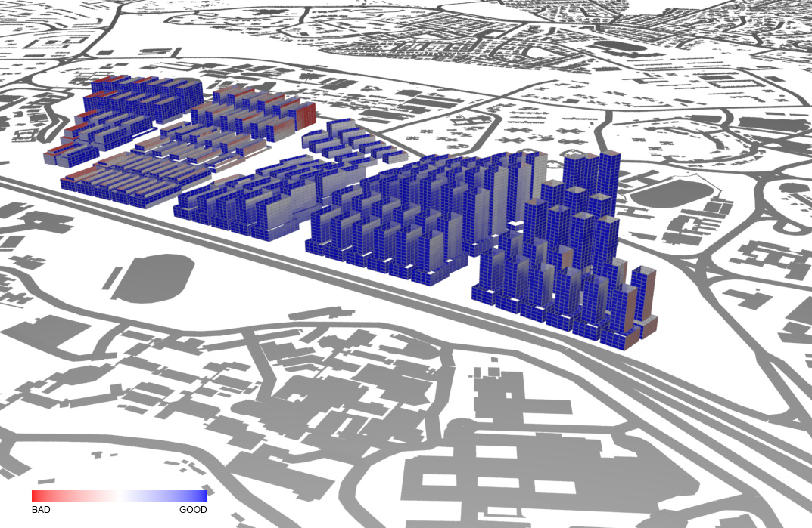
* **Solar Factor** 
Blue color indicates space having good value for solar factor. Most of the buildings do not have excessive heat gain from sunlight except residential blocks at North-West. 
 
 

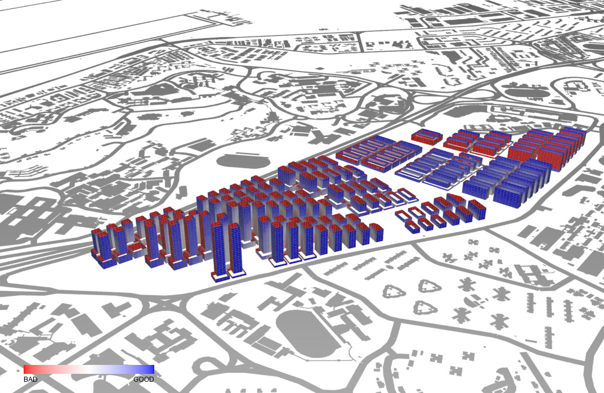
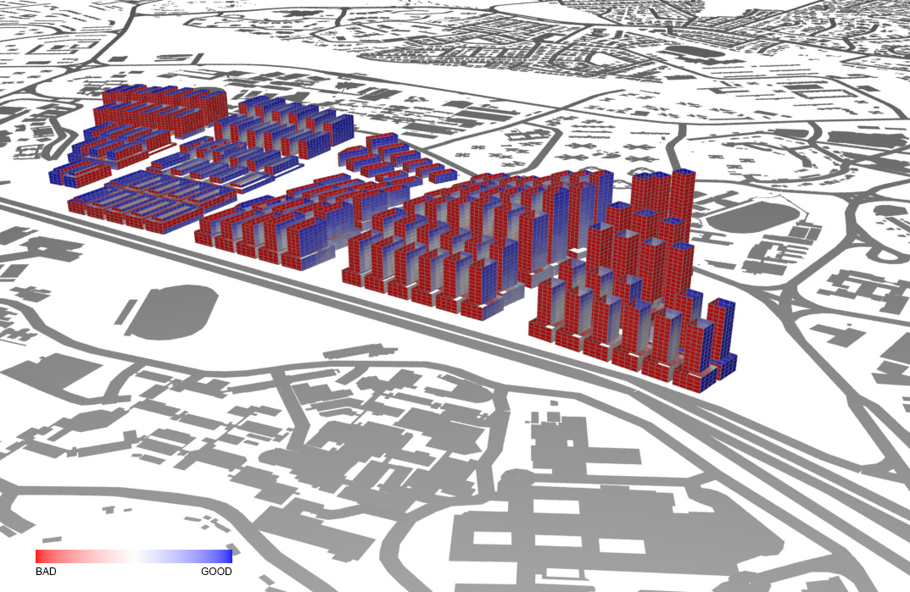
* **Daylight Factor** 
The result reflects that provision of daylighting for South-West or North-West facing elevations is poor. The South-East elevations of some buildings also fail to access sufficient daylight. It might because of the closely packed arrangement among building blocks. 

 
 

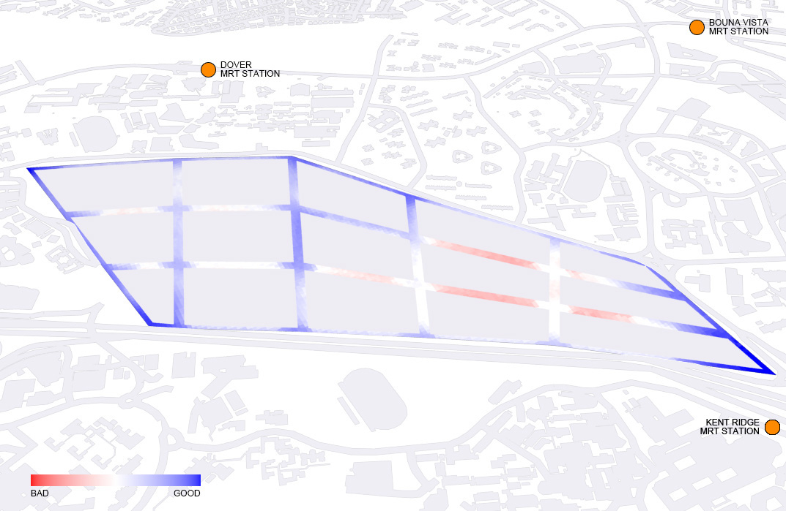
* **Sky Exposure Factor** 
Road between each parcel is designed to be 24m wide to provide 3m pedestrian road, 8m traffic lanes for both side and a 2m tree lawn in the middle. The result is almost satisfied except four roads at South-East area. It might because of the fact that most of the tall residential buildings are located at South-East, which obstructs the access of sun light to the street level. 

 
 

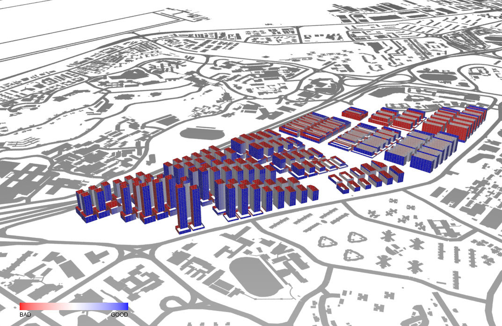
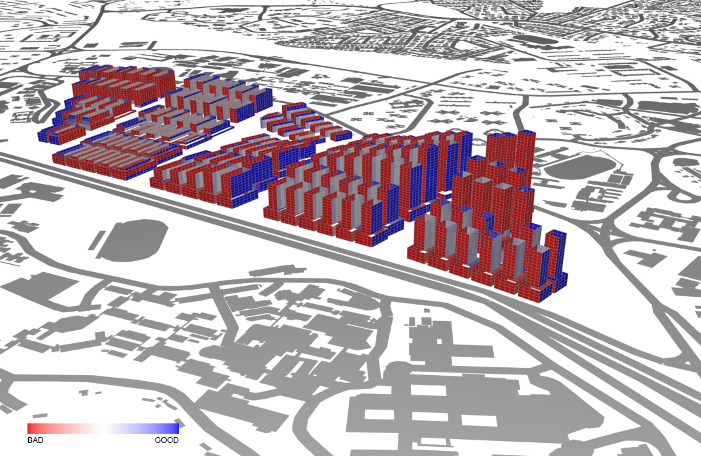
* **View Factor** 
(Results is provided for referenced but view factor is not discussed in this chapter.) 

 
 

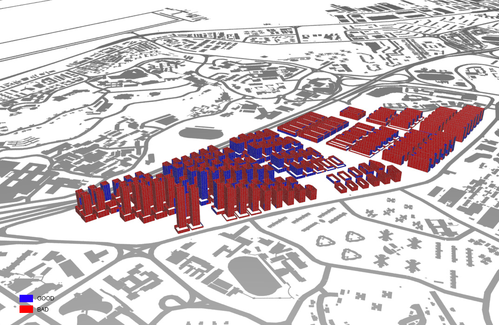
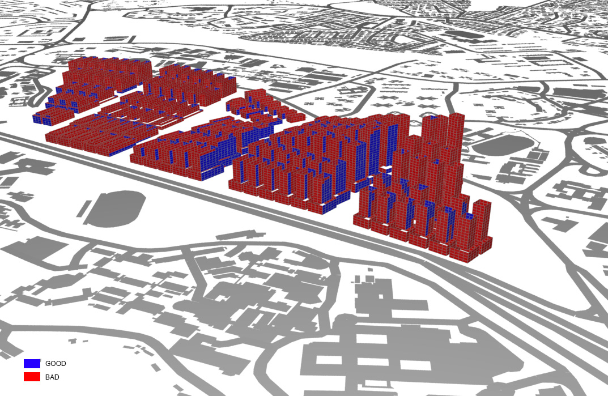
* **Good Window Threshold** 
Not more than one-fourth of windows are defined as “good window”. This indicates improvements need to be made to provide enough daylighting for South-West and North-West elevations. 

 
 

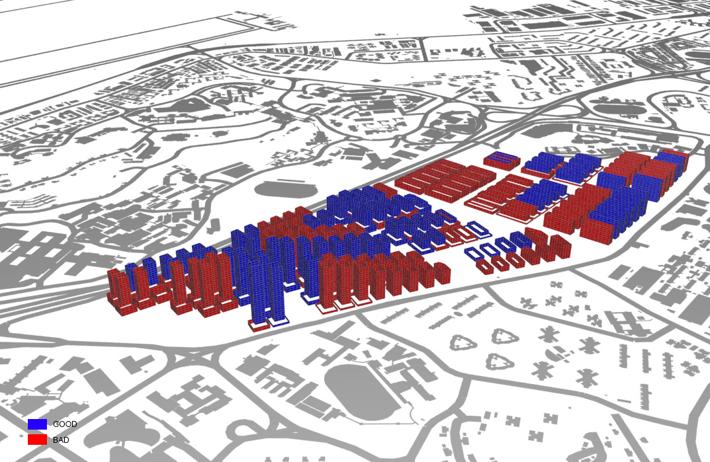
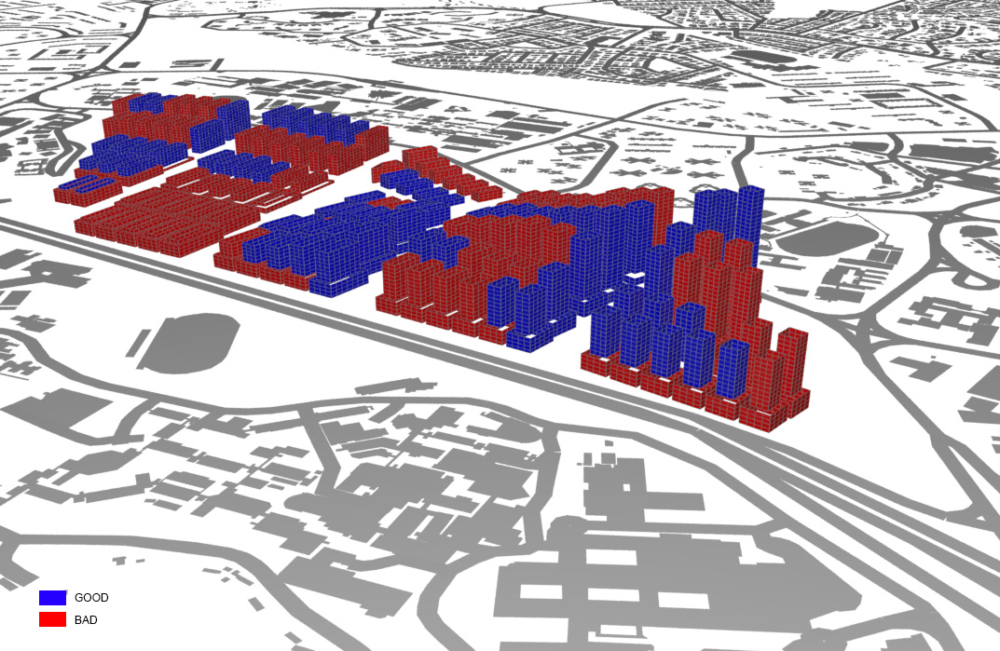
* **Good Building Threshold** 
The poor result from good window threshold also leads to a bad result in good building threshold. Nearly half of the buildings meet the requirement even they all get a good passive ratio. 

 
 

## Evaluation
These are the suggestions for refinements in the 2nd iteration:

* **Park at the Middle of Parcel** 
An open space can be introduced to the closely packed environment of each parcel as a buffer zone to provide setback between two rows of building blocks and ease the situation. However, this might lead to the increase of height of building blocks or become denser in rows.

* **Redivision of Parcels** 
Instead of having 15 parcels (3 columns and 5 rows), the site is separated into West and East parts and have 9 parcels (3 columns and 3 rows) and 4 parcels (2 columns and 2 rows) grid layout. This can divide the site in evener way.

