# Iteration 2

Changes and refinements are made in the second iteration to test if provision of an open space could improve the provision of daylight to indoor environment. One-quarter of the site (188625sqm) is designed to be park for public. The space requirements for residential and commercial remains unchanged.

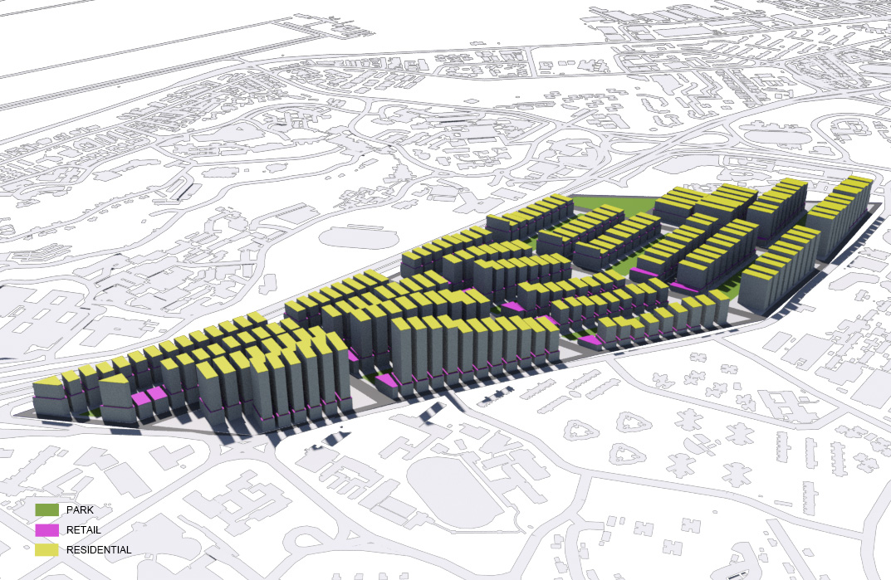
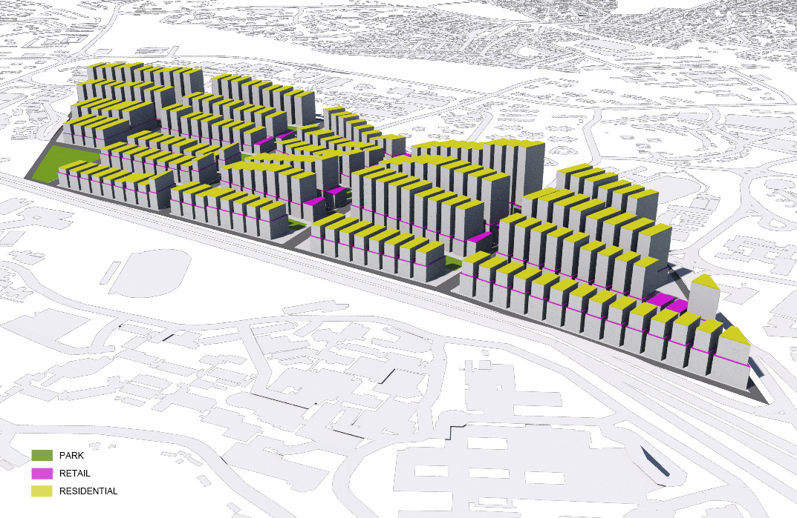
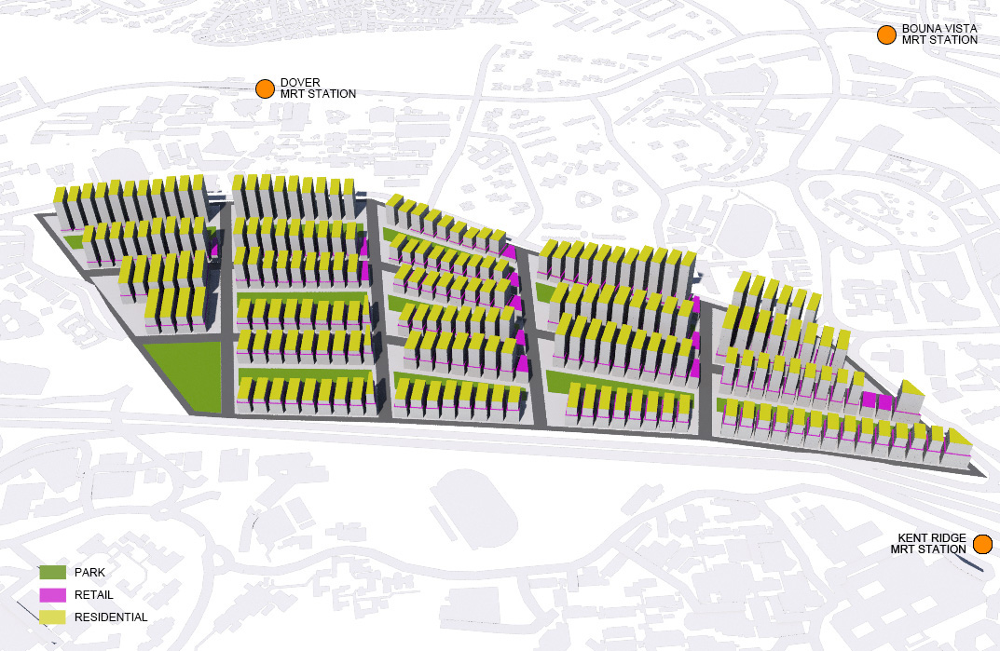

* **Distribution of Parcels** 
Area of 9 parcels varies from 17500sqm to 60200sqm. Parcel with area smaller than 20000sqm is designed to be a big public park and parcels with area between 20000sqm and 40000sqm would not have green buffer as to ensure that all buildings have good passive ratio while keep using same building typologies.

* **Residential Usage** 
The tallest residential block has 20 levels and the minimum distance among buildings is 10m. The building footprint varies from 600sqm to 1600sqm.

* **ommercial Usage** 
Minimum distance among commercial blocks in the same parcel is still 6m while the height of commercial building blocks varies from 1-6 levels according to the distance from Aye. The building footprint is from 600sqm to 2340sqm.

## Data
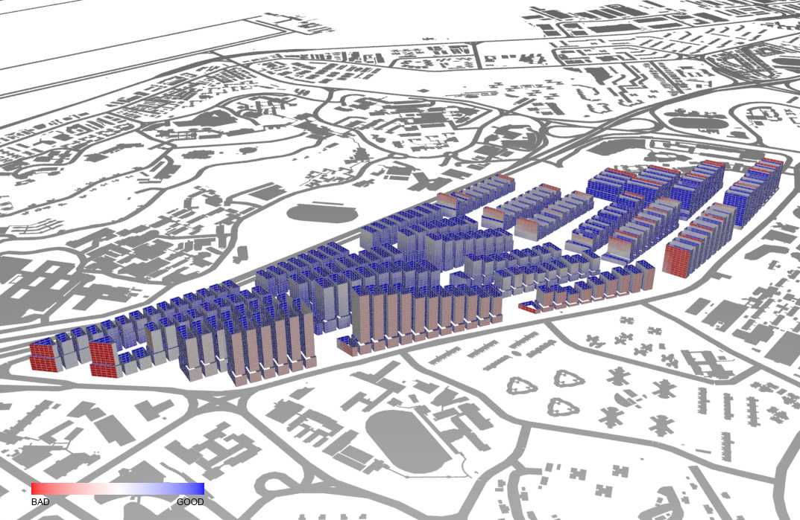
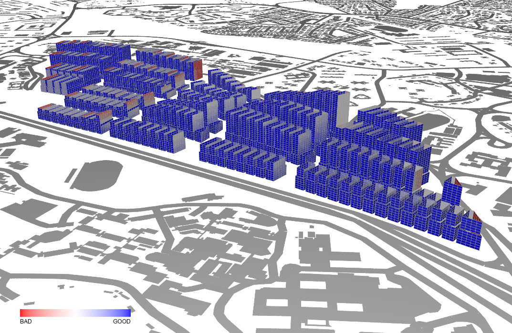
* **Solar Factor** 
The result is very similar to what we have got for the first iteration. Heat gain of South-East elevation is always greater. Elevations that are directly facing to South-East are indicated in bright red. This means that building shape or window orientation of those buildings should be changed. 
 
 

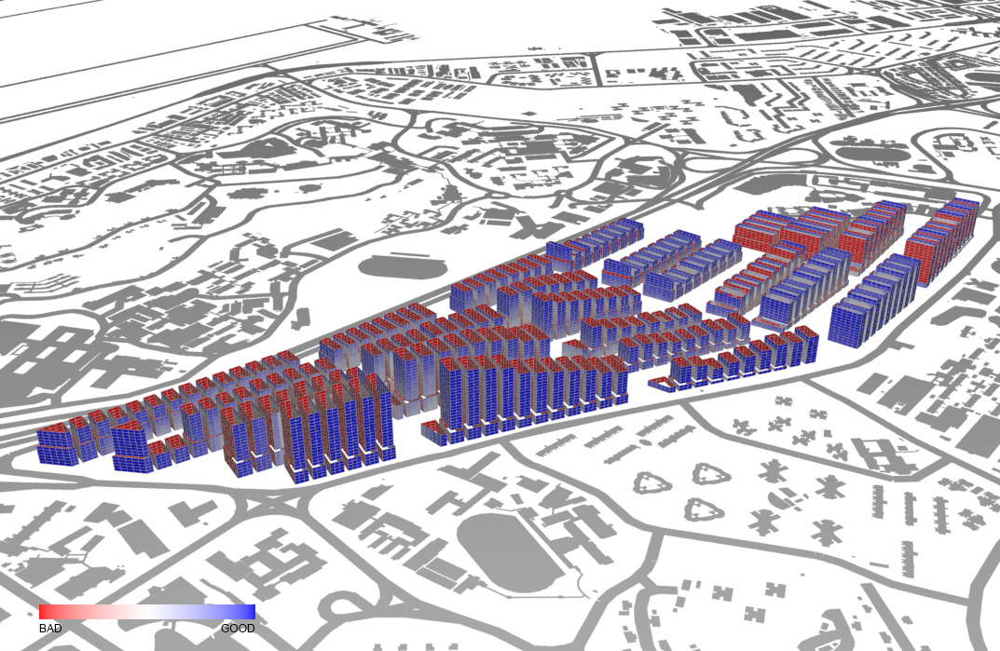
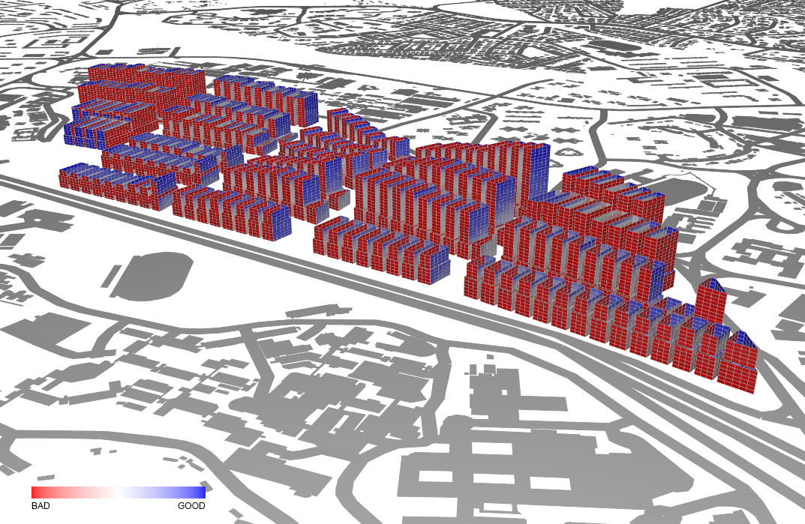
* **Daylight Factor** 
We assumed that provision of open space as a buffer to provide buildings setback can ease the situation. Nevertheless, the result vividly shows that it does not really help. 
 
 

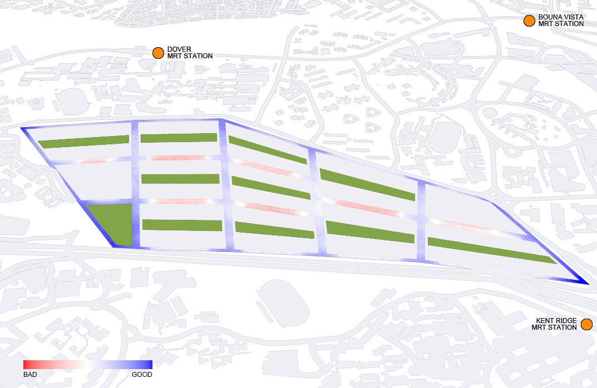
* **Sky Exposure Factor** 
The middle of the road between parcels is still with a poor sky exposure factor and the situation is getting worse due to the increase of average building height. 
 
 

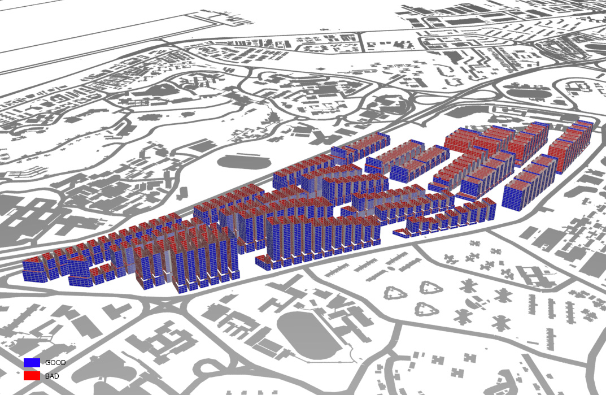
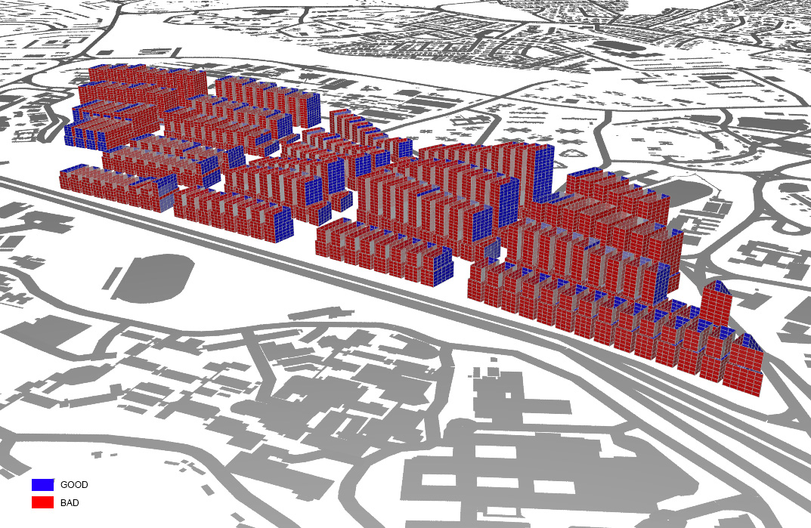
* **View Factor** 
(Results is provided for referenced but view factor is not discussed in this chapter.) 
 
 

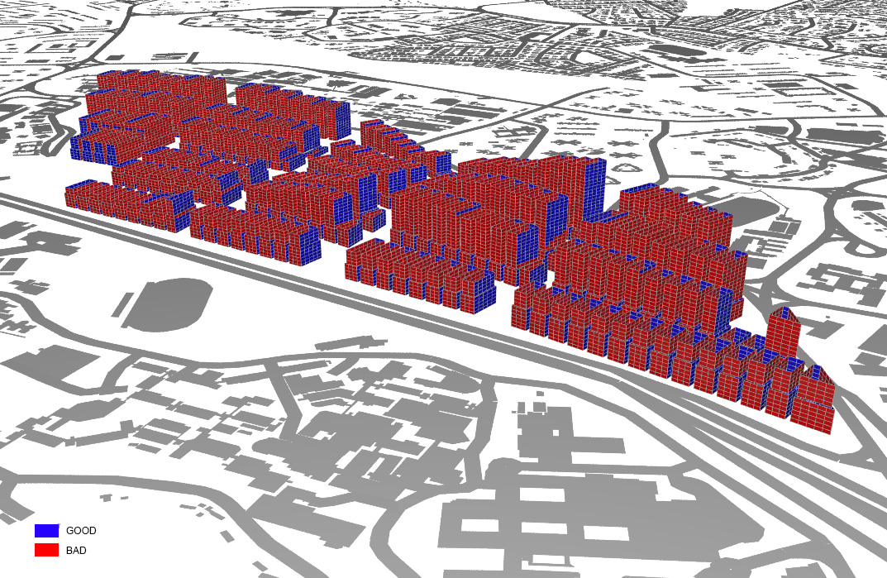
* **Good Window Threshold** 
Only half of the windows are defined as “good windows” because of the poor performance in daylighting. 
 
 

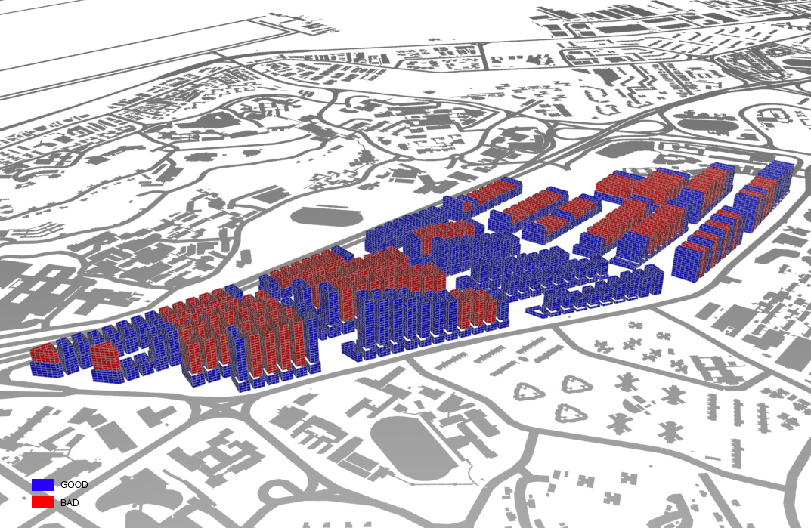
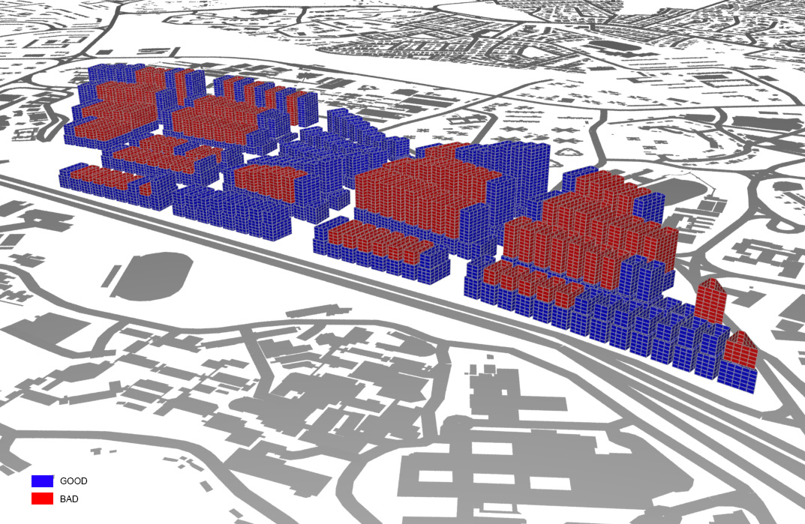
* **Good Building Threshold** 
Same as the first iteration, the poor result from good window threshold also leads to a bad result in good building threshold. Nearly half of the buildings meet the requirement even they all get a good passive ratio. 
 
 

## Evaluation
We now understand that the increase of building setbacks cannot improve the lighting quality of the interior space of building in this situation. This proved that it is not the problem of distance among buildings and we should focus on building typologies instead.

These are the suggestions for refinements in the 3rd iteration:

* **Enlarging Building Blocks** 
In order to control building height while keeping one-quarter of land as park for the community, small buildings are combined to larger blocks to improve the efficiency. The larger retail footprints at the lower level also provide opportunity for residential buildings to have a more flexible design.

* **Changing Window Orientation** 
The shape and orientation of residential buildings can be redesigned to prevent excessive heat gain from South-East facing elevation as well as to ensure daylight access from each side of building.

* **Low Developments at Two Ends** 
Open spaces or lower blocks can be located at two ends of the site to limit the height of development next to the two entrances of the site. Restricting the maximum height of buildings is assumed to be the way to improve the access of daylight to street level.

