# Iteration 3

We focus more on building typologies for the third iteration. Distribution of parcels and location of parks remains unchanged. However, two-storey community centers are introduced to two ends of the site as it is one of the essential functional spaces for a livable residential community.

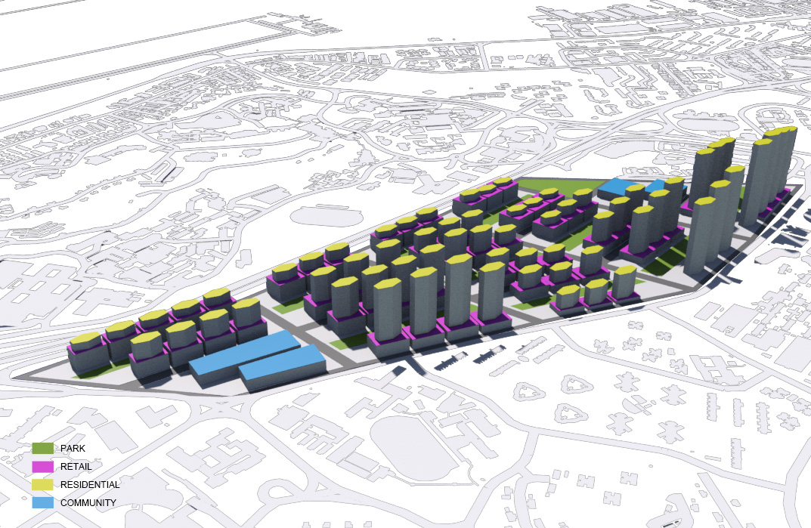
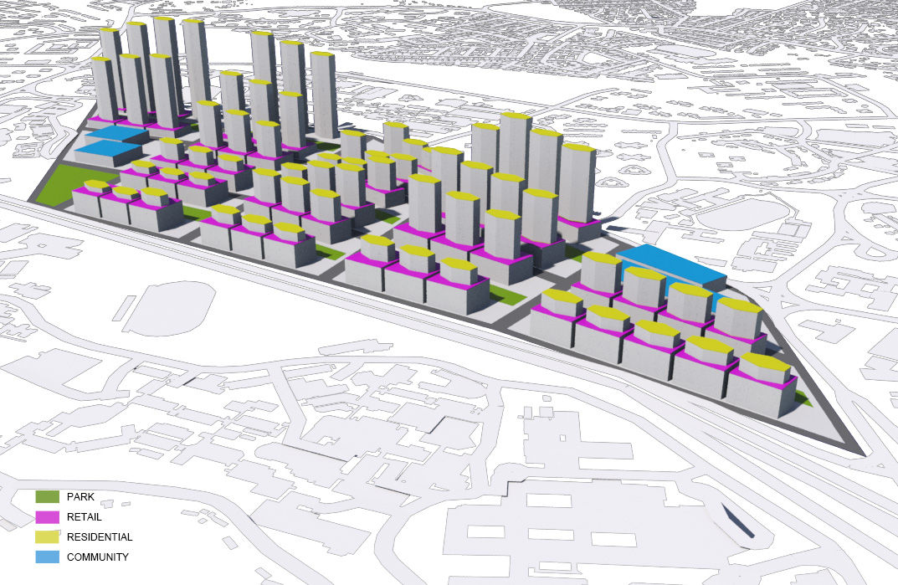
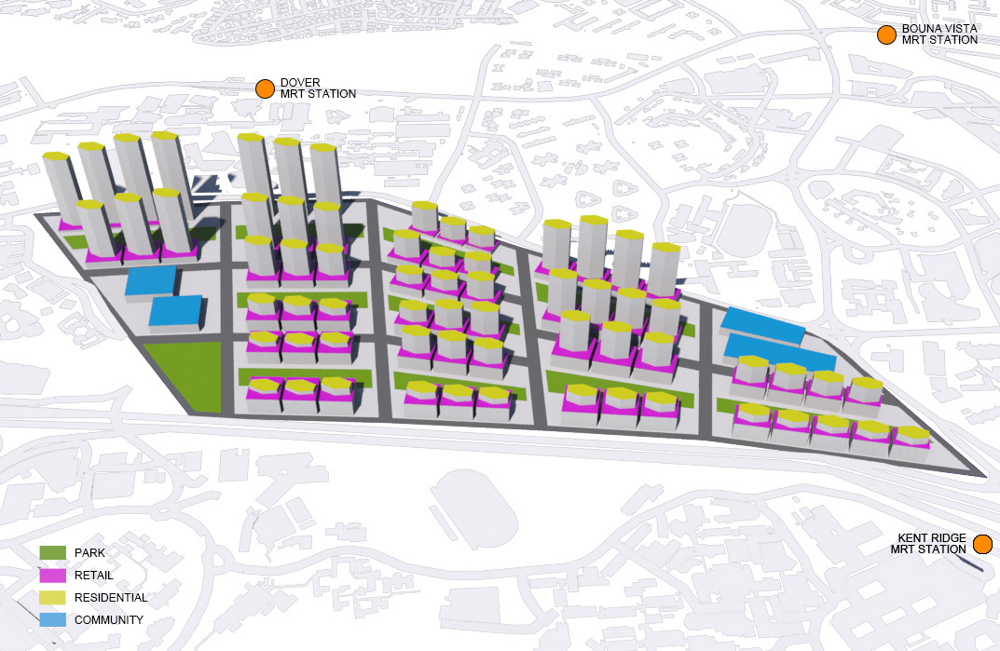

* **Residential Usage**
The tallest residential block has 67 levels and the minimum distance among buildings is 20m. The building footprint is fixed to 1170sqm.

* **Commercial Usage**
The height of commercial building blocks varies from 1-7 levels according to the distance from Aye. The building footprint is from 2260sqm to 4300sqm.

## Data
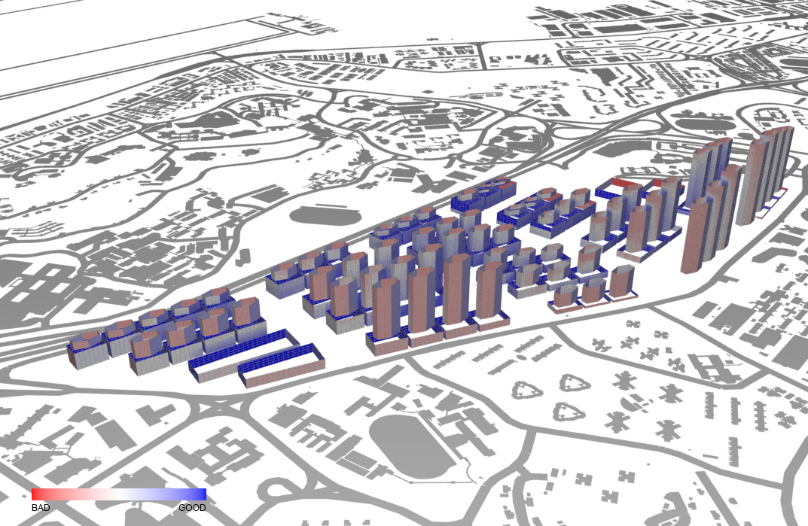
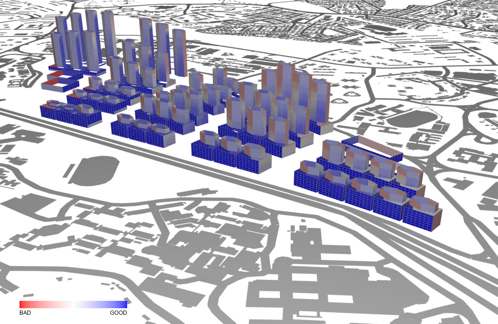
* **Solar Factor** 
Since there are no windows facing to South-East directly, the overall solar factor is improved. The satisficed result proves that changing of building shape can reduce heat gain of the structure. 

 
 

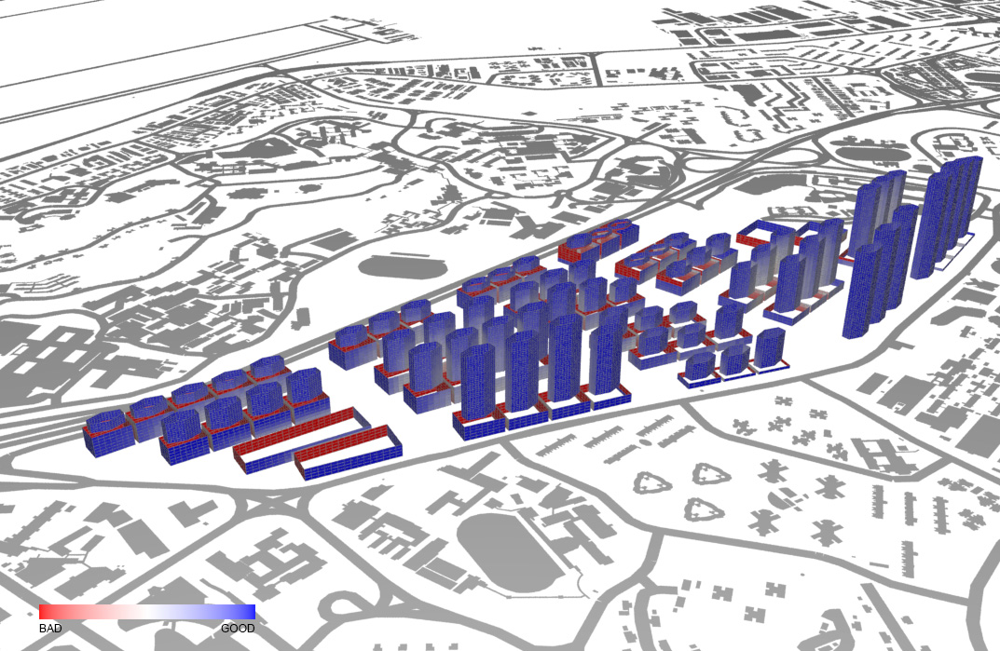
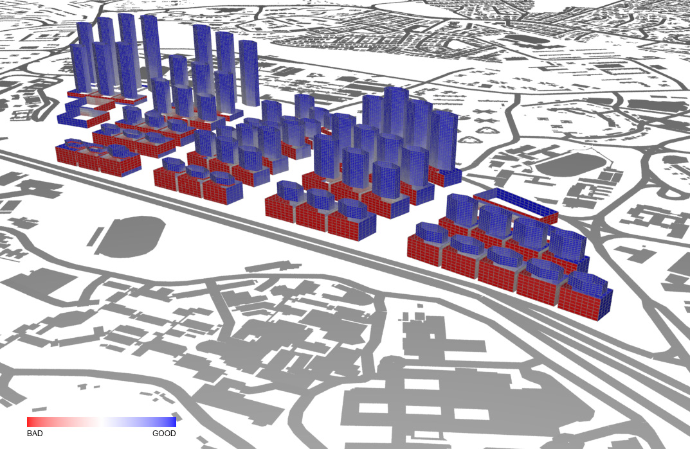
* **Daylight Factor** 
The situation is greatly ameliorated for residential buildings. All six elevations have a good daylight factor, which means that the changes of building shape can also improve daylighting. 

 
 

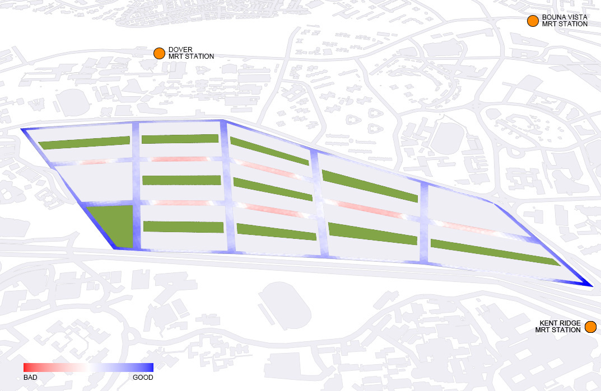
* **Sky Exposure Factor** 
The result is almost the same for the second and third iteration. 

 
 

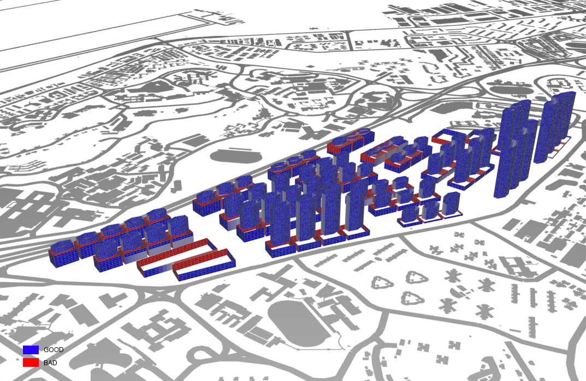
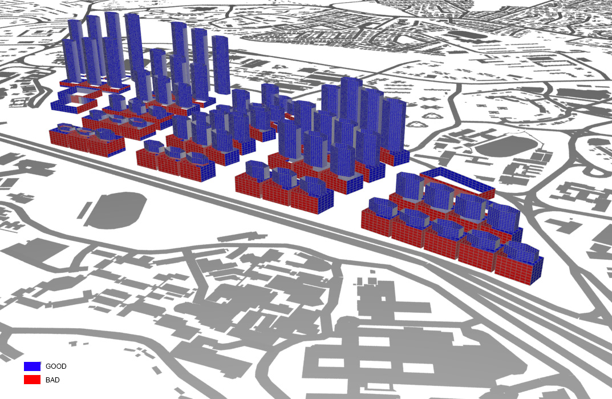
* **View Factor** 
(Results is provided for referenced but view factor is not discussed in this chapter.) 

 
 

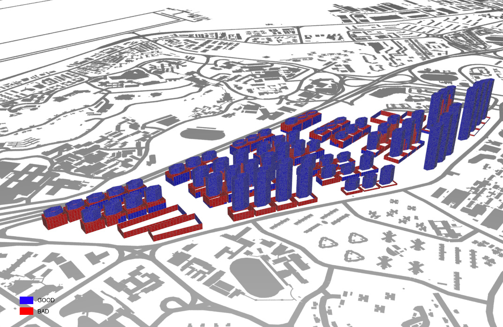
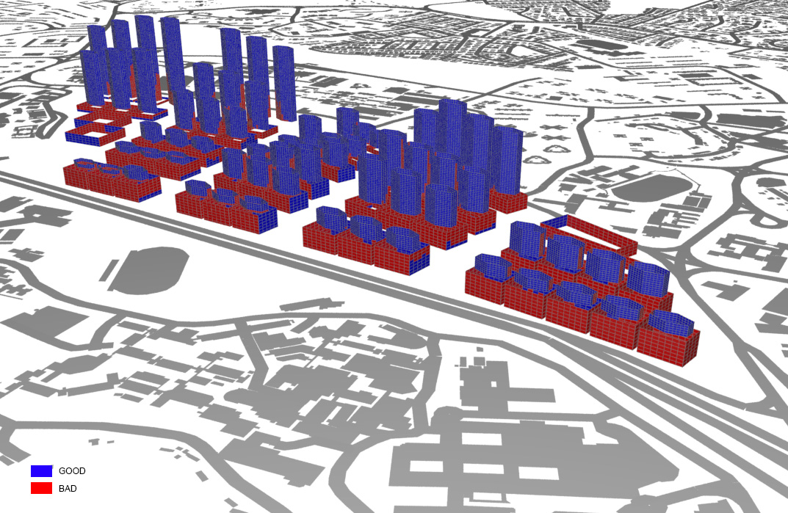
* **Good Window Threshold** 
With the great improvement in both solar and daylight factors, most windows of residential buildings are defined as “good windows”. However, as the shape and orientation of retail blocks are the same for all three iteration, the South-West or North-West facing elevations are still being defined as “bad windows”. 

 
 

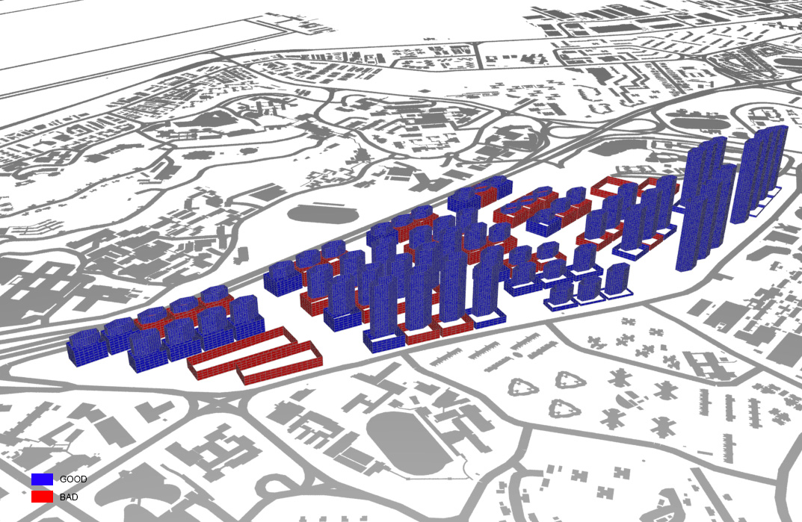
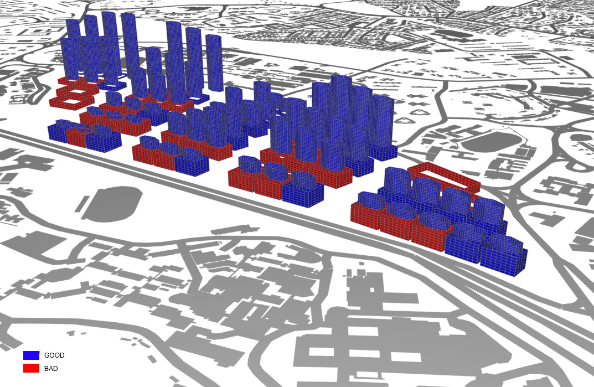
* **Good Building Threshold** 
All residential buildings are defined as “good buildings” while some retails and commercial centers are defined as “bad buildings” because of the bad window threshold. 

 
 

## Evaluation
It is surprising that the increasing height of residential blocks does not lead to a bad result in daylight factor. As long as the arrangement of buildings is not too closely apart, it would not cause any problems. More tests can be done in order to find the minimum building setback for the six-sided residential mass.

These are the suggestions for refinements in further iterations:
* **Redesign the Shape of Retail Blocks** 
The result of third iterations proved that orientation of façades should be the one of the major factors in design. The importance of building height restriction and provision of open space is more significant for maintaining the spatial quality of the road.

* **Improvement of View Factor** 
Although view factor is not considered and discuss in this chapter, we can easily discover the relationship of daylight factor and view factor. View factor falls to 0 when the value of daylight factor is 0. Therefore, the actual view factor can only be shown once the daylight factor is improved from 0.

* **Consideration of Social and Economic Dimensions** 
The three iterative designs only focus on specific aspects to generate building typologies. After the improvement of the quality for basics urban elements, we can start thinking about social and economic requirements for a comprehensive master planning.

