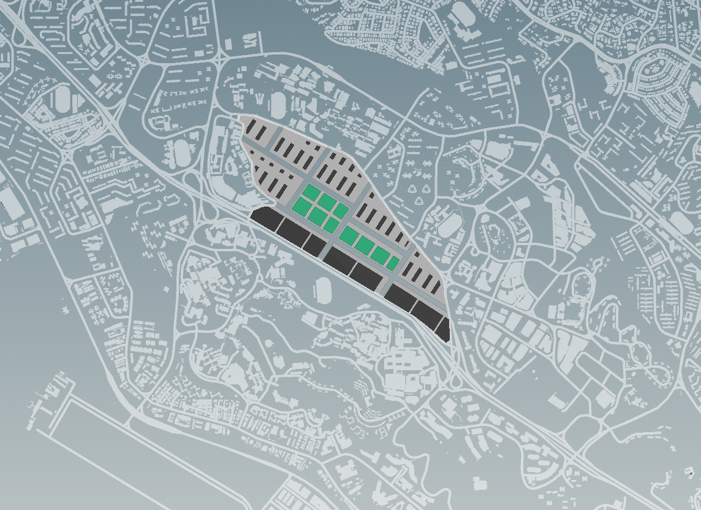

# Introduction

A typical approach of planning was adopted in the preliminary stages of design. Sensitive response to context was set as a top priority in the design, therefore there is a need to first indicate the conditions of the existing environment, 

The western edge of the site is occupied by numerous education institutes with the National University of Singapore in the greatest proximity. This suggests the potential of engaging the large student community into the neighborhood. The AYE highway runs along the southern edge, presenting a barrier to connection with anything beyond. Four stations, namely, Kent Ridge, One - North, Buona vista and Dover, in the order of proximity, closest to furthest, lie around the site. This presents the potential for the design of a carlite, pedestrian-focused neighborhood. 

The site was first zoned in response to zoning patterns along its periphery. Residential is planned to line the western and northern edge, plots are divided to increase the ease of entry. Industrial units line the southern edge, alongside AYE, acting as a barrier against the sound and exhaust from traffic flow.

The proposal also plans to respond to daily flow of traffic during peak hours, by distributing residential and industrial traffic flow along different roads. Entry and exit into the block is planned to occur along separate axes to allow congestion to ease naturally. Such is one of the potentials presented by engaging the dynamics of the crossroad.

The primary and secondary axes dedicated to the commercial and industrial functions lie in opposite directions. This as a result creates synergy along points of intersection. The commercial zone is therefore aptly placed within the core to respond to such synergy and to serve the neighborhood along the periphery.

