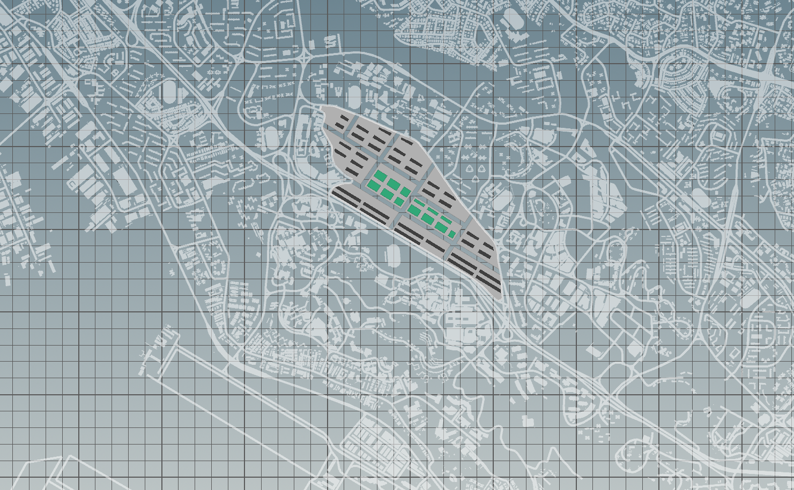
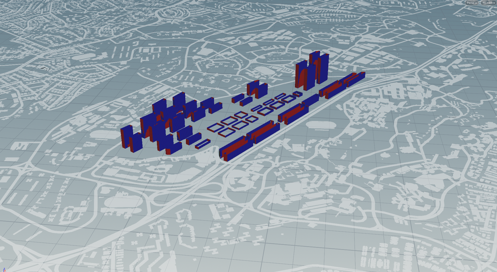
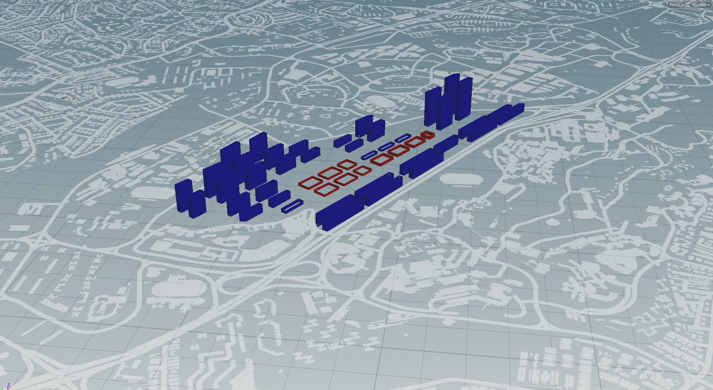
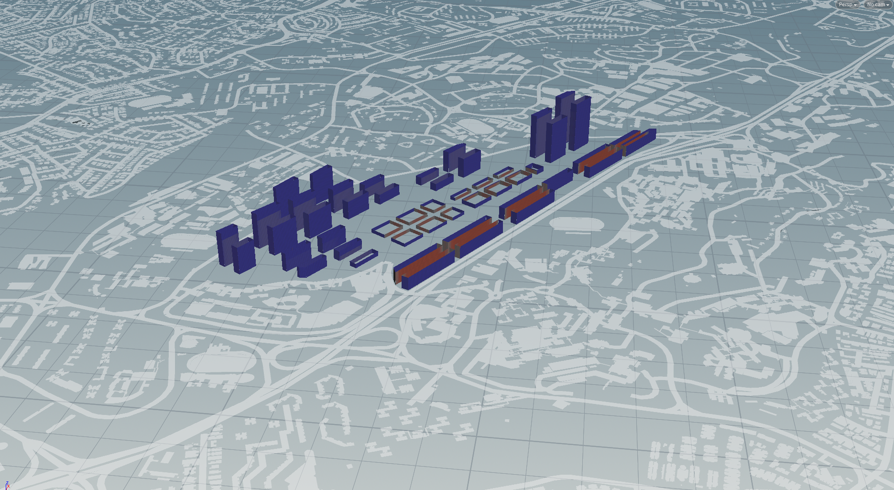
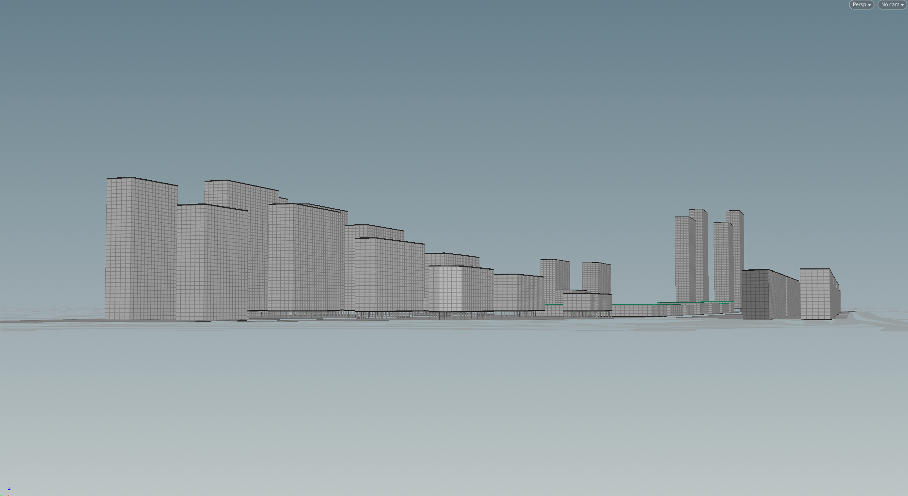
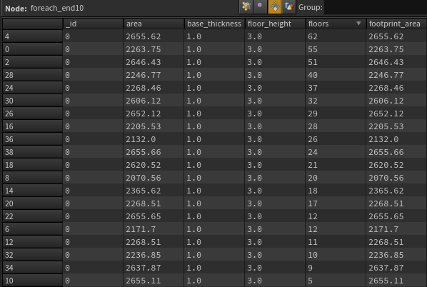

# Iteration 2

The immediate response to the first iteration is to switch the orientation of the residential blocks, by a 90 degree rotation. This will all the long face of each blocks to attain a north-south orientation instead.

An instant improvement in the readings for good windows can be observed. A balance between daylight received and solar exposure is attained to ensure a pleasant living environment for the dwelling units. 

Density of the residential units is varied to respond to proximity to the train stations, namely One - North and Buona Vista station. Such will allow residential blocks to vary in height and create a more dynamic skyline. 

Another change made in response to the previous iteration was to reduce the footprint of the industrial and commercial blocks. As expected, the satisfactory passive ratios for attained, resulting in more efficient block types for the industrial zone. A central boulevard was inserted into the commercial area along with the division of each block into 2. Single storey commercial blocks are raised to create ground level arcades to accommodate more communal activities and better engage the community

Individual blocks are sensitively spaced apart to ensure sufficient views for each unit. This is reflected in the visualisation of view factors, with very minimal windows reflecting a non satisfactory result.

In order to better improve the living environment, large residential blocks are raised to create void decks. These void decks grant porosity in the ground level and also serve as a space for communal activities. Visual porosity increases the connectivity on the ground level, facilitating encouraging movement.

However, there are still observations made that suggests more room for improvement. A most prominent would be the towering heights of the residential blocks. Though displaying optimum results in terms of building performance, the height of taller blocks range from 10 - 62 storeys. In order to produce for realistic projections, theres is a need to revise the distribution of the residential units.

