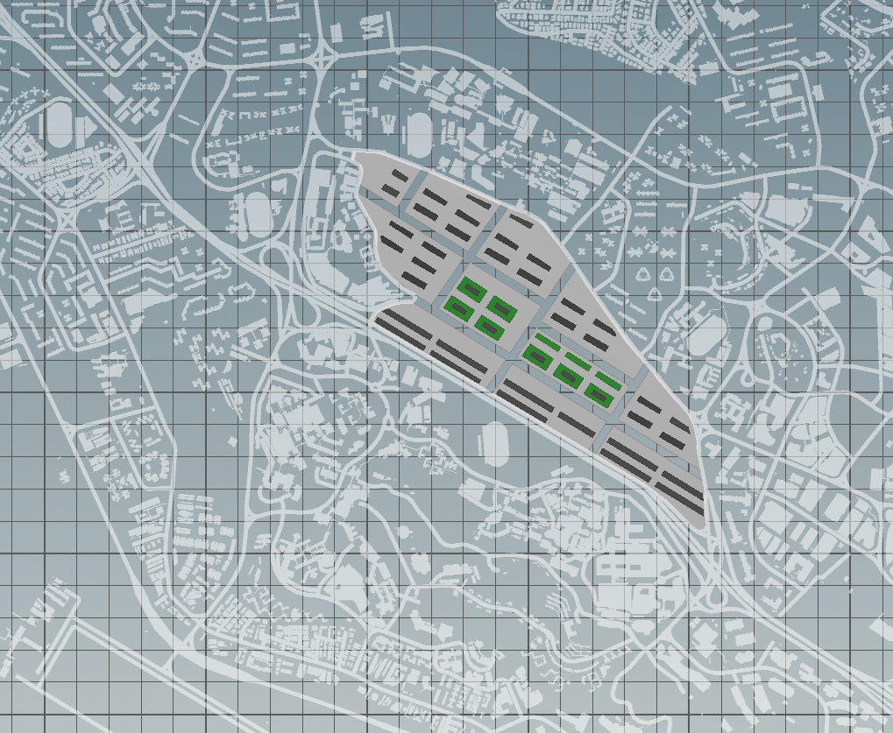
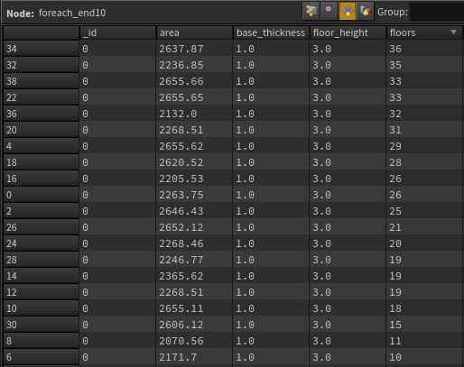
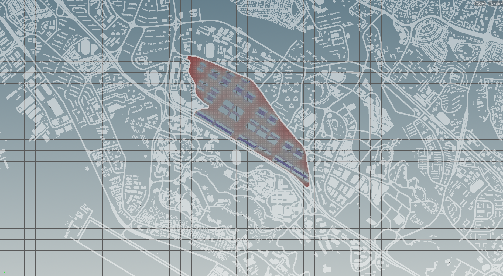
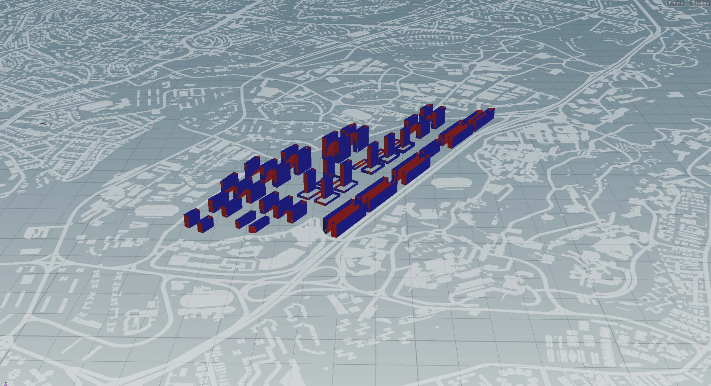
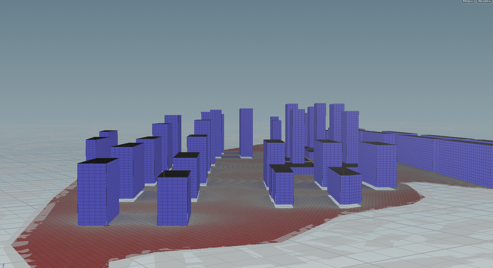
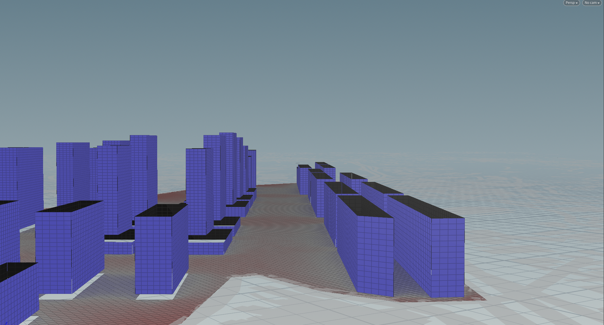
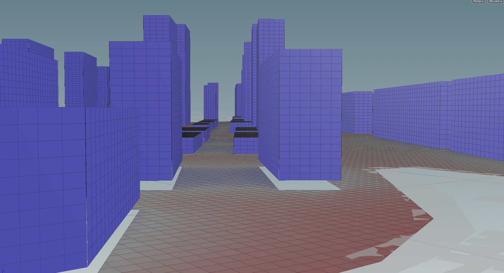

# Iteration 3

The final design attempt focuses on the redistribution of the residential units, specifically across the commercial zones to create podium type blocks, with the residential units sitting above commercial blocks.

A reduction in building height can be observed with the tallest only having 36 floors. This reflects a more even distribution of dwelling units across the site to prevent congestion and concentration of human activities.

An analysis of solar exposure on the streets was also conducted to access the ability of streets to support pedestrian activity and comfort levels of walking along the streets.

The results reflect a coherence of cool and hot zones with the designation of portions of streets dedicated to support pedestrian movement. 
In this final iteration, a high percentage of buildings and their windows have achieved the expected optimum results in terms of view factor and passive ratio. A balance between solar and daylight exposure was also maintained.

Above all, a visualisation of the street analysis compliments the design focus on crossroads and creation of boulevards as a design strategy to create pleasant neighborhoods by reflecting the shaded environment created as a result of the precise layout of the surrounding blocks.

