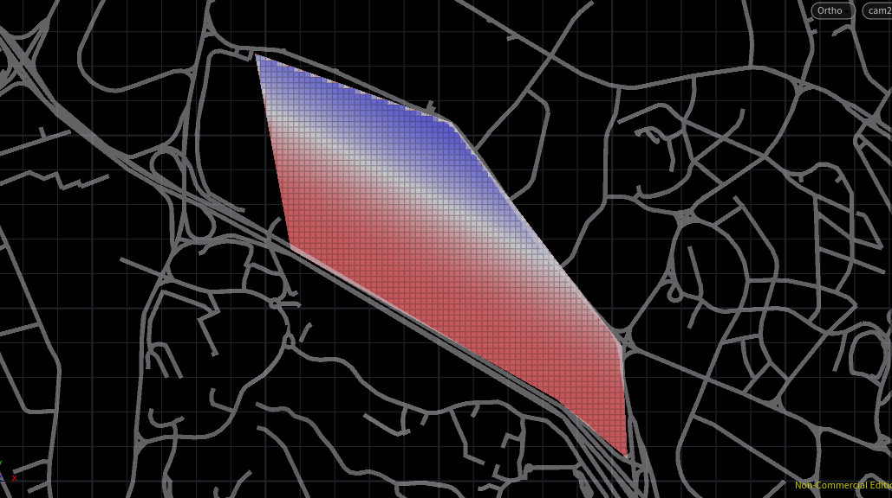
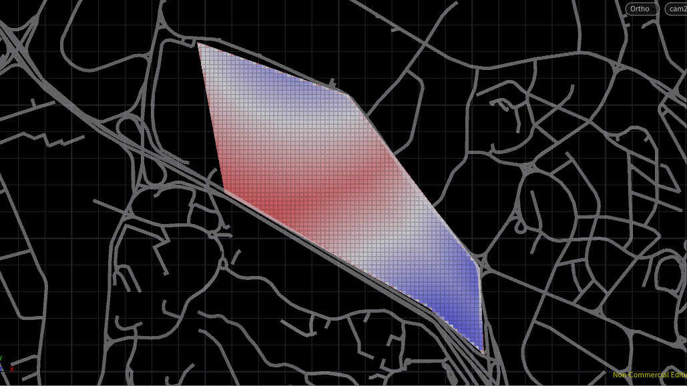
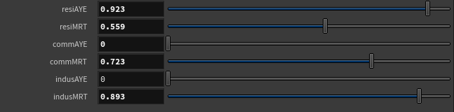

# Introduction

This project looks at the hypothetical redevelopment of a site which is situated along the Ayer Rajah Expressway (AYE) and sandwiched between the University Town of National University of Singapore and One North Research and Business Park.

## Relative Densities
Across the different iterations, residential, commercial, and industrial plots were distributed across the site and their relative densities were computed based on attractor and repellent curves and points.
  

Basic site considerations such as proximity to Mass Rapid Transit (MRT) stations and AYE are part of these computations. AYE served as a repellent curve due to the noise created from the high volume of cars. MRT stations on the other hand served as attractor points for the convenience it brings. The coloured grid highlights favoured areas of each index (AYE and MRT) respectively, where blue indicates a better site.
  

To aid decision making for the designer, sliders are created, and each index could be weighted with a multiplier to indicate the index’s importance to a program. In this short example, being away from AYE is most important for residential programs as compared to industrial and commercial programs.
  
In iteration 2 and 3, several other weights were added to the density computation in the interest of creating a more variable skyline. A rundown of the weights is included in each Chapter.

## Environment Evaluation
Building types are evaluated based on the following run-down:
* For good windows, 
  * view_threshold > 0.4
  * daylight_threshold > 0.1
  * solar_threshold < 0.2
* For good building thresholds, 
  * passive_threshold > 0.5
  * good_window_threshold > 0.1
