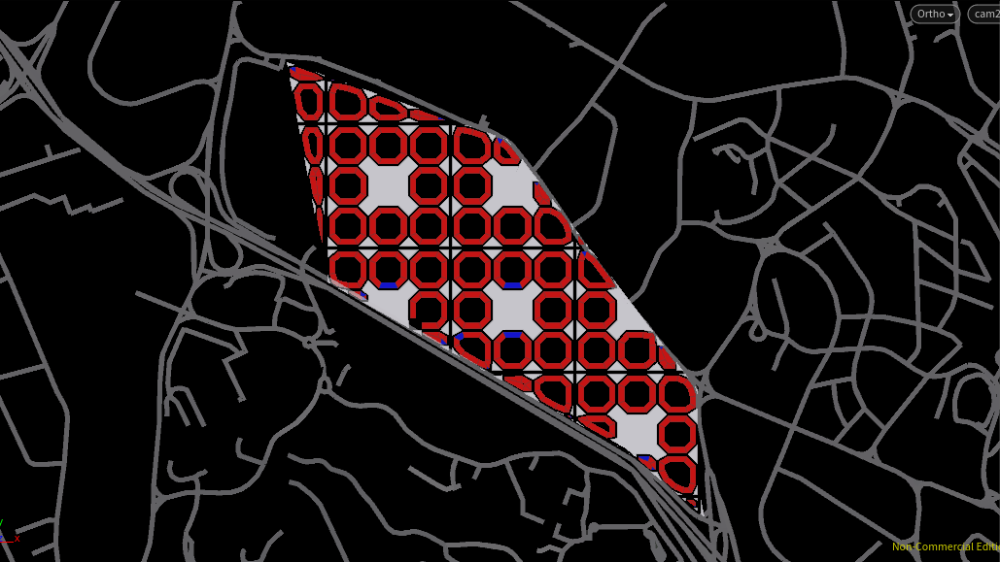
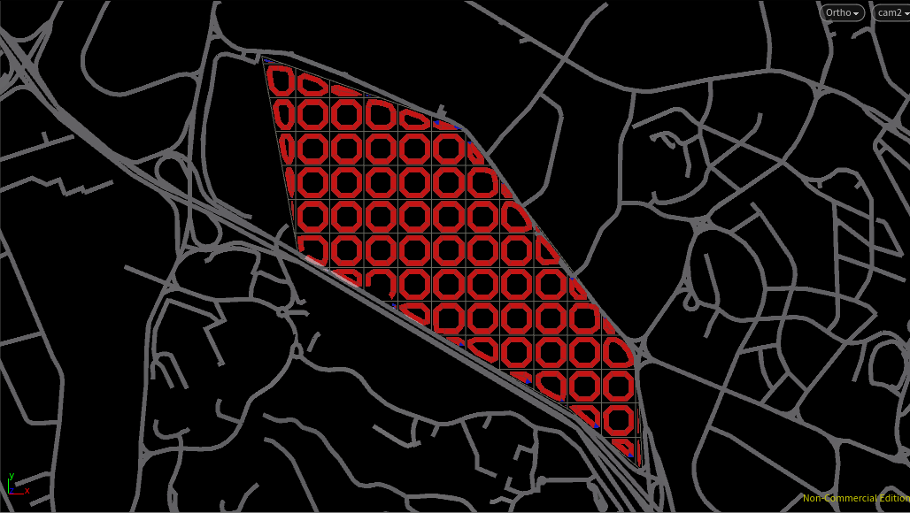
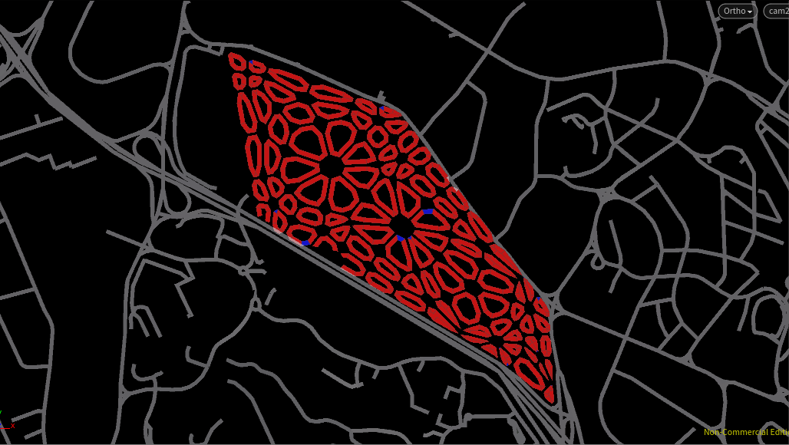
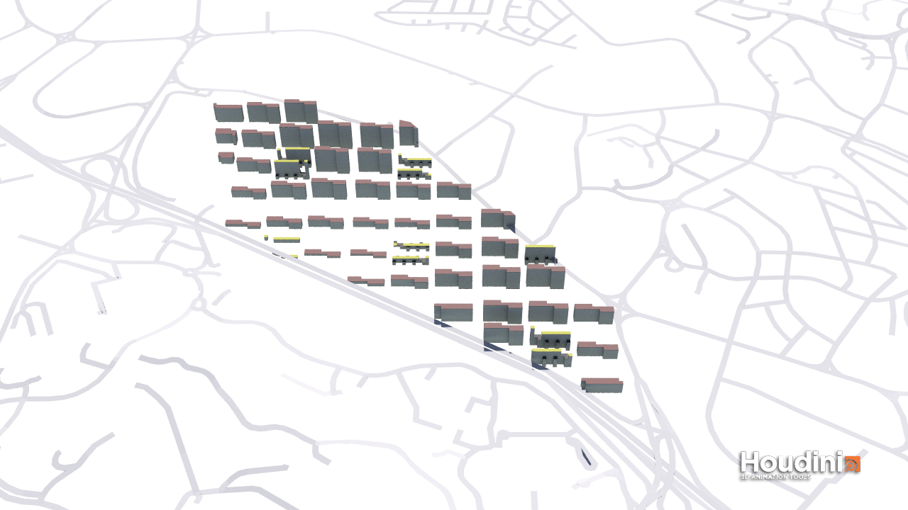
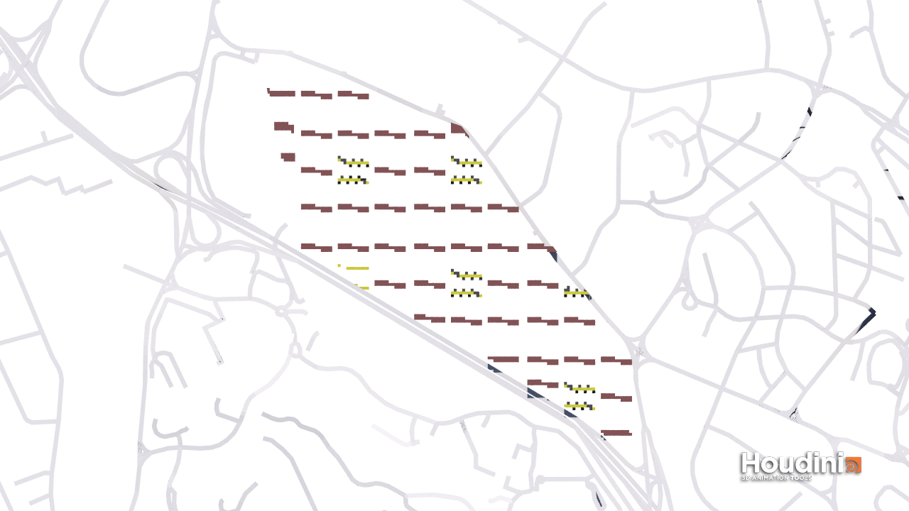
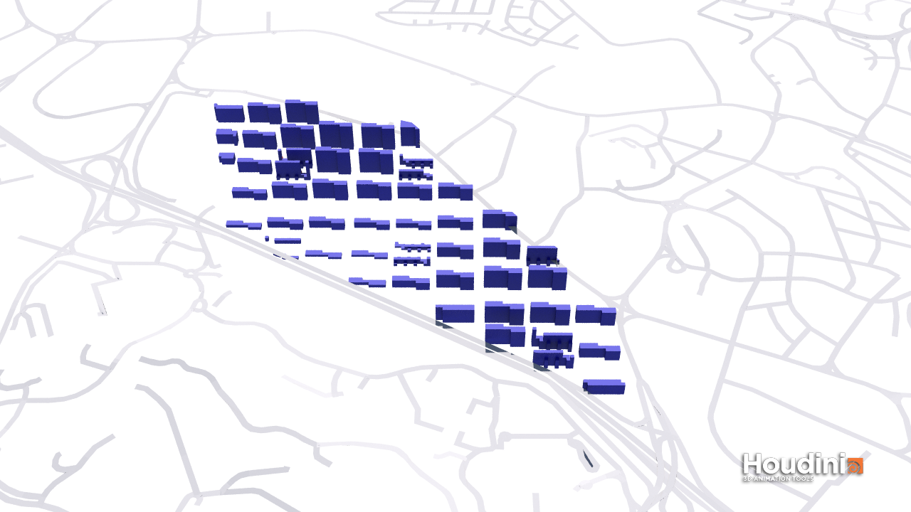
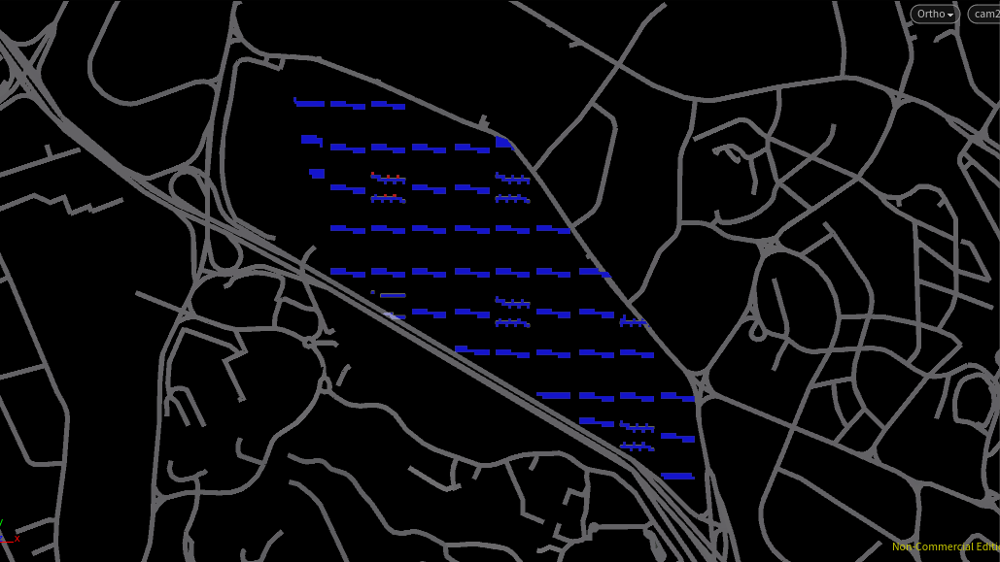

# Iteration 1a: Tests

In this iteration, regular and irregular Voronoi grid coupled with different building types were tested extensively to understand the environmental implications of each strategy should they be chosen.
The following are a quick run through of the various types tested

a.	Percentage Good Windows: 10.9918
b.	Percentage Good VF: 51.6432
c.	Percentage Good SF: 85.655
d.	Percentage Good PR: 100
e.	Percentage Good DF: 47.0903
f.	Percentage Good Building: 5.28736

a.	Percentage Good Windows: 8.85619
b.	Percentage Good VF: 42.6957
c.	Percentage Good SF: 87.5468
d.	Percentage Good PR: 100
e.	Percentage Good DF: 42.0251
f.	Percentage Good Building: 4.77002

a.	Percentage Good Windows: 8.85619
b.	Percentage Good VF: 42.6957
c.	Percentage Good SF: 87.5468
d.	Percentage Good PR: 100
e.	Percentage Good DF: 42.0251
f.	Percentage Good Building: 4.77002

## Evaluation
Although voronoi grid introduces more turns and consequently a slightly more interesting street scape, it returns less value to this simulation when buildings are built to the edge of the plot. Daylight, view, and solar factor are all too low.

# Iteration 1b: Instant Gratification

Conceptually, Commercial and Industrial Buildings were mixed to possibly work as clean tech industrial towers with a possible mix of retail. Residential buildings are all made to be within walking distance of a clean tech tower. This is to simulate a city for clean tech workers.

a.	Percentage Good Windows: 81.8129
b.	Percentage Good VF: 96.5413
c.	Percentage Good SF: 89.2467
d.	Percentage Good PR: 100
e.	Percentage Good DF: 92.7323
f.	Percentage Good Building: 95.9677

These 32-storey (max), N-S facing towers prove to be effective in achieving good environment results. They allow the ground to be completely free up for activities and green space.

However, they look awfully boring. 

In the subsequent iterations, I try to deviate from a uniform urban grain and rigid distribution of similar types.
