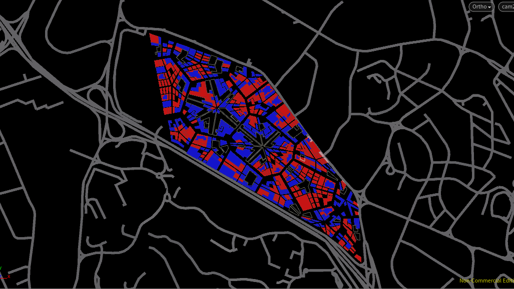

# Iteration 2: “Organic” City – Mixed Urban Grain; Plot function determined by Area
In this iteration, Plots were divided into four or more until each plot reaches a certain size. Irregular and small plots were merged. Larger Parks, Industrial, and Mixed Residential-Commercial Plots were identified first, followed by other more fine-grained commercial, residential, and Industrial plots. Civic buildings were introduced into this iteration for the left-over small plots scattered around the site. They will subsequently serve as a density attractor for residential plots.

## Set-up

Interestingly, the resulting program distribution created radial parks, commercial, and residential plots around the site – each with a mixed scatter of other programs. 

  
### Weighting Relative Density Calculations
To control the favourable conditions for each program, parameters are established as weights for the calculation of the relative densities
* Industrial
** Proximity to AYE (reversed): 0.015
** Proximity to MRT: 0.893
**	Proximity to Central Points: 0.247
**	Proximity to Arterial Roads (reversed): 0.013
**	Proximity to Parks: 0.206
**	Proximity to Civic Buildings: 0.015
*	Commercial
**	Proximity to AYE (reversed): 0.015
**	Proximity to MRT: 0.514
**	Proximity to Central Points: 1
**	Proximity to Arterial Roads (reversed):0.013
**	Proximity to Parks: 0.765
**	Proximity to Civic Buildings: 0.021
*	Residential
**	Proximity to AYE (reversed): 1
**	Proximity to MRT: 1
**	Proximity to Central Points: 0.232
**	Proximity to Arterial Roads (reversed): 0.869
**	Proximity to Parks: 1
**	Proximity to Civic Buildings: 0.807

### Relative Density Calculations were weighted as above to achieve
*	Denser Industrial and Commercial Buildings near AYE and Arterial Roads – Inverse for Residential due to noise
*	Industrial and Residential with higher proximity to the MRT to cater to the working class
*	Commercial with high proximity to the city centres
*	Commercial and Residential with high proximity to the Parks
*	Denser Residential where it is near a civic building

### Resulting Relative Densities
The more favourable a plot is for the program, the denser the plot is – highlighted in blue in the following images.

Relative Density for Industrial

Relative Density for Commercial

Relative Density for Residential  

### Floor Area/Head
The following floor area/head was used to generate the city massing. To accommodate the new civic program, floor area/head for residential was reduced.
* Industrial: 5sqm
*	Commercial: 8sqm
*	Residential: 20sqm
*	Civic: 2sqm

### Result
The Relative Densities were compensated with its respective footprint area before finally computing number of floors required for 75 000 people.

## Environment Evaluation 

* Percentage Good Windows: 20.7277
*	Percentage Good VF: 38.2298
*	Percentage Good SF: 86.1899
*	Percentage Good PR: 96.9172
*	Percentage Good DF: 40.6992
*	Percentage Good Building: 48.9831
  
In this iteration, larger building masses serve as landmarks in the sea of small scaled buildings. There is a good distribution of programs around and the varying street width and urban grain creates a overall messy but interesting urban scape. However, some street width - height ratio is too low, resulting in poor urban spaces and poor environment evaluated buildings.
