# Iteration 3.0: “Planned” City – Plot function determined by Neighbourhood
In this iteration, a neighbourhood “type” rule was established and used to generate the city. Conceptually, it was derived based on the conventional functional attraction to circulation roads. 

## Set-up
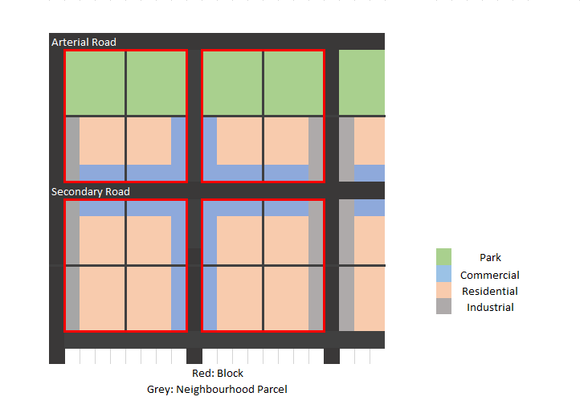 
Coming from Iteration 2 where a green boulevard was chanced upon, instead in this iteration, a central park was first manually created to join the two city centre nodes together. Arterial roads which circulate in from the site’s surroundings carve out the remaining parcels while industrial buildings line them. Individual parcels are then subdivided to create smaller blocks. Commercial buildings line these new secondary roads and the rest were made residential. Residential blocks which were too deep were made into courtyard towers. Hence, each neighbourhood parcel within a block exhibits a unique character which is then used to compute its relative density
  
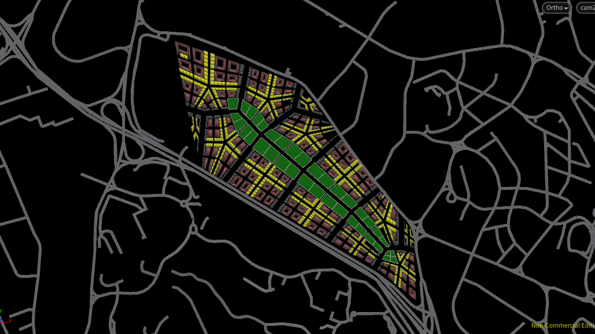 
Resulting Program Distribution

### Weighting Relative Density Calculations
The same relative proximity parameters which allowed me to control the favourable conditions for each program was reused from iteration 2.  Each parameter is used to weigh the proximity score.
* Industrial
  * Proximity to AYE (reversed): 0.015
  * Proximity to MRT: 0.893
  *	Proximity to Central Points: 0.247
  *	Proximity to Arterial Roads (reversed): 0.013
  *	Proximity to Parks: 0.206
*	Commercial
  *	Proximity to AYE (reversed): 0.015
  *	Proximity to MRT: 0.514
  *	Proximity to Central Points: 1
  *	Proximity to Arterial Roads (reversed):0.013
  *	Proximity to Parks: 0.765
*	Residential
  *	Proximity to AYE (reversed): 1
  *	Proximity to MRT: 1
  *	Proximity to Central Points: 0.232
  *	Proximity to Arterial Roads (reversed): 0.869
  *	Proximity to Parks: 1

### Relative Density Calculations were weighted as above to achieve
*	Denser Industrial and Commercial Buildings near AYE and Arterial Roads – Inverse for Residential due to noise
*	Industrial and Residential with higher proximity to the MRT to cater to the working class
*	Commercial with high proximity to the city centres
*	Commercial and Residential with high proximity to the Parks

### Resulting Relative Densities
The more favourable a plot is for the program, the denser the plot is – highlighted in blue in the following images.
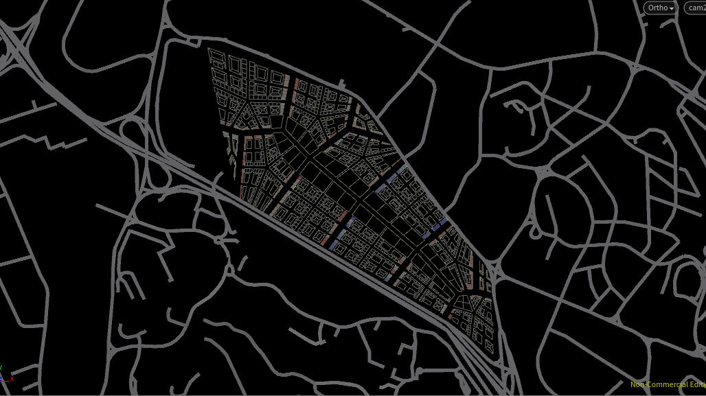
Relative Density for Industrial
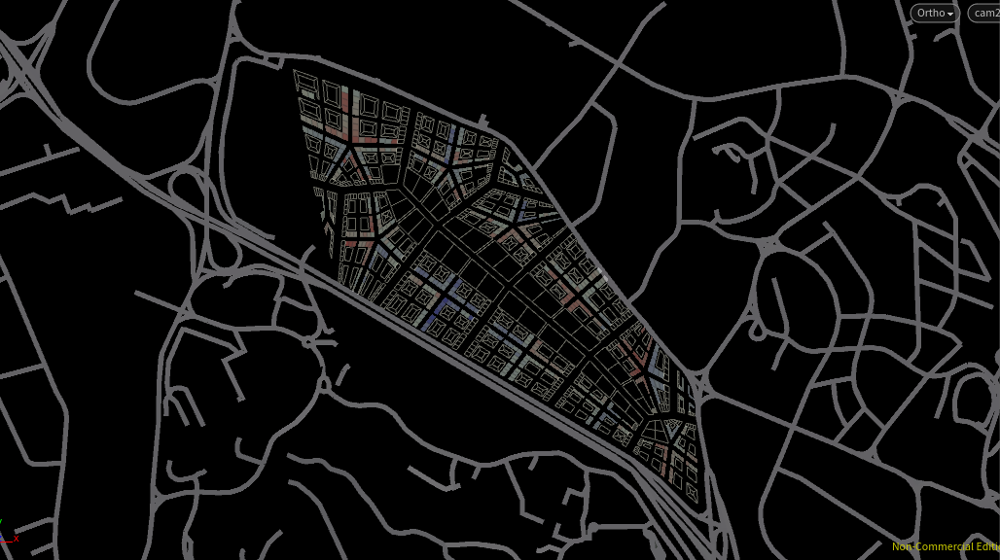
Relative Density for Commercial
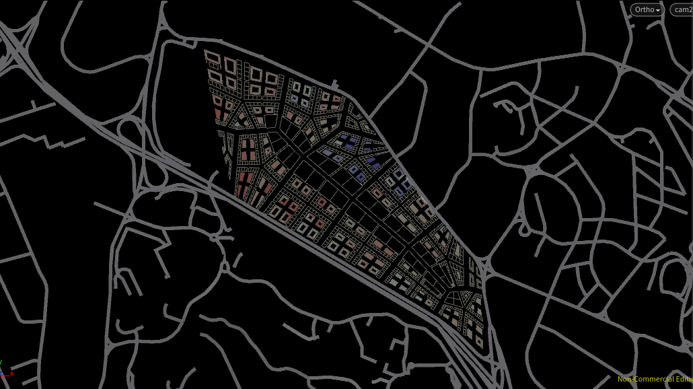
Relative Density for Residential  

### Floor Area/Head
In this iteration, civic buildings were removed, and the following floor area/head was used to generate the city massing
* Industrial: 5sqm
*	Commercial: 8sqm
*	Residential: 22sqm

### Result
The Relative Densities were compensated with its respective footprint area before finally computing number of floors required for 75 000 people.
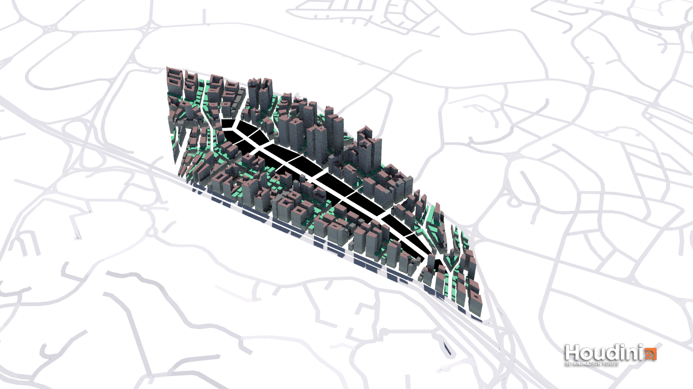

## Environment Evaluation 
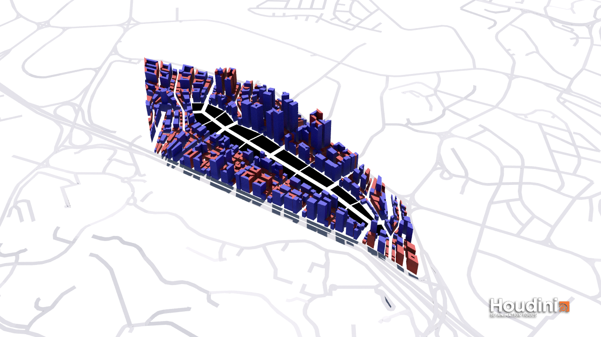
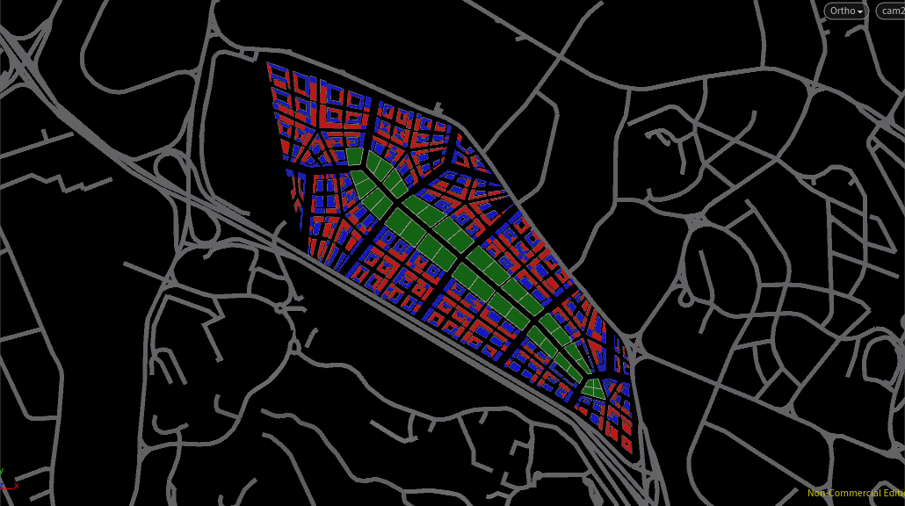
*	Percentage Good Windows: 15.4969
*	Percentage Good VF: 28.4127
*	Percentage Good SF: 92.039
*	Percentage Good PR: 100
*	Percentage Good DF: 26.3796
*	Percentage Good Building: 46.8137
  
Poor results were expected from the closely packed layout as daylight and view factors are low. Most good buildings were the industrial buildings which fronts the wider arterial roads and the tall residential buildings which increases its good-window to floor area ratio. Better scores may be achieved if the secondary roads which the commercial plots front are widened, and the buildings were rotated to be more North-South Facing.

## Iteration 3.1a: Distributed Parks
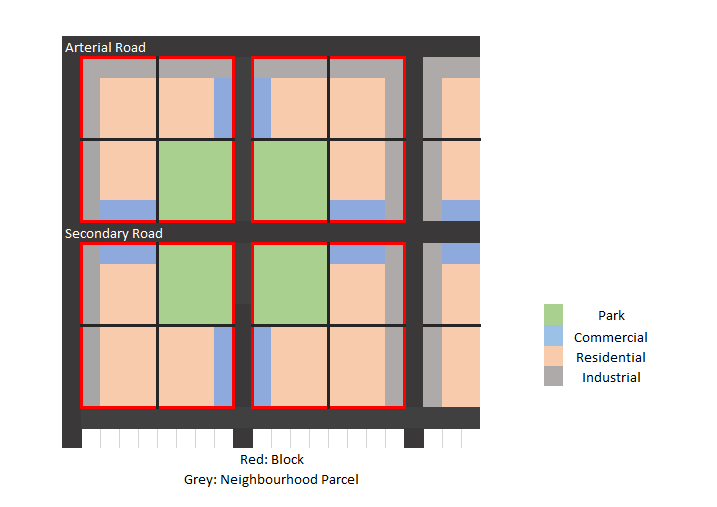 
Because setting back the building footprints only increases the overall height and neighbouring buildings still effectively block one another, in this iteration, instead of predefining a central park, the park space is distributed around the city to reduce the built density around the perimeter of the city. Procedurally, each subdivided parcel of a block sets its inner-most plot as a park.
  
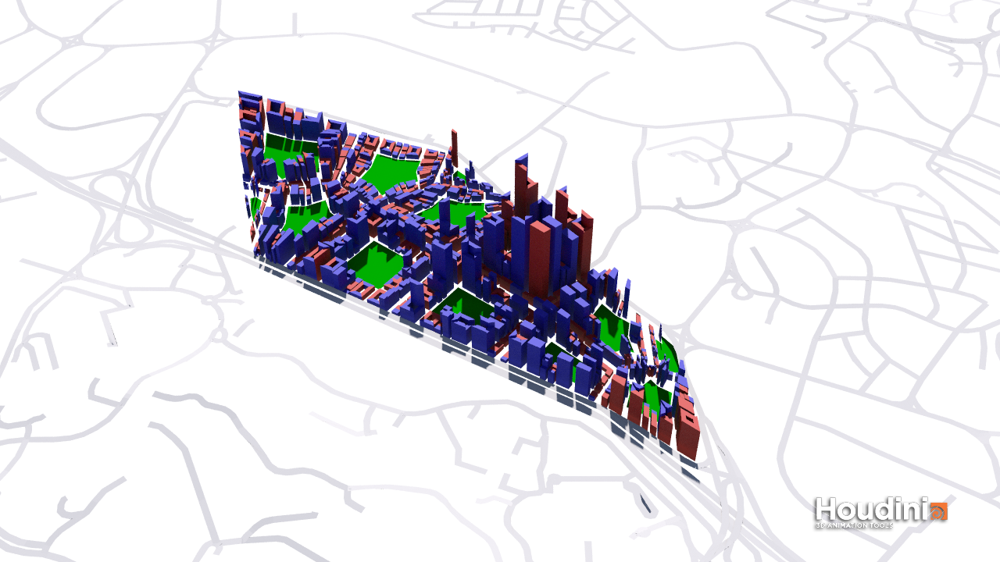 
Running through environment evaluation, the overall percentage of Good Buildings improved slightly. This is expected as most buildings now have at least one side facing a large open space, which would greatly increase its environment score. With that pointed out, I had initially left same typed buildings distinct to generate a more interesting skyline and having more buildings just mean a lower overall environment score (Buildings meant to be read as a whole are evaluated separately, unnecessarily reducing the evaluation score. Merging similar type buildings would certainly increase the overall score by a margin.
### Rundown of evaluation scores
*	Percentage Good Windows: 15.5866
*	Percentage Good VF: 31.2169
*	Percentage Good SF: 89.6001
*	Percentage Good PR: 100
*	Percentage Good DF: 28.8877
*	Percentage Good Building: 49.1537

## Iteration 3.1b: Merged Buildings
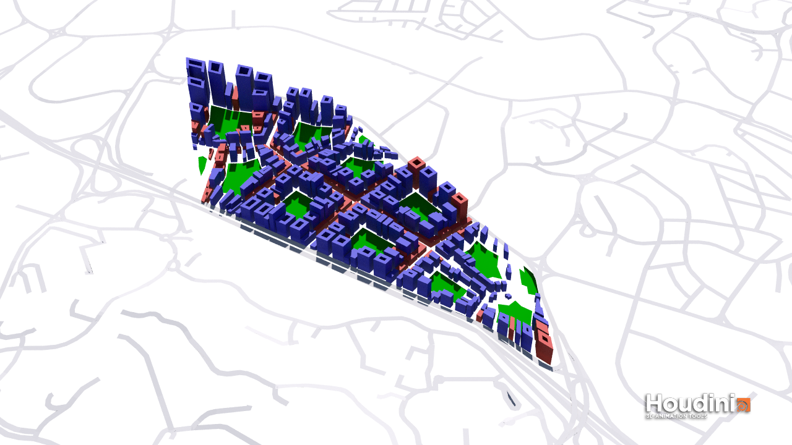 
Same typed neighbouring buildings are now merged and evaluated as a single building. Care was taken to ensure that each building would still satisfy the passive ratio evaluation and no deep buildings would be created. As such, the current "good building" evaluation scores top my past evaluations (except iteration 1) with a score of 71.3793%
### Rundown of evaluation scores
*	Percentage Good Windows: 23.6584
*	Percentage Good VF: 40.3029
*	Percentage Good SF: 88.7635
*	Percentage Good PR: 100
*	Percentage Good DF: 39.9497
*	Percentage Good Building: 71.3793
