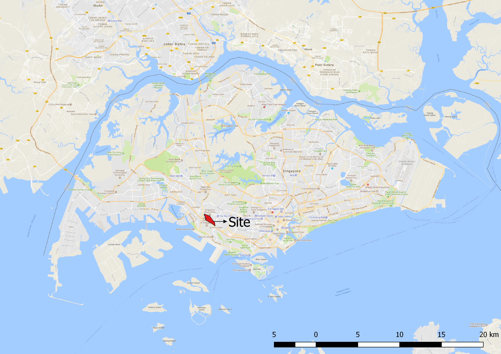
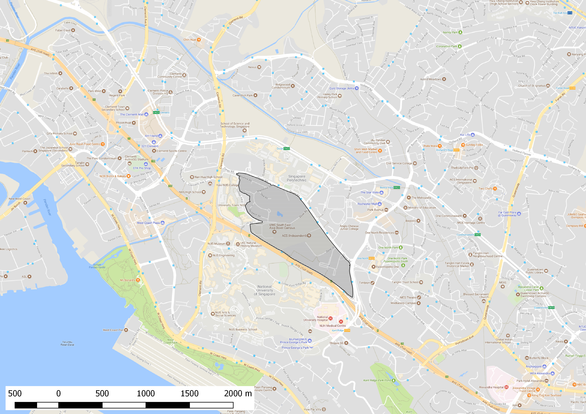
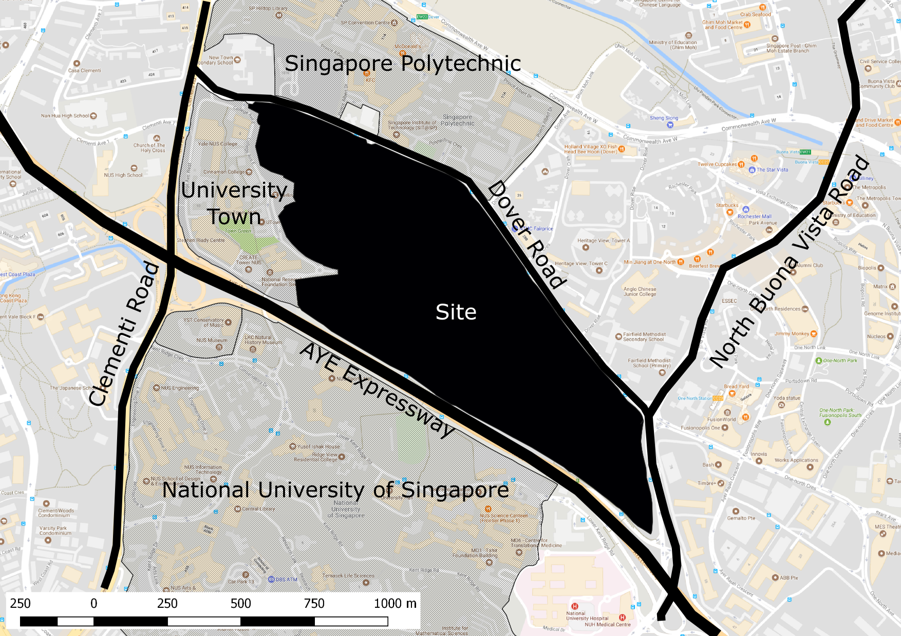
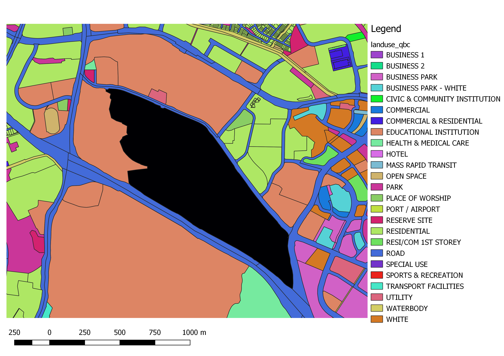
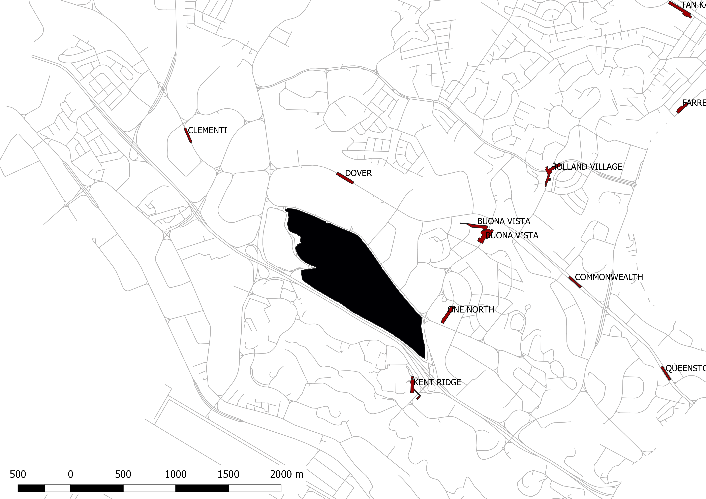

# Site Analysis

by CHEN Kian Wee

## Geospatial Data

In order to perform site analysis, geospatial data was downloaded from data.gov.sg website. The "Master Plan 2014 Land Use" contains valuable information such as:

* Geometry of the plots
* Gross Plot Ratio \(GPR\)
* Land Use Type

Building footprints were obtained from the "Master Plan 2014 Building" data available on the same portal and from Open Street Map website. 

## Basic 2D Site Analysis

With the open geospatial data obtained, we can quickly perform basic site analysis on our site. The images below are generated from using GIS software with minimal graphic manipulation \(Fig. 1-4\). As we are interested in assessing the accessibility of the site, the location of all the MRT stations around the site is obtained from the open data portal. In addition, we have also obtained the road network data from SG One Map. Fig. 5 illustrates the accessibility of the site.

*Fig. 1: Location map of the site*

*Fig. 2: Site map of the Project@Dover Road*

*Fig. 3: Annotated site map of the Project@Dover Road*

*Fig. 4: Land use analysis of the site*

*Fig. 5: Roads and MRT network around the site*

