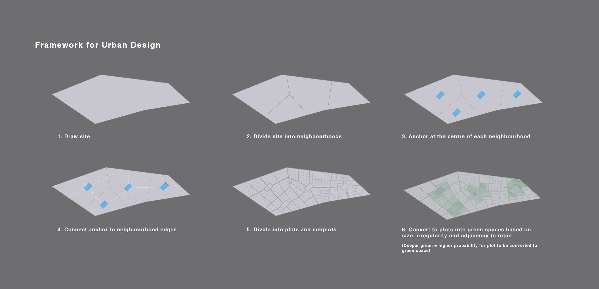

# Introduction

In this prototyping exercise, I attempted to meet several design goals in order to generate the urban design. The city would need to:
1.	Consist of several identifiable neighbourhoods with a distinct focal point
2.	Contribute a substantial amount of green space that would create pleasant public spaces
3.	Contain sufficient space for residences, shops, clean-tech industries and offices.
4.	Liveable.

These design goals could be manifested through applying a process of steps onto the site:
1.	Draw site boundary.
2.	The site is divided into 4 neighbourhoods. 
3.	At the centre of each neighbourhood is the focal point of the neighbourhood, an anchor that might draw visitors into the respective neighbourhood; in this exercise, this anchor was categorised as a circular park in Iteration 1, and a shopping mall in Iteration 2. 
4.	Each anchor is connected its adjacent counterpart by major roads to link together the neighbourhoods, and 
5.	Each anchor is connected to the edge of the neighbourhood to link the neighbourhood to outside of the site.
6.	Placing these major roads creates the major plots on the site. These major plots are then subdivided to form smaller plots
7.	To create usable public spaces, select plots around each shopping mall are turned into green spaces (a numerical attribute was given to each plot to determine whether it would be converted into a green space, based on its size, irregularity (number of edges) and adjacency to shopping malls). 

This same framework will then later be used to generate different iterations of the urban design with the exception of Iteration 1.
