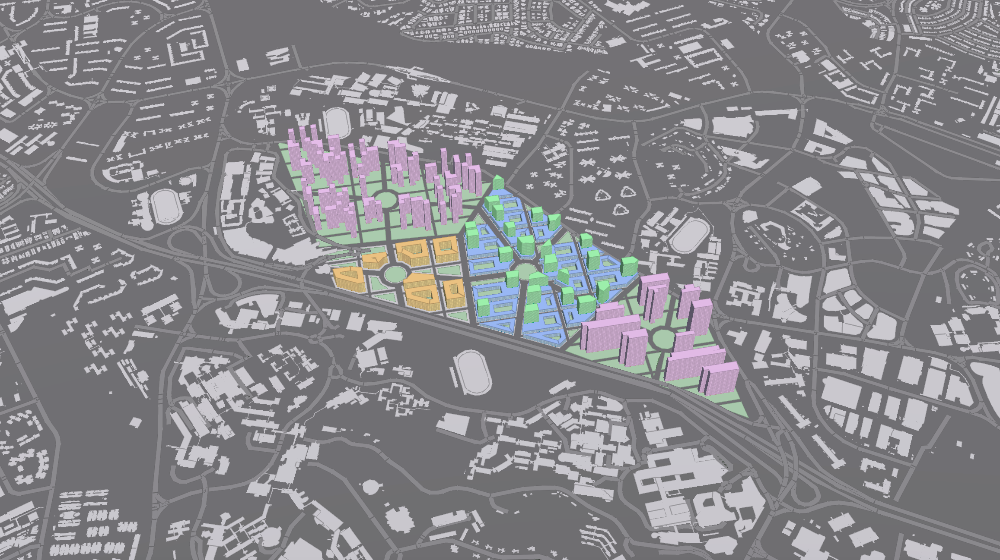

# Iteration 1

Iteration 1 was conceived as a test bed for different building typologies within the site. Each neighbourhood was divided into its own specialised programme (residential, industrial and commercial). The typology of each programme would be applied consistently throughout each neighbourhood, based on existing typologies of the respective programme. Through varying the typology, we can determine the effectiveness of each in terms of the qualitative environmental analysis (solar radiation, daylighting and views). 

(image of resi 1 typology)
Residential typology 1 was developed by dividing the plots into a 15-metre2 grid; within each plot, peripheral subdivisions would be systematically removed in order to create a single long orthogonal residential tower sitting above each plot of greenery. 

(image of resi 2 typology)
Residential typology 2 was developed by dividing the predetermined plots, but into a 20 metre squared grid. Within each plot, squares would be randomly removed in order to create a random arrangement of thin residential towers densely clustered together. 

(image of industrial typology)
A courtyard typology was used under the assumption that the typical deep-slab industrial building typology would be unable to meet the minimum daylighting requirements of the subsequent evaluation.

(image of commercial typology)
The commercial typology consists of a 1-4 floor podium of shops to create street level engagement with pedestrians, and a tower block of offices sitting above the podium. A courtyard is created to bring additional daylight into the deep slab podium.

# Evaluation

(image of sky exposure analysis – plan view)

__Residential 1__
Percentage of good buildings: 100.0% (10/10 good buildings)
Unexpectedly, the long north-south facing blocks fare well in terms of the environmental evaluation. East-west facing windows however would always score poorly due to excess solar radiation. 

Residential 2
Percentage of good buildings: 97.6% (40/41 good buildings)
The random but orthogonal grid proved to successfully generate blocks whose north-south faces created an excellent proportion of windows. It is interesting to note that the moderately dense clustering arrangement of the residential towers was able to mitigate the effects of excessive solar radiation as seen in Residential Typology 1; however certain highly dense clusters would reduce the admission of sunlight, that its daylighting would be deemed insufficient at lower portions of the building. Likewise, the arrangement results in poorer sky exposure within the neighbourhood. Overall, 97.6% of this building typology would be evaluated as good by the balancing of these factors.

Industrial
Percentage of good buildings: 0.0% (0/7 good buildings)
(image of industrial good windows)
The addition of a courtyard to increase solar penetration into the industrial building typology appears to have failed, given that the moderate height of industrial buildings at that density (7-9 floors) prevents sunlight from entering into the courtyard windows other than the highest 3-4 floors. Additionally, courtyards frequently compromise on the view factor. These factors render most courtyard windows to be bad windows because of poor daylighting or poor views.

Commercial
Percentage of good buildings: 50.0% (13/26 good buildings)
(image of comm view factor)
Analysis shows that the reason for Commercial buildings being bad is the presence of the podium; office towers always prove to be good buildings, given their largely orthogonal and long north-south faces. The courtyard podiums of the commercial typology, unlike the industrial courtyards, were sufficiently low-rise (2-4 floors) to enable the penetration of sunlight to every floor, the courtyards also allowing a substantial amount of sky exposure for its green public spaces within. The podiums identified to be bad were consequent of poor views in trying to achieve an engaging and intimate street level with podiums pulled close together on both sides of the road.
