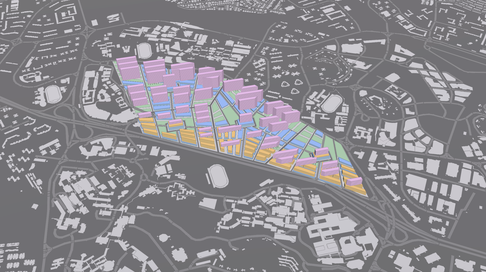
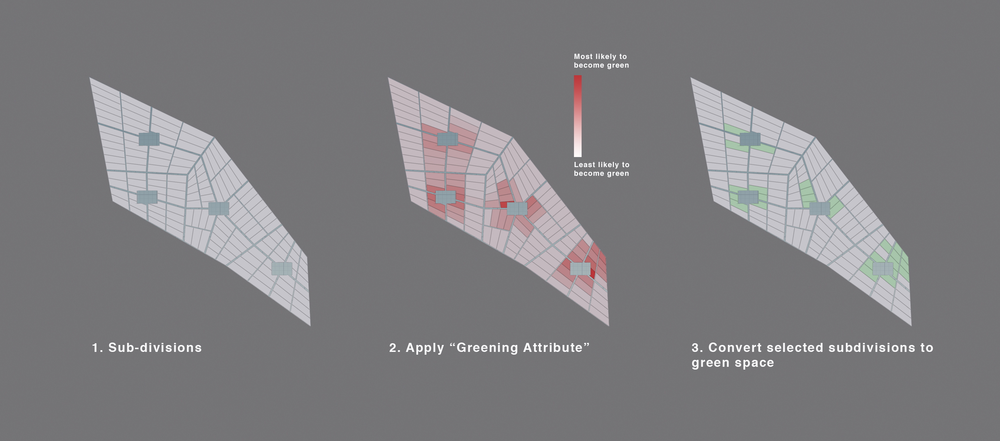
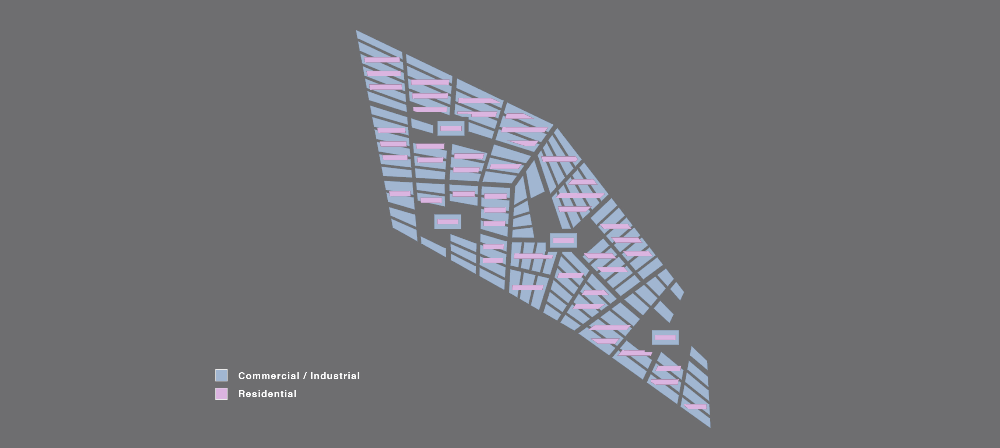
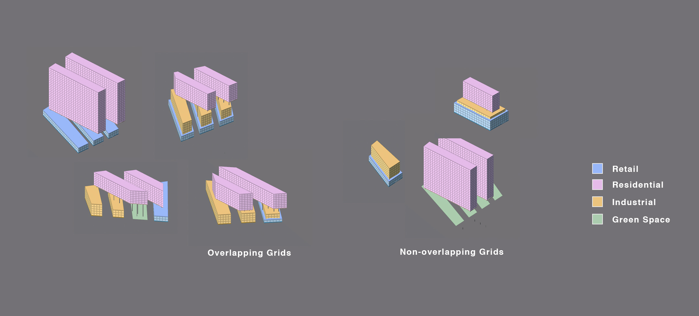

# Iteration 2

Iteration 2 envisions a new urban typology in which the grain of the retail and industrial that follow the road system overlaps and juxtaposes with the residential blocks above them. Shops sprawl across the street level, each taking up a subdivided plot within the neighbourhood, thereby maximising street level engagement and becoming denser at the centre of the neighbourhood where shopping malls are located. Clean-tech industrial blocks are pushed above these shops, where casual pedestrians have no need to engage with them. 

A "Greening Attribute" is applied to each plot, that determines which particular plots will be converted into green spaces determined by its size, irregularity and adjacency to a shopping centre.  

The distribution of programmes across the site would vary for each programme - residences are located more strongly away from the AYE to the south and closer to MRTs; Industries are located closer to the AYE; and Retail would be more strongly located closer to the neighbourhood malls.

Residences are conceived as orthogonal blocks cut from larger neighbourhood subplots, capitalising on the successful form of the in the North-South facing residential blocks in Iteration 1. Residences are shifted far above the shop and industrial blocks, even spanning across multiple blocks of shops. This creates varying volumetric expansions on the ground level as residential blocks overhang from shops and industrial blocks of varying heights, thereby creating a a diverse and unique street quality that varies with the programmes around it.

__Iteration 2 Evaluation__

As in Iteration 1, the north-south facing residential blocks were successful in terms of the environmental analysis, where 100.0% of residential blocks were deemed good buildings. Consequential to the arrangement of this mixed-use typology, the industrial and shop blocks on the lower levels received insufficient daylighting due to the residential blocks above them. 

Unexpectedly, the presence of large residential blocks above the streetscape creates areas in which sky exposure becomes exceedingly low, especially in narrower streets. Doing so does leave much open green space available for public use, it which its surroundings and therefore exposure to the sky are unobstructed by buildings. 

Further prototyping needs to be done to achieve both the same quality of space and quantifiable environmental objectives.
 
