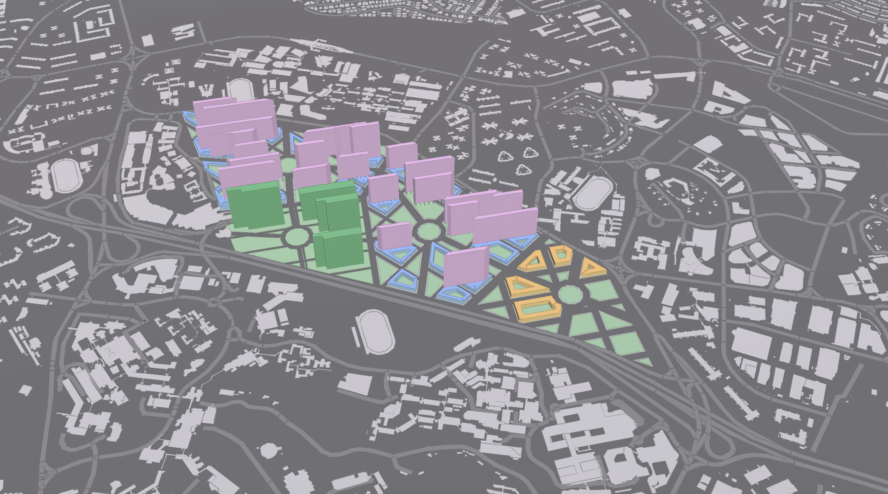
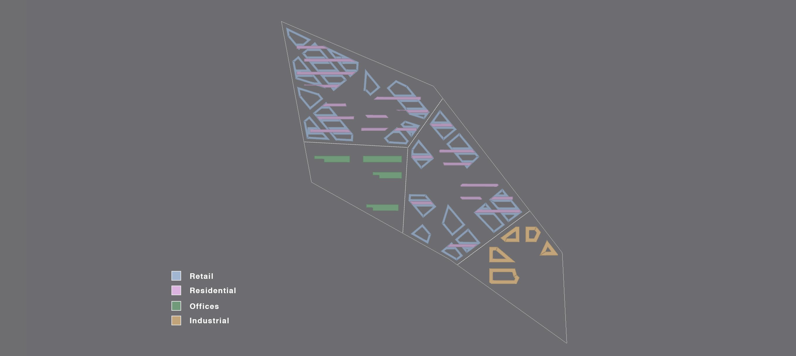
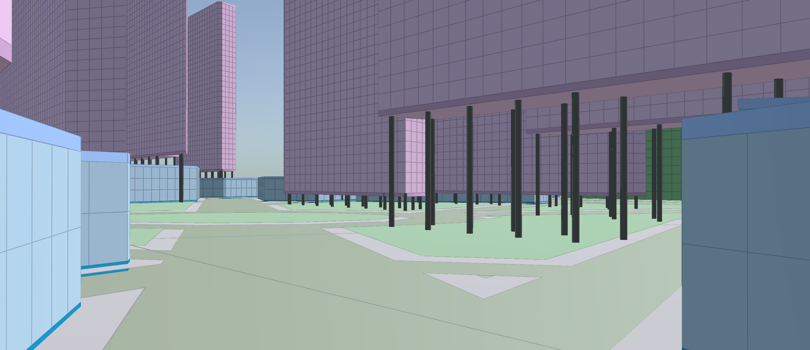
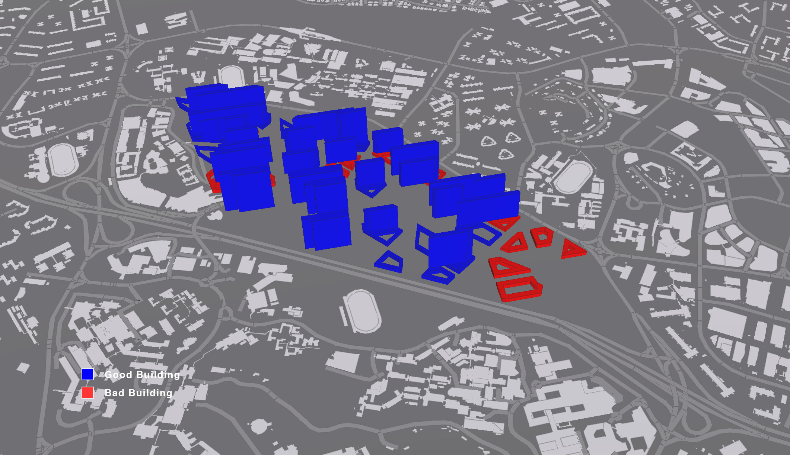
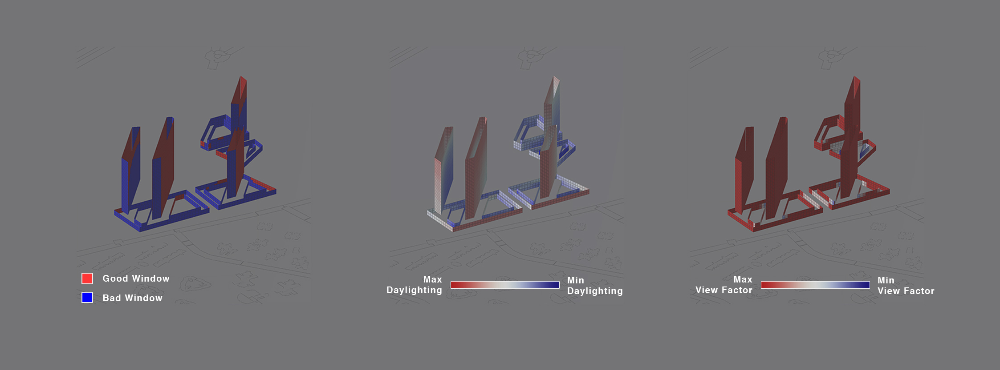
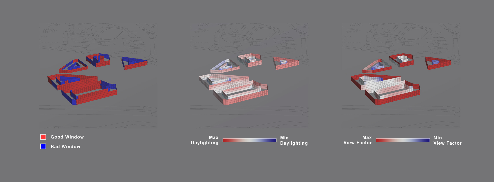

# Iteration 3

Iteration 3 combines the results of both Iteration 1 and 2 to create a mix of reassigned building typologies, largely successful in creating buildings that are deemed good by the environmental analyses. 

_Evolution of Typologies_

From Iteration 1’s low-rise retail with courtyards was adapted to Iteration 2’s approach of superimposed residential and street-level retail grids; this enables the same interesting street quality in Iteration 2, yet solves most of the daylighting problems by regularising its building faces with courtyards. 

Iteration 1’s residential typology 1 was reassigned as office buildings for commercial space, which would stand alone within 1 neighbourhood. 

Iteration 1’s industrial typology was adjusted in its building depth and proportions in order to optimise it according to environmental analysis.

_Application of the "Greening Attribute" to plots_

_Overylaying of building footprints to show the superimposing grids_

Similar to Iteration 2, a process of converting plots into parks was carried out by applying the “Greening Attribute” that is determined by the plot’s size, irregularity (number of edges) and adjacency to shopping malls). From the remaining buildable plots, the different building typologies emerge.

The superimposing of these grids as before, create a unique street quality.

__Iteration 3 Evaluation__

In this iteration, the courtyard retail podiums at ground floor are largely considered good buildings, after applying the same logic that Iteration 1 used in making the hybrid courtyard podium typology. More could still be done in improving the relatively lower daylight factor that causes some of these buildings to be considered ‘bad’ after environmental analysis.

_Analysis of 'bad' retail podiums_

The industrial typology fared poorly as all its buildings were deemed ‘bad’. However, inspection of its environmental analysis reveals that the buildings consist strongly of good windows. Daylighting factors are high, while view factor scores well apart from at small courtyard windows. Therefore I can conclude that the industrial typology in this iteration to be generally a success.

_Analysis of 'bad' industrial buildings'

North-south facing buildings (residential and offices) fare successfully, and all buildings are evaluated to be good buildings.

Overall, I feel that Iteration 3 has been a success.
