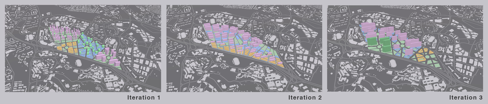

# Overhead

**KHOR Chen Sian Gerald**

_Overhead_ looks at 3 prototyped iterations urban forms at our site at One North - each iteration is evaluated based on environmental analysis, to determine quantifiable environmental qualities like daylighting, solar penetration and views. 

Iteration 1 looks at four different typologies and how they fare; Iteration 2 introduces the idea of overlapping grids at different elevations to create a unique and varied experience of the city. Finally, Iteration 3 combines the best of the first two iterations, to create an interesting urban form that meets the programmatic and environmental requirements of buildings. 

The iterative process follows a framework that generates neighbourhood boundaries, subdivisions and plots; then creates green spaces within these neighbourhoods.

In conclusion, _Overhead_ shows how it is possible for both quantitative goals (environmental) and qualitative goals (spatial quality) can be met through the process of rapid urban prototyping.
