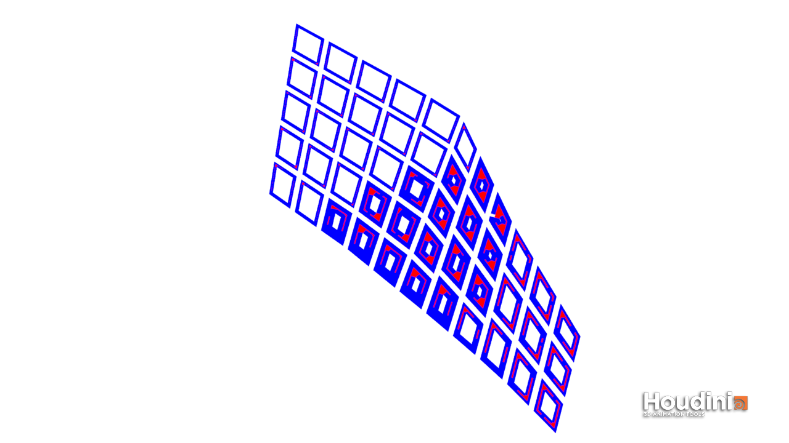

# Iteration 1

*Figure 2. iteration 1*
 

*Figure 3. plots and zones of iteration 1*

For iteration 1, a macro scaled approach was first adopted.

The site area is bounded by the Dover Road and the AYE – the two major roads through which the site can be accessed. A typical grid system is then generated in place. To ensure more regular shaped plots were generated, the grid divisions were done using the egg slice command that cuts the area (along the directions parallel to the edges) into quadrilateral plots of 150m width that are offset 9.6m to create the transport network grid.

With respect to Dover Road and the AYE, the plots are allocated to three programmatic zones: the residential (red), commercial (grey) and clean-tech industrial (blue) zones. 

The residential zone takes the plots westwards that are most easily accessible by the 2 aforementioned major roads and Clementi Road as the residential units gets the highest priority to accessibility to the existing road networks. Additionally, it directly connects to the adjacent Clementi neighbourhood. 

The commercial zone occupies the central plots such that a commercial hub is formed where activity is most concentrated.
The clean-tech industrial zone occupies the remaining plots eastwards that are immediately adjacent to One-North, thus facilitating a stronger relationship between the technology-focused facilities and R&D. 

*Figure 4. residential plot with courtyard*

Using the “polyextrude” node in Houdini, courtyards can be created for each building massing by insetting the building polygon. Each building massing is then segmented into building units through the use the “voronoi fracture” node.  

*Figure 5.example of resultant residential massing of iteration 1*

To determine the number of floors of the building massing in each programmatic zone, the required total floor area of each programmatic zone is first determined and then it is divided by the footprint of each zone. The number of floors calculated by Houdini is then used as an attribute that is fed into the “make buildings” node that will automatically generate the building masses of the correct number of floors (and of a set floor height) according to the programmatic zone. 

After generating the building massing for all zones, the building performance is determined through the use of the “evaluate buildings” node. This will tell us how many of the building massing is considered a good building, based on the good window and good building threshold criteria as stipulated by the brief.

The following are the results of iteration 1:

*Figure 6. View_threshold(>0.4): 0.53*

*Figure 7. Daylight_threshold (>0.1):  0.13*

*Figure 8. solar_threshold (<0.2): 0.13*

*Figure 9. Passive_threshold (>0.5):  0.90*

*Figure 10. Good_window_threshold (>0.1):  0.11*

*Figure 11. OVERALL GOOD BUILDING PERCENTAGE: 37%*

As seen from the results above, iteration 1 met all the required threshold values, albeit the good window threshold was only marginally better than what is required. 

Despite hitting the individual performance targets, a large majority of the buildings were still bad buildings. This can be attributed to the possibility that the standard deviation between the good and bad values of each measurement is large enough such that the average value is offset by the significantly good values. Also, while a particular building or window might perform very well in one aspect, it might perform very poorly in another. 

While majority of the residential units faired decently, a large majority of the bad buildings were contributed by the commercial and clean-tech industrial units. 

In the case of iteration 1, it can be deduced from the evaluation results that majority of the poor buildings might be a result of insufficient good views out of the buildings, and hence insufficient good windows. 

The resultant building massing was to be fine tuned in iteration 2 to fix the suspected problems. 

