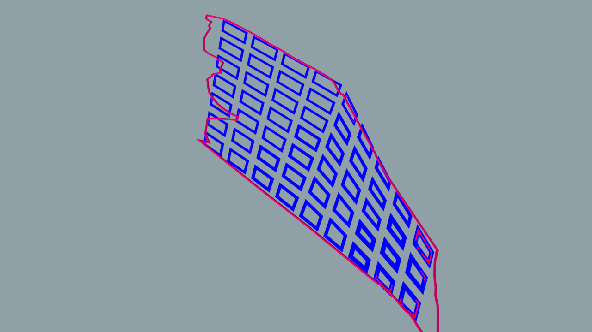
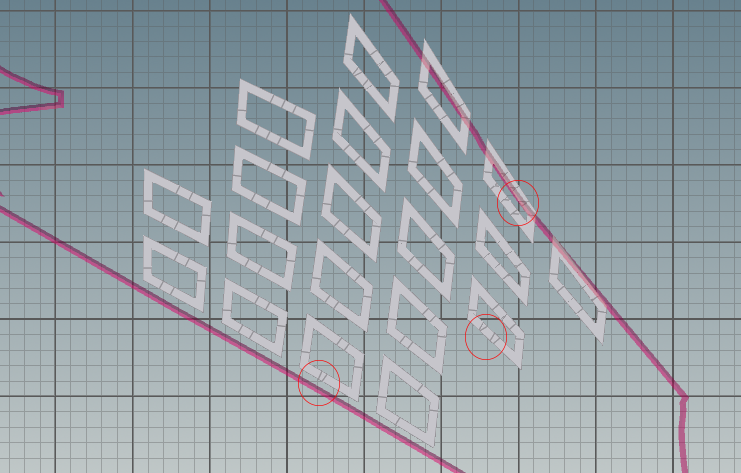

# Iteration 2

*Figure 12. iteration 2*

By studying iteration 1, it was possible that the building masses were too closely packed together and that the commercial building masses were too deep hence, resulting small courtyards. As a result, the views out of the windows are very poor since there are many windows facing too closely to each other, which also contributed significantly to the proportion of bad windows.
It was therefore decided that there will be changes made to the grid sizes and the street width, as well as the courtyard typology of the commercial typology. The changes can be seen in the following:

*Figure 13. grid plots of iteration 2*

As the facades that face the AYE and Dover Road tend to produce better evaluation results, it was decided to elongate the grid in a direction parallel to the two major roads. This is done by reducing the grid length and grid width values from 11m to 9m and 150m to 115m respectively. 

The street width  was increased from 9m to 12m to pull the building facades further apart and improve the view factor.  

*Figure 14. commercial plots of iteration 2 have expanded courtyards*

The depth of the commercial building typology was reduced from a value of 35 in Iteration 1, to 15 (under the “subnet plot” node for the commercial zone) in order to expand the courtyard and improve the views out of the windows surrounding each courtyard. 

The following are the results of iteration 2:

*Figure 15. View_threshold(>0.4): 0.62*

 
*Figure 16. Daylight_threshold (>0.1): 0.12*

*Figure 17. solar_threshold (<0.2): 0.12*

*Figure 18. Passive_threshold (>0.5):  0.95*

*Figure 19. Good_window_threshold (>0.1):  0.22*

*Figure 20. OVERALL GOOD BUILDING PERCENTAGE: 82%*

The results of iteration 2 did not change much in values from iteration 1 except for the view, passive and good window threshold values (although the visualised results seem to appear otherwise). This is possibly because of the increased number of primitives/ building units and hence, larger total value base in calculating the threshold values.  Nevertheless, the improvements in view factor, passive ratio and good window thresholds were significant enough to contribute to a large increase in the number (and percentage) of good buildings. 

While the number of good buildings has increased greatly, the building massing visually looks intimidating and does not appear liveable.  The massing also looks too homogenous and has very little variation between the courtyard typologies of the different zones. Additionally, the performance of the building masses concentrated in the centre of each zone is compromised by the surrounding buildings.

*Figure 19. awkward units observed (red circles)*

In addition, there were several awkward triangular units formed within the building masses.  

