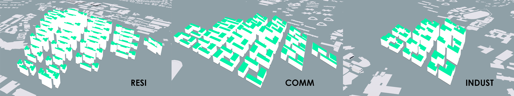
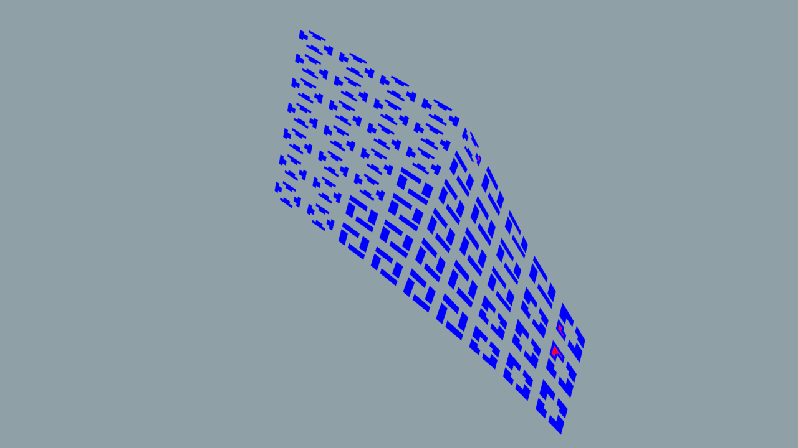

# Iteration 3

From iteration 2 to 3, the final changes are made in a micro scale for more detailed fine-tuning of the building massing which would also require developing the urban fabric into a finer grain. In order to do this, the plots have to be broken up into more individual and controllable units. 

It was also discovered that the previous method of dividing the plot into units using “voronoi fracture” node resulted in awkward triangular units formed. 

*Figure 20. regular grid formed by "subdivide" node*

Therefore the “subdivide” node was used instead to give more controlled and predictable plots divided in a regular grid fashion.  

*Figure 21. the three different courtyard typologies*

The courtyards for each programmatic zone can then be created by removing parts of the grid of each plot, thus the building masses will have unique courtyards suited to their specific programmes. 

*Figure 22. finer grained massing in commercial zone compared to previous iterations*

More sub plots are also created from the removal of the parts of the grid of each plot. Thus, a finer urban fabric is created. 

*Figure 23. varied masses of each zone according to respective rd values*

In order to improve the performance of the central building masses and break the homogeneity of the urbanscape, the central masses have to be taller while the surrounding ones have to be shorter, while maintaining the correct required floor areas. 

The method to determine the number of floors as used in the first two iterations, which resulted in a fixed number of floors dependent on the zones, had to be changed to one that is based on relative density (rd) calculations to allow the necessary height variations to be made in each zone. 

The following are the results of iteration 3:

*Figure 24. View_threshold(>0.4): 0.62*

*Figure 25. Daylight_threshold (>0.1): 0.12*

*Figure 26. solar_threshold (<0.2): 0.11*

*Figure 27. Passive_threshold (>0.5): 0.90*

*Figure 28. Good_window_threshold (>0.1): 0.25*

*Figure 29. OVERALL GOOD BUILDING PERCENTAGE: 97%* 

It is observed that the threshold results did not change significantly except for the passive ratio. This is again likely because of a result of finer grain/ more building units and hence the increased number of primitives/ building units which resulted in a larger total value base in calculating the threshold values. Furthermore, the surrounding building and vegetation context has been factored in the evaluation process for iteration 3.  

Nonetheless, the overall good building percentage increased significantly. This could be due to a lower standard deviation between the good and bad buildings whereby a significant proportion of bad buildings became good buildings, with some good buildings being slightly compromised in their performances. 

