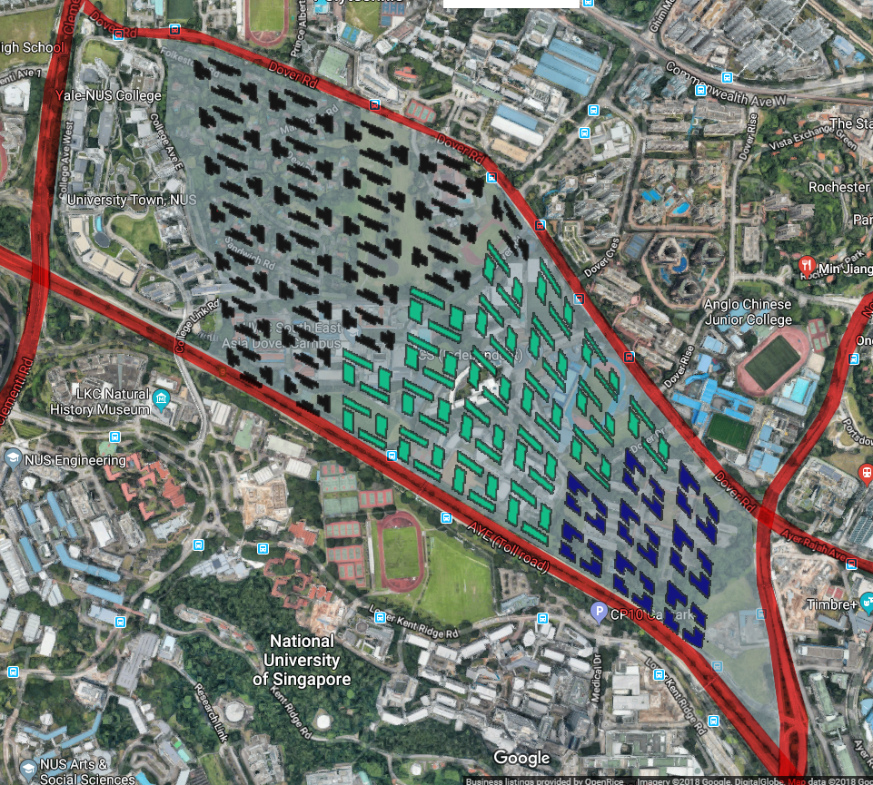

# Urbanscaping With Courtyard Typologies

**Lim Yan Cheng Harvey**

*Figure 1. Plan view of site integrated with final urban massing*

My project aims to explore the usage of the Courtyard typology in urban planning, which tends to be one of the most efficient building typologies for urban cities, within the allocated site that is adjacent to One-North. This site will be home to a population of 75,000 people who will live and work in a shared environment. The urban prototyping will be done through the use of Houdini, a 3D animation software.

The exploratory process of the project goes from a macro to micro scale, whereby the courtyard typology is first applied across all programmes (residential, commercial and industrial) of the master plan with the appropriate densities and as large building massing in the first iteration before finally zooming down to micro level adjustments and breaking up of the individual building masses into finer, more detailed and specific massing in the third and final iteration. This is to enhance the liveability of the buildings, all while making changes in accordance to the building evaluation figures of each iteration to eventually achieve a healthy distribution of good buildings and varied courtyard typologies.

