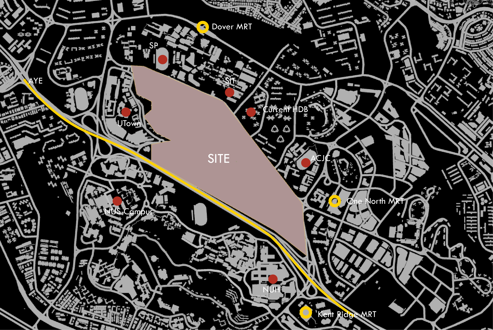

# Introduction

## Site Context

Key nodes around the site are marked as above, where yellow represents main transport nodes, and red represents main resource of participants in the site. With the help of Houdini, the following parameters are set as foundation for all the iterations explored:

*	Residential density gets higher when closer to NUS, UTown, SP, SIT (student residence), and MRT stations, and gets lower when closer to AYE
*	Commercial density gets higher when closer to all public nodes
*	Industry density gets higher when closer to AYE, and when the sum of distance to institutions, NUH, and current HDB gets higher
*	Office density gets higher when closer to MRT stations and current HDB

Assume there are 75,000 people live on site, and every person gets 35 m2, within which 18m2 goes to residential, 8m2 goes to commercial, 4m2 goes to clean tech industry, and last 5m2 goes to office. 

## Analysis Parameters

The thresholds for determining a good/bad window and building are as follows: 

Good Window threshold:
*	View threshold > 0.4
*	Daylight threshold > 0.1
*	Solar threshold < 0.2 

Good Building thresholds:
*	Passive threshold > 0.5
*	Good window > 0.1
