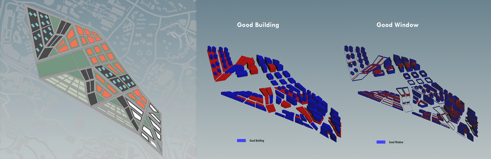
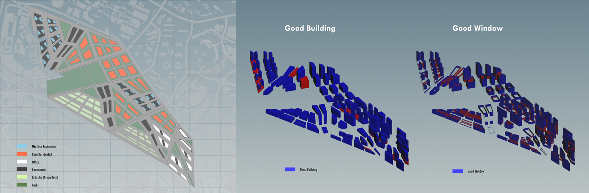

# Iteration 1

In the first iteration, re-zoning of the site based on site context is explored. Main roads are introduced based on the existing road pattern, and zoning is based on the analysis of site. 

The urban plots near southern ends is closer to One North MRT and Kent Ridge MRT, which is most accessible by people outside of the community, so that it is mainly office with commercial podium. Regions near NUS UTown and SP are residential for student accommodation. Those close to existing HDB are also residential as a continuing pattern. Plots near AYE are assigned to be industry area, which are separated from the residence either by park or by commercial plots. Commercial podium below residential tower and office tower can serve for certain plots. Separated commercial strips on the other hands serve the whole community. Theses plots also acts as a tightening band as well as buffer zone, to bridge zones while leave spaces with different spatial quality beyond. 

In order to reduce solar radiance gain, all buildings on site have their long span facing North-South direction to minimise the surface towards East-West where most solar radiation comes from. 

## Iteration 1.1

**Good Building: 73.8%
Good Window: 58.7%**

The simulation results show a bad performance on the oversized commercial podium and commercial strips. To optimize the result, streets at the commercial strips were changed to boulevards with wider street scape and less view hinderance. Commercial Podiums with area more than 5000m2 are subdivided once more to reduce the undulating commercial street and create more intimate shopping streets.

## Iteration 1.2

Due to the reduced foot print of the hybrid residential space, the skyline shows more height variation, mainly reflects on the increasing height in residential region. 

**Good building: 90.9%
Good window: 76.2%**

The performance has been largely improved by splitting up oversized blocks. However, the connecting commercial strips still perform as segments of urban plots which is lack of continuity. Thus, it still cannot fulfil the aim of synergizing the surrounding community on site. However, the zoning blends quite well with the current adjacent development.

