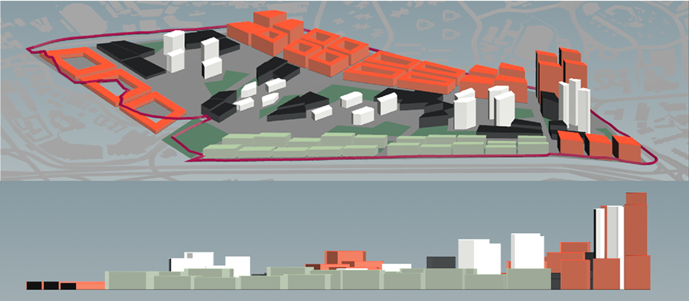
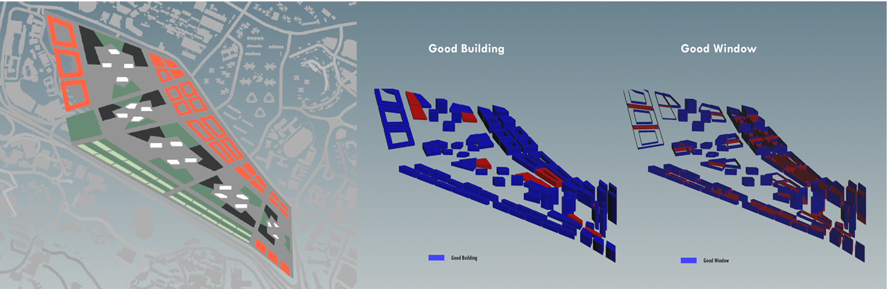
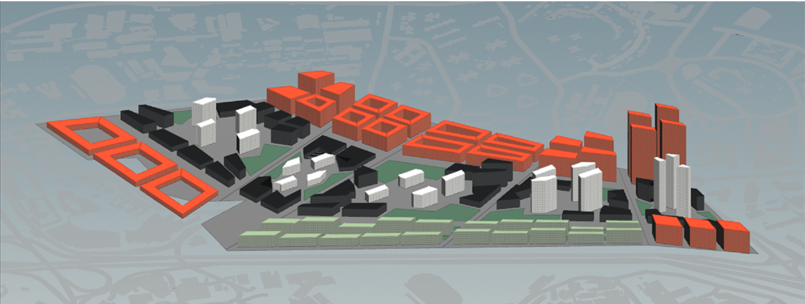
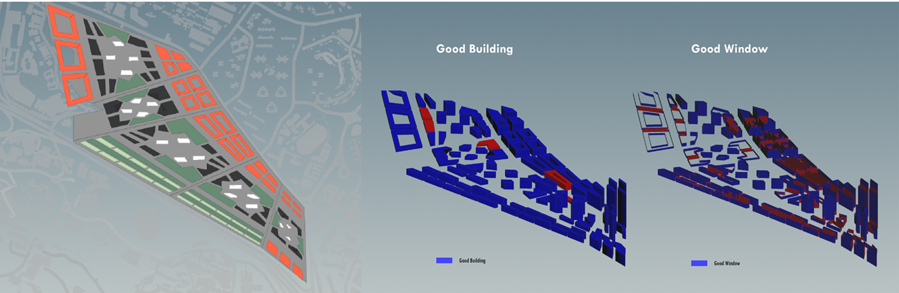

# Iteration 2

In iteration 2, the zoning for residential space and industry has been inherited from iteration 1, while that for commercial and office has been revisited. 

As most of the case study shows that CBD area in a city will turn out to be “ghost town” during night time, and during daytime in weekdays, parks as places for leisure always have few people. Thus, in the second iteration, by introducing the central spine as a continuous space for urban activities, and integrating the peak activities during day and night together at shared urban blocks, the vibrancy and space occupancy can be enhanced at the same time. During the day, working class may enjoy the view of nature out side of window, student off-class can also hold activities at the same outdoor space. During night, the commercial and parks in turn will become the dominant activity nodes. In this way, not only residents and institutions around the site can be linked by the central spine, people from communities nearby and who work here can also be part of it.

## Iteration 2.1

As the aim is to create a central spine with parks as the linkage of the urban public space, this attempt is to test out how the idea of super block perform in such context. From the perspective, we can see a quite even spread of volume across the site with only an aggregation of density near the southern tip of the site. However, the central super block lacks the quality to create a sense of secure for human activity. Oversizing blocks may reduce the sense of the “bock” which gives the boundary and enclosure. Yet the arrangement of the super block is logical, where commercial buildings located at the corners of the block to attracts any passers-by along the streets, and the office towers scatter in the urban park at the centre of each super block. 

**Good Building: 87.3%
Good Window: 17.9%**

Due to the spread layout of buildings, the simulation results show quite a high rate of good building. However, whether this hybrid super block is a suitable typology needs to be tested out when applied to a more human friendly scale.

## Iteration 2.2

Iteration 2.2 is an optimisation of the central hybrid block before proceeding rescaling.  Instead of purely gathering all commercial building at the corner of the super block, to take the advantage of the long span, in this iteration, commercial buildings are spaced along the street, while carving out pedestrian friendly streets to enter the parks at the centre. Meanwhile, following the rule from previous iteration, entrance to parks remains to invite more visiting population.

**Good Building: 95.9%
Good Window: 19.0%**

This experiment generates exceptionally good results on percentage of good building. Yet, similar issue of oversizing residential block also exists. 

## Iteration 2.3

Based on the tests in the previous two iterations, the block sizes both for the central super blocks and residential blocks have been rescaled. Residential blocks having inner courtyard area more than 500m2 after expanding inwards 20m adopt a courtyard typology, otherwise just extrude vertically.

Parcelling out residential blocks effectively reduces the super tall building at the southern corner in previous iterations, and even out the density distribution to an average of 14 floors. Each super block is arranged such that commercial buildings locates at the periphery of the block with pedestrian walkways carved in between, and office towers situated in the middle. Perforated central parks allow visual access along the street, enjoy semi-enclosure from the office and commercial buildings, and also have unite large unobstructed open space for holding activities and leisure. 

Most of the buildings align along the East-West direction to reduce solar heat gain. While residential blocks appear dense and even a bit overwhelming. These blocks form an obvious contrast with those at the central spine.

**Good Building: 76.9%
Good Window: 21.7%**

The percentage of good building in this iteration is not as high as previous ones. From the simulation diagram above, we can tell that those not fulfilling the parameters are mainly residential courtyard typology. Especially the two whole rows at the north western corner. The reason behind it is due to the view hinderance either outwards towards the street or inwards to the courtyard because of this compact layout. The result on the central hybrid urban super block is rather acceptable. Those failed the test are from some groups of relatively closely placed commercial blocks. Same reason goes to those that failed the good window test for central spine. Either by alternating orientation of these commercial blocks or enlarging spacing will improve the result. 

