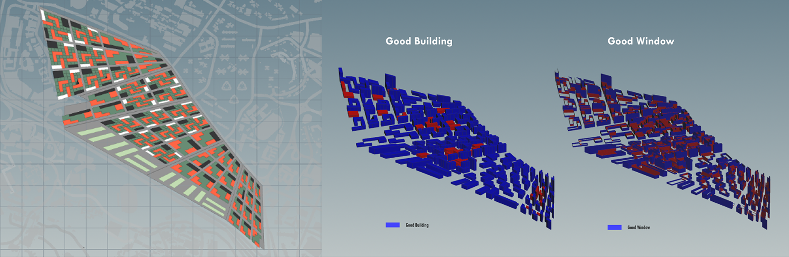

# Iteration 3

Moving one step forward, if we apply the super block typology tested in iteration 2 throughout the whole site, we will get a well-blended result, where blocks are demarcated by streets and connected by public green space. Within each super block, daily needs of a person can be fulfilled by providing with office, commercial, residential and green space within each block. More public ones like commercial buildings and office towers locate at the outer cycle of the super block, while “L” or “I” shaped residential buildings reside at the inner cycle for higher level of intimacy, and arranged in such a way that solar radiation reception and overlooking are reduced.  

For super blocks smaller than 4000m2, simple courtyard typology is adopted with openings for access to central green space at diagonal corner for visual permeability and wider spatial experience. For blocks larger than 4000m2 where more buildings can be placed in the central region without over hindered on view field, residential towers are placed in the inner cycle. In this case, the central green space is divided in to a more private zone which is surrounded by residential buildings, and relatively more public ones which are shared among office, commercial and residential buildings.

Zoning for industry remains the same.

## Iteration 3.1

From the perspective, we can see that by applying this typology to the whole site, the density is quite evenly distributed, and result in a more pedestrian friendly street scape. However, the typology was set as such that larger blocks have a hybrid of residential, commercial and office buildings, while smaller ones have a combination of residential and commercial ones which fulfil the basic daily need and high frequency of visit. Based on the foundation parameters for all iterations mentioned in introduction, the closer to MRT stations, the higher the density for office should go. If following this pre-determined program distribution for various super block types, office towers will not be able to take the most advantageous location. 

Yet if majority of the offices would be used for student start-ups or for the “maker factories”, then this well blend of the offices with residences, as well as the close adjacency to NUS and SP campuses would be a suitable typology.

**Good Building: 87.8%
Good Window: 18.3%**

The simulation result shows a quite high percentage of good building. Majority of buildings failed the test are some closely spaced commercial blocks. Due to the layout restriction, it is quite hard to score high in good window test because of the view hindrance within 50 meters. Orientation arrangement of residential blocks situated at the inner circle can be reconsidered to maximize view field.

## Iteration 3.2

As analysed after iteration 3.1, slight change in zoning has been made. Plots near the southern corner now adopt the hybrid of residential and office, more like a SOHO district. Those super blocks between NUS and SP campuses still remain the same. Besides, to enhance the view field, commercial blocks with the area larger than 2000m2 are offset in 3 meters for ground level pedestrian activities.

**Good Building: 92.7%
Good Window: 34.1%**

After making the aforementioned changes, we can see a good reflection on the simulation result.
