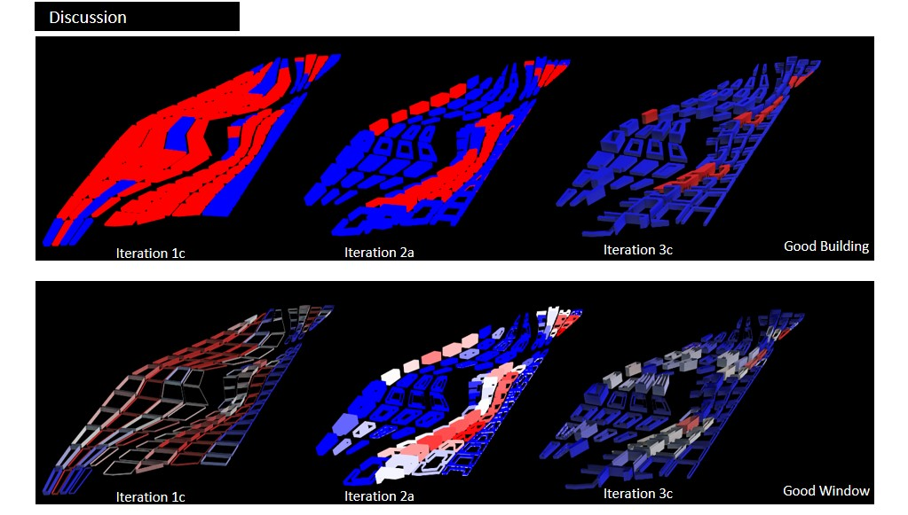

# Discussion

All in all, through the 3 iterations, I learnt that plot size and building typologies (slab, point, courtyard, u-shaped blocks) are important elements that contribute to the urban fabric of a city. Through these elements, the buildings of the site can have better access to daylight while close proximity between each other may also be good in reducing solar heat. However, if they were too closed apart, views may be compromised. The typology of the blocks themselves may also affect the passive and active areas of the buildings for light penetration. These performance indicators would in turn determine whether there is sufficient good windows and good buildings in the site.

Over the 3 iterations, the good windows and good building percentages have been improving. From the 24% good buildings in Iteration 1C, the percentage has increased dramatically to 87% in Iteration 3C. The percentage of good windows has also increased from 21% in Iteration 1C to 83% in Iteration 3C. This means the site has a reasonable number of good buildings that have unobstructed views, good daylight penetrating into the floor space but also keeping out excess sunlight, creating a good environment for live, work and play. 

Such good environment in turn is essential to creating an interactive environment for people walking on the pedestrian corridor and into the smaller roads. This way, it fosters communication and collaboration while connecting NUS Utown to One-North Fusionopolis.

__Further Development__

To further improve on the urban form, the building typologies can be rotated to reduce direct sunlight on the East-West façade. This may further increase the number of good window and thus, good buildings. 

In addition, the indicators are merely performance analysis for the environment. Other indicators that studies the flow of people through the site and how they will congregate around certain programs may also be useful in understanding how interactions may occur in the site. In addition, a study on the roads and street systems may also be useful in understanding the impact of a shaded pathway on the level of interactions that people may have in the pedestrian corridor and also the smaller roads. Further development in these areas may value-add to the analysis of the pedestrian corridor as the central nervous system for interactions, collaboration and innovation.
