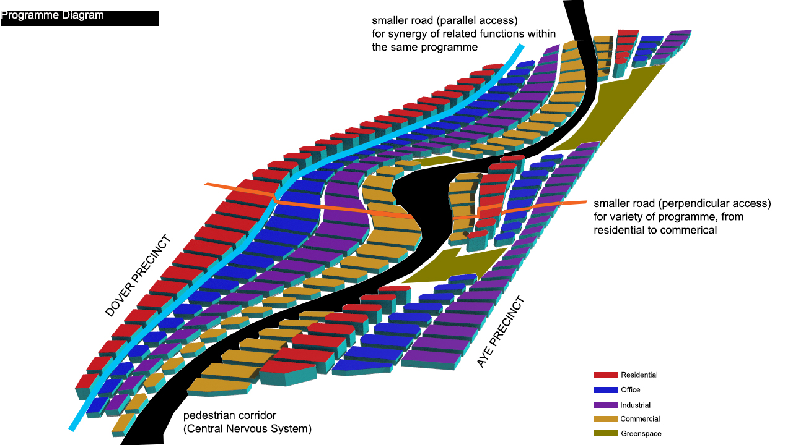

# Introduction

The city is a place of encounters and interactions. This in turn spur collaboration and innovation. 

Flanked by Dover road and the Ayer-Rajah Expressway (AYE), the site is sandwiched between 2 main innovation clusters, namely the National University of Singapore (NUS) UTown clusters and the One-North’s Fusionopolis clusters. By linking the 2 clusters together, it may create better synergy between the education and research & development arm of innovation. Therefore, it can foster better communications and in turn, opportunities for collaborations to take place. Hence, the urban form should provide a platform for this physical connection from NUS Utown to Fusionopolis. 

Tay Kheng Soon’s concept of a Central Nervous System (CNS) in the urban fabric provides an insight to how to connect the clusters and encourage interactions. Central to the idea of CNS, it is a physical pedestrianized boulevard that runs through an entire site for ease of walking. On both sides of the boulevard are commercial areas that would draw people to the CNS for interactions and engagement in public activities. The CNS is a corridor of a series of greenspaces, event plazas, pathways that spills into smaller routes, alleyways that brings you further into the site. With the CNS, it not only connect two destinations together, it is also an avenue for meeting, congregation and interactions for innovative collaborations. 

Therefore, this project attempts to connect NUS UTown and Fusionopolis through Tay’s concept of CNS. With this physical pathway meandering across the site, the process will test its implications on urban forms (plot size) and building typologies (slab block, courtyard blocks and U-shaped blocks). The building blocks are organized into strips of programme (red-residential, blue-office, purple-industrial, yellow-commercial). These programs are arranged in this manner to provide variety of programs as one transverse perpendicularly to the pedestrian corridor while having synergy of the same program as one walks parallel to the pedestrian corridor. The analysis of the building blocks will be based on environmental performance indicators like daylight factor, view, solar and active-passive space ratio. With these indicators, we can then draw conclusions of whether the building has ‘good windows’, thus is a ‘good building’.

In the following section, we will explore 3 iterations. The iterations will affect both sides of the CNS (Dover precinct and AYE precinct) or at times, only 1 precinct at a time. The first looks at the urban forms in which we test the varying plot sizes (small, big and combined). In the second iteration, we will look at the varying size of the courtyard typology (fixed and random). Then, lastly, the third iterations looks at the U-shaped building typology (thicker U, thinner U, and hybrid). 

Using the iterations, we will then discuss the implications of CNS on the urban form and typology, and its environmental performances. 

