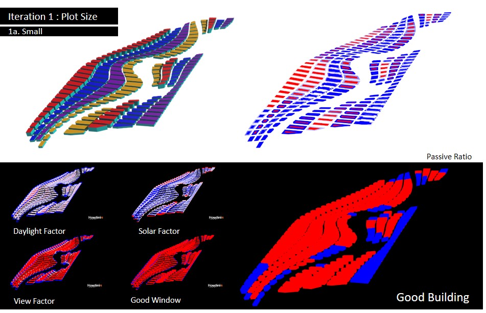
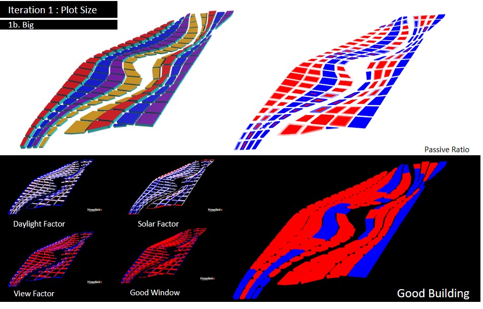
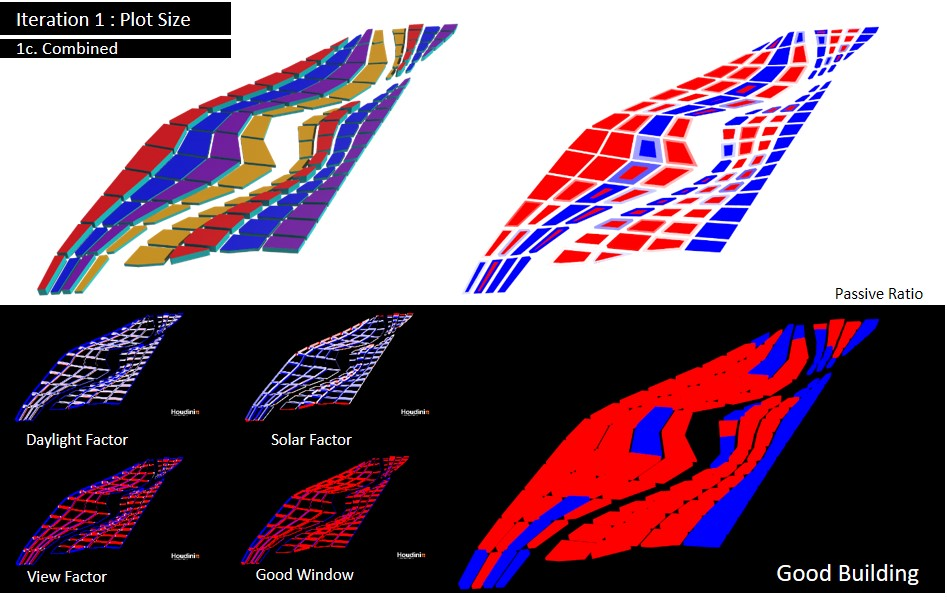

# Iteration 1: Urban Form (Plot Size)

__1.1 Iteration 1A: Small Plots__

In this mini-iteration, both Dover and AYE precinct are split into 40 segments, generating a mixture of slab and point blocks for the residential, industrial, office and commercial function. They range from low-rise 3-storey blocks to 10-storey blocks with commercial being the lowest (yellow) and residential the highest (red). These blocks are lined along the meandering pedestrianized corridor. Overall, it is a carpet of low-rise to mid-rise blocks that follows the sensual curves of the pedestrianized corridor.

Overall, it has a majority of bad buildings. This is largely due to view obstructions caused by the close proximity of the blocks, resulting in a high concentration of bad windows amongst the blocks. However, the closely packed slab blocks are good for shielding direct sunlight, thus registered acceptable range of solar factor. 

__1.2 Iteration 1B: Big Plots__

In this iteration, I tried larger plot sizes with fewer segments (26 smaller roads on Dover precinct and 15 smaller roads for AYE precinct). With larger plots, the overall height of buildings went down. As a result, the whole site is filled with podium-sized blocks of buildings with thick floorplan. While such floorplans may be suitable for industrial use, it limits the amount of natural light entering the building. 

Hence, the overall good building ratio is very low. This is largely due to the thick floorplan which also translates to a higher percentage of floor areas that does not get natural light and require active means to do so. Therefore, a smaller plot size is favored or holes can be punctured through the thick plots. 

__1.3 Iteration 1C: Combined__

In this iteration, we try a combination of big and small plots on both sides with 14 smaller roads on Dover precinct and 20 smaller roads on AYE precinct. While it did not produce considerable improvements, it created a small park in the AYE precinct. 

While the iteration did not give favorable results, it shows that Dover precinct is more suitable for bigger plots and AYE precinct favors smaller plots. This is due to the curvature set at the start of iterative process. Hence, going forward, I will use large plots with a different typology for Dover precinct.
