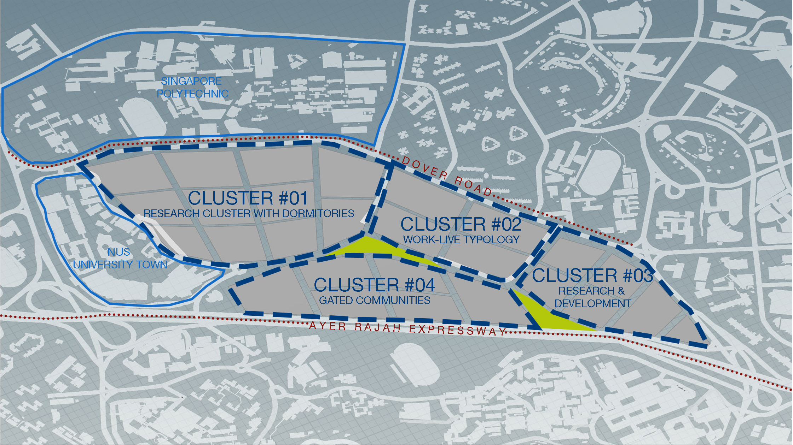
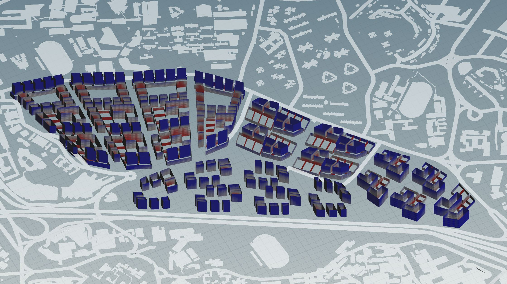
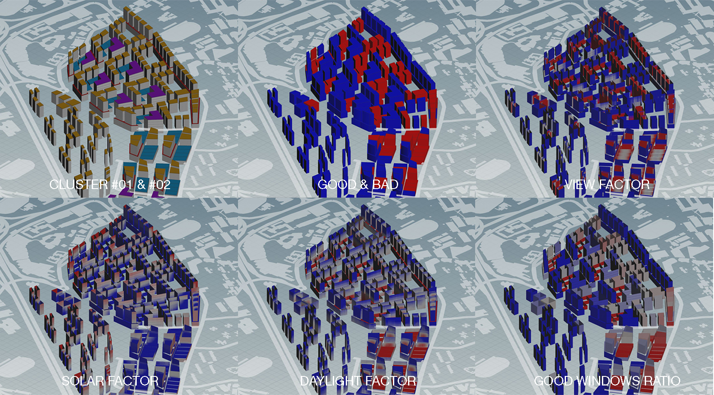

# Iteration 2

## Four Distinct Clusters 

 *Four Distinct Clusters* 
  
The second iteration is an improved version of the first one, which takes into account that the site is surrounded by tertiary educational institutions. Besides zoning the clusters based on the current road conditions, each cluster is carefully considered based on its surrounding context. Being surrounded by both NUS University Town and Singapore Polytechnic, Cluster #01 serves as a research cluster for both institutions to collaborate and house dormitories scattered within the cluster. Cluster #02 aims to provide for the work-live community, with residential blocks situated adjacent to offices. Working in tandem to Cluster #02, Cluster #03 is a creative research and development hub that is within close proximity to the MRT. Similar to the previous iteration, Cluster #04 acts as a buffer zone for the rest of the site, due to the Ayer Rajah Expressway. Instead of housing industrial buildings, I have opted for gated communities instead, for their sparse building distribution.

## Distribution of Program

 *Program Distribution*

### Residential *(highlighted in yellow)*
In this iteration, residential takes three main forms: dormitories, work-live and gated communities (condominiums). In Cluster #01, we can find staff and student dormitories scattered throughout the cluster. Adjacent to Singapore Polytechnic, shops are attached at the podium and dormitories are situated on the tower block. Residential buildings in Cluster #02 are positioned in alternate formations to the offices, so as to allow for cross ventilation and ease of access to offices. Lastly, breaking away from the courtyard typology,  residential towers are scattered sparsely in Cluster #03’s gated communities, so as to allow for the sound from AYE to be displaced and softened as it transverse through the site. 

### Offices & Industrial Buildings *(highlighted in blue and purple respectively)*
Unlike the previous iteration where these two programs had a designated cluster, they are now redistributed out into Clusters #01 and #03. In which both are serving research and development purposes. They are positioned side by side, in order to ease the transition between each building.

## Overall Evaluation

### Good & Bad Buildings

 *Good & Bad Buildings*
  
In this iteration, the good & bad buildings evaluation shows a significant number of buildings which are bad (in red). These buildings are primarily located in Cluster #01 and Cluster #02, with a few exceptions in the other two clusters. Upon closer inspection it can be observed that the problematic buildings are mainly dormitories in Cluster #01, residential in Cluster #02 and offices in both these clusters.

### View Factor

 *View Factor*
  
Taking a closer look into the view factor evaluation, it can be speculated that the bad buildings mentioned earlier have poor view factor. From the figure above that there are a lot of red portions scattered around Cluster #01, this could be the result of the buildings being too close to one another. This creates an obstructed view for the user. On the other hand, Cluster #03’s gated community seems to be doing well in this evaluation, likely due to the scattered building layout. 

### Daylight Factor

 *Daylight Factor*

It can be observed from the daylight factor evaluation that the buildings in Cluster #01 have poor daylight conditions, a result that is very similar to the view factor. In order to improve this situation, Cluster #01 should be made less dense, with buildings further away from each other.

### Specific Areas of Improvement

 *Comparative Evaluations for Clusters #01 & #02*

Looking through all the evaluations, Cluster #01 and #02 seems to be the most problematic, with many buildings showing bad results (in red). This may be due to buildings being too close together, which inevitably, affects both the view factor and daylight factor. Perhaps what can be done to improve the results is by reorganising the buildings in Cluster #01, allowing more space in between each building. Another method is to further split the plots, so that the active-passive ratio can be improved. 

### Improved Iterations

 *Iterations 2.1, 2.2 and 2.3*
  
To reduce the number of bad buildings in Cluster #02 specifically, I reduced the office buildings by half, leaving more gaps between them. This resulted in the more good buildings. In order to improve even further, I attempted to reorganise the layout for industrial (in purple) and offices (in blue), which resulted in a marginally better overall evaluation as seen in Iteration 3.3.

