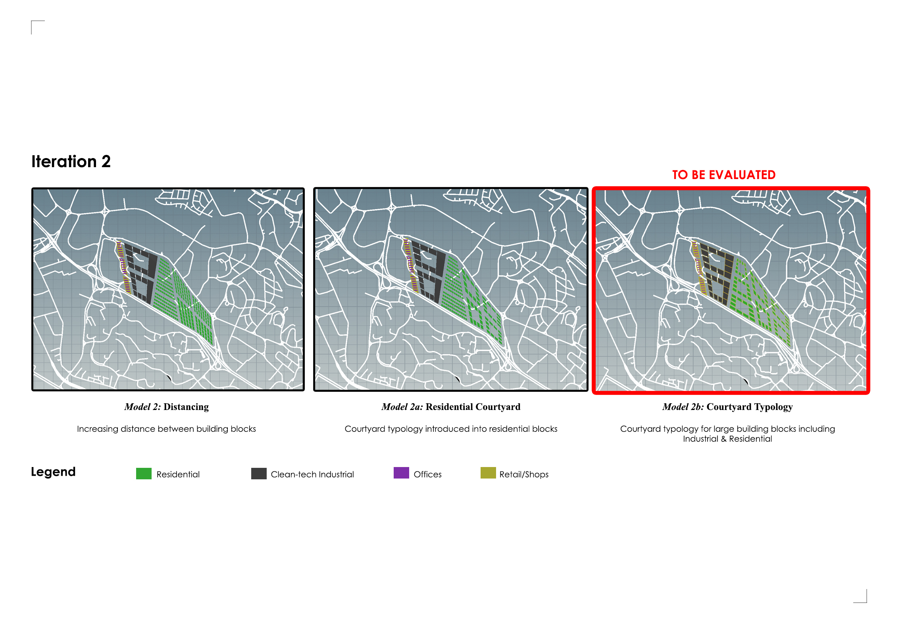
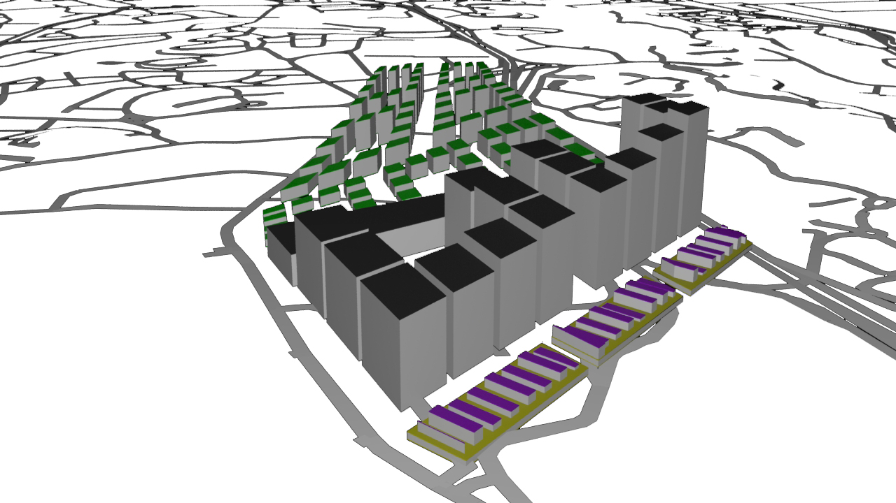
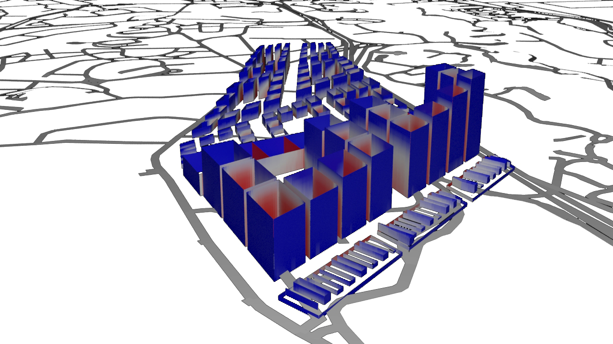
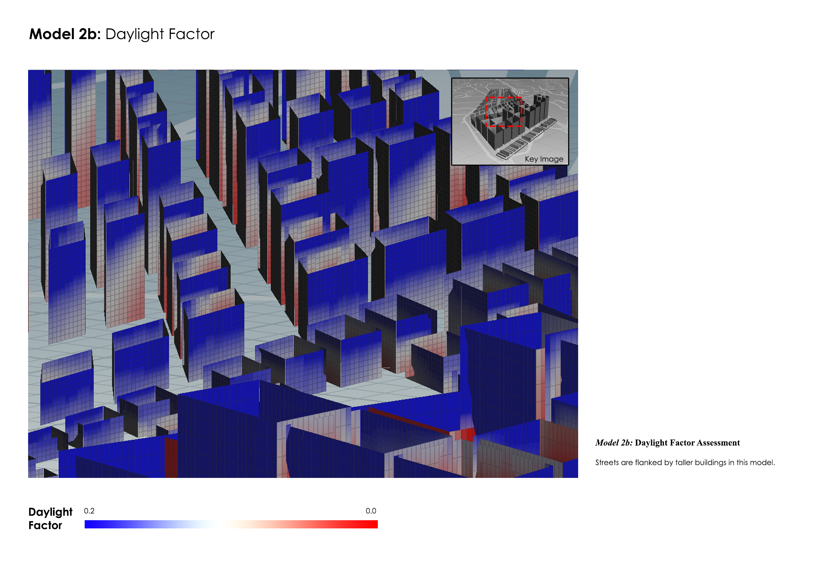
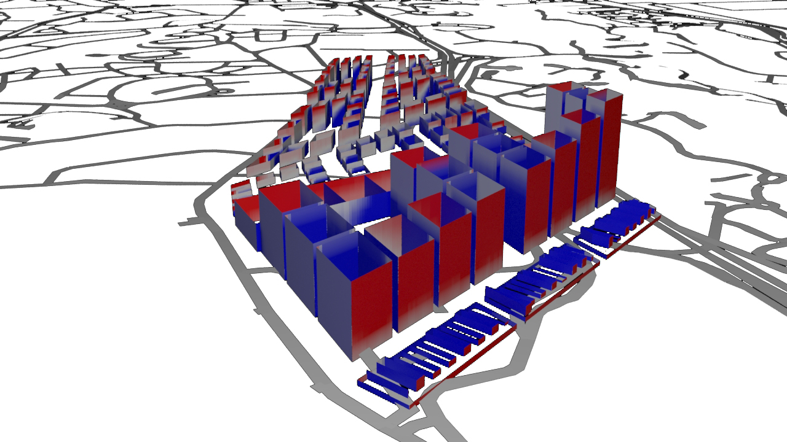
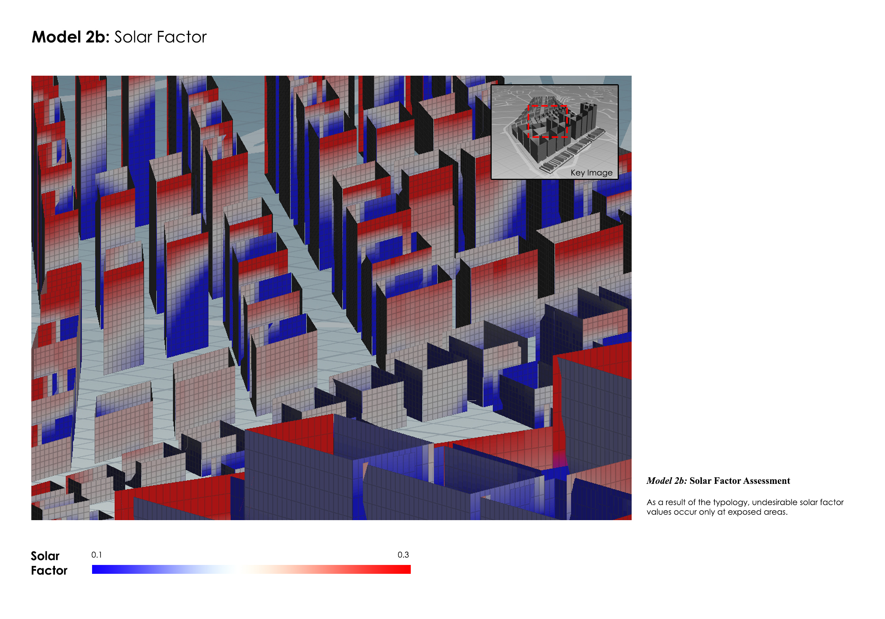
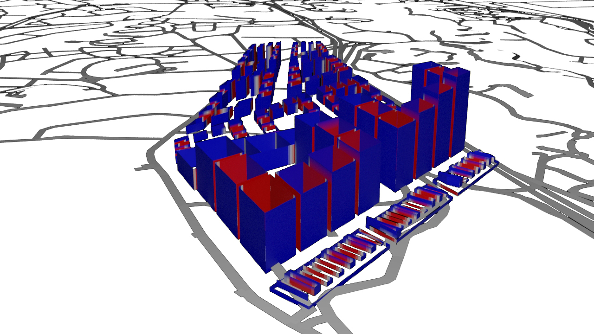
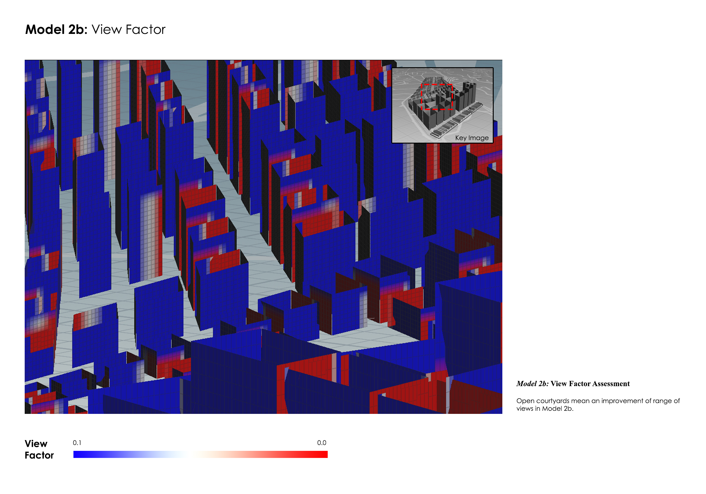
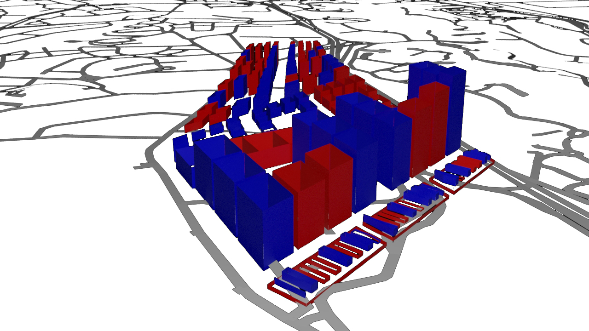

# Iteration 2
The courtyard typology of the Industrial building blocks in Model 1b was brought forward into the next iteration. Industrial and Residential blocks adopts this typology as it allows a fair amount of ‘breathability’ between building blocks. Furthermore, daylight is able to reach deeper areas of these blocks. 

## Model 2b: Overall
The sprawl of building blocks is not without its order - reiterating the concept of retaining the ridge as a symbolic form of the area, similar to Model 1b, areas are intensified according to the proximity of public transport amenities namely One-North, Kent Ridge and Buona Vista MRT stations. 

**Urban Morphology of Model 2b**

***Residential***

| Floor Height (m)  | No. of Storeys | Street Width (m) |
| ------------ | ------------- | ------------- |
| 3 | 1 - 19 | 6 |

***Clean-tech Industrial*** 

| Floor Height (m)  | No. of Storeys | Street Width (m) |
| ------------ | ------------- | ------------- |
| 10 | 9 - 17 | 5 |

***Offices*** 

| Floor Height (m)  | No. of Storeys | Street Width (m) |
| ------------ | ------------- | ------------- |
| 3 | 1 - 5 | 8 |

***Retail*** 

| Floor Height (m)  | No. of Storeys | Street Width (m) |
| ------------ | ------------- | ------------- |
| 6 | 1 | 8 |

### Model 2b: Daylight Factor

The residents living in the lower storeys of the development still suffer from a lack of daylight owing to the deep streets sandwiched between towers. The rectilinear form of building blocks are flat and does not allow for irregular dispersion of daylight off its surfaces. This creates a model that is mostly washed and ineffective. 

Comparing this with Model 1b, Daylight Factor is less evenly distributed across the whole development. This is mainly due to the tall Industrial building blocks located at the Eastern side of the development. 

### Model 2b: Solar Factor

A similar condition to Model 1b is experienced in the assessment of Solar Factor values. However, it is noted that buildings at the lower storeys receive neutral values. This could be due to the negative space created in courtyards located in the middle of the building. 

As compared to Model 1b’s Solar Factor, the wider streets result in a greater amount of solar gain on surfaces. Therefore, the model returned lesser ‘blue’ zones than in the case of Model 1b. 

### Model 2b: View Factor Factor

However, there is a significant improvement of View Factor owing to the expansion of streets. This is true largely for the Residential blocks but is not the case for Industrial blocks and Offices. 

The courtyard typology adopted in the Residential blocks are the main reasons why the quality of views have drastically improved from the previous model. 

## Model 2b: Performance Summary

Any indication of ‘good’ buildings in this model is an improvement from the previous iteration. In Model 2b, building blocks that are located at the perimeter of their sub plots fares well in the assessment of Daylight Factor, Solar Factor and View Factor. We learn from Model 2b that the courtyard typology adopted have improved the quality of buildings in the overall development. 

