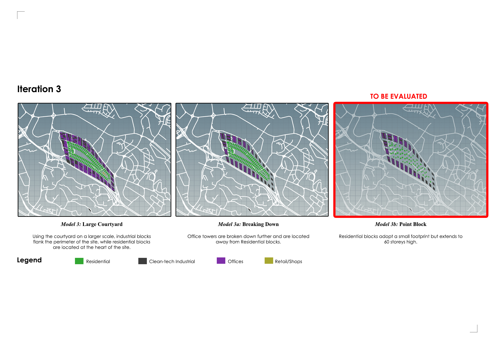
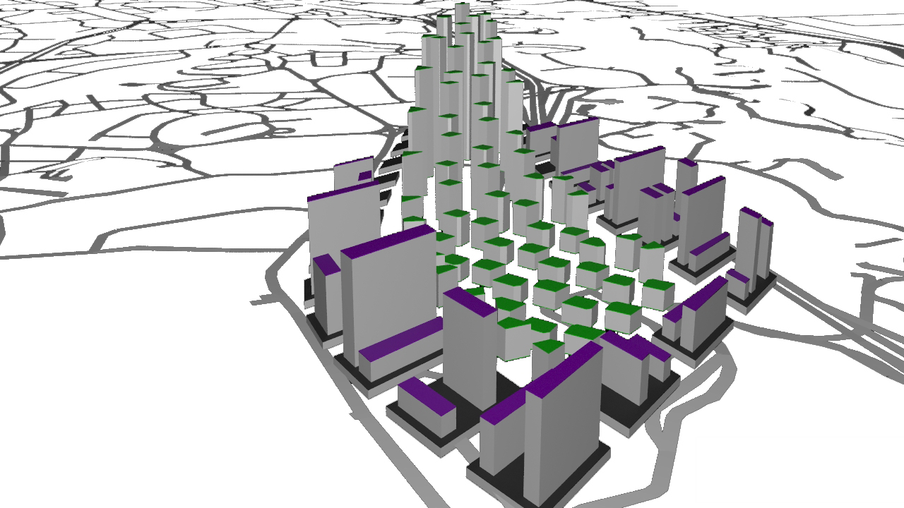
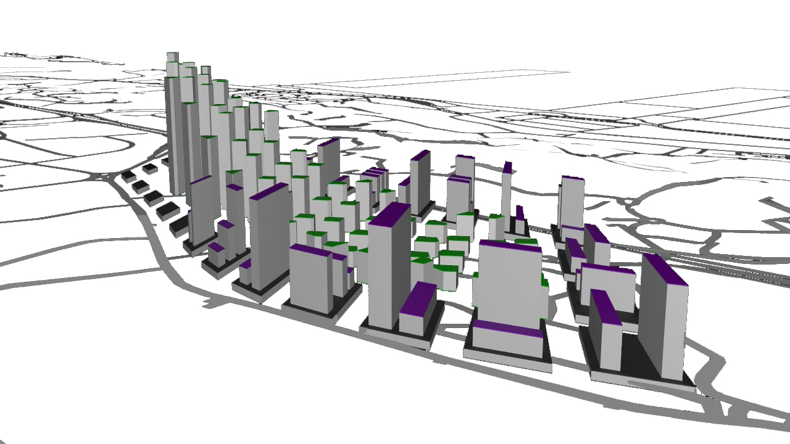
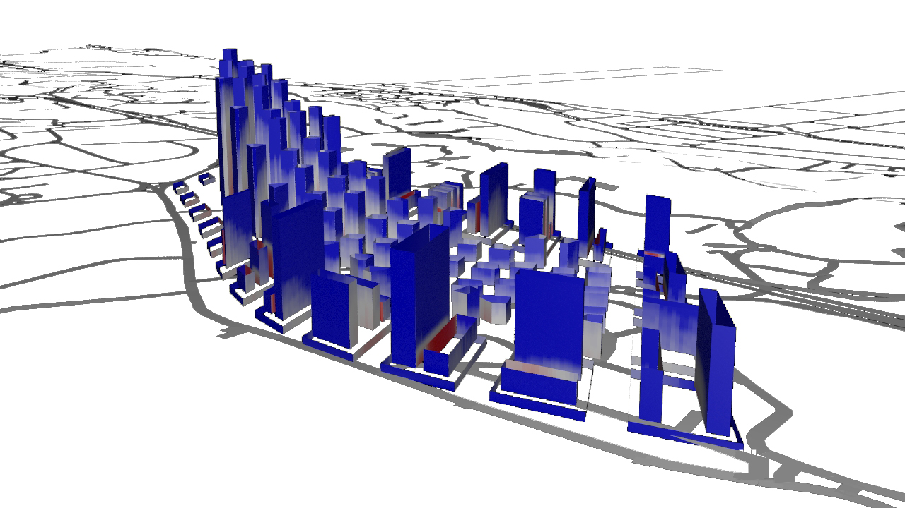
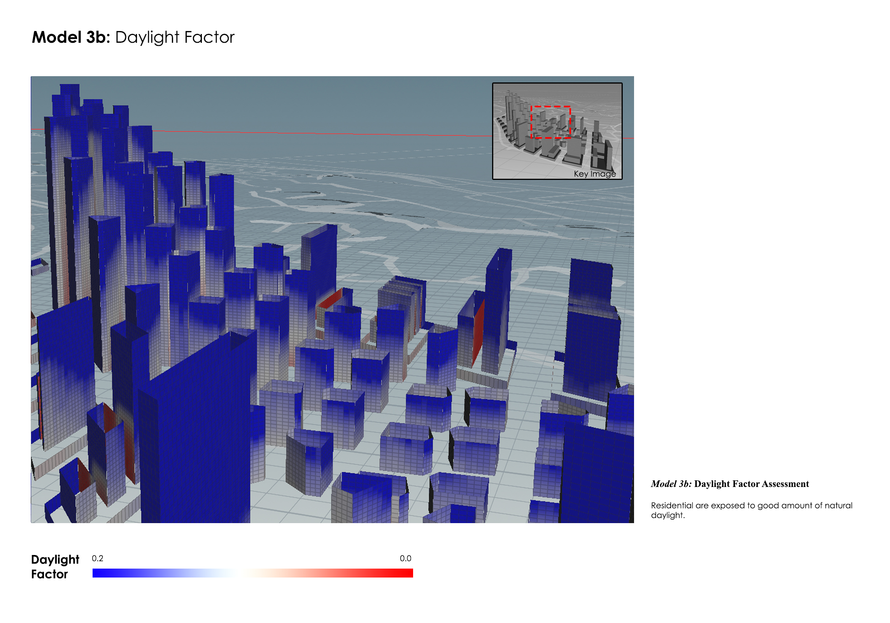
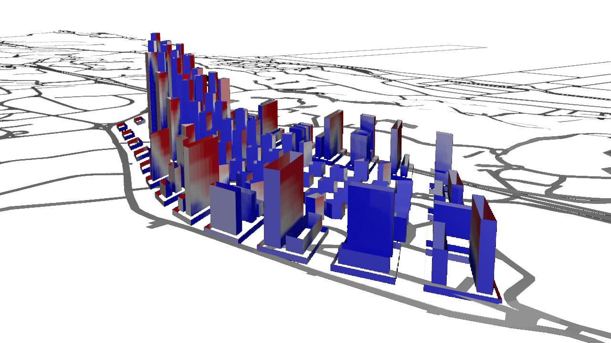
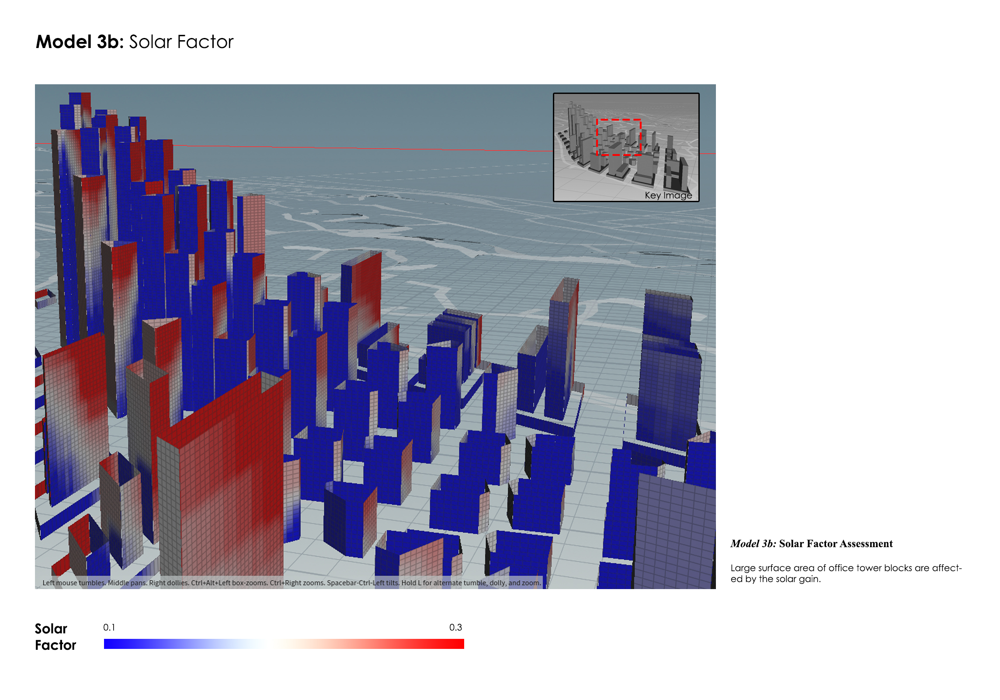
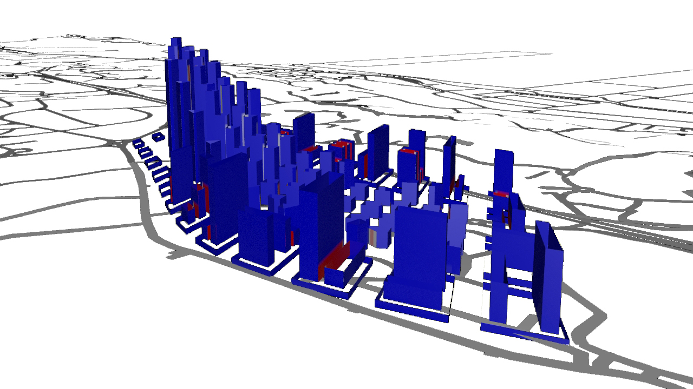
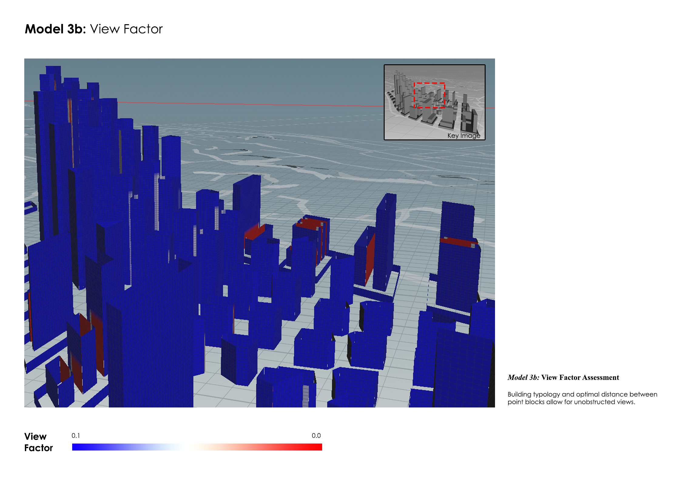
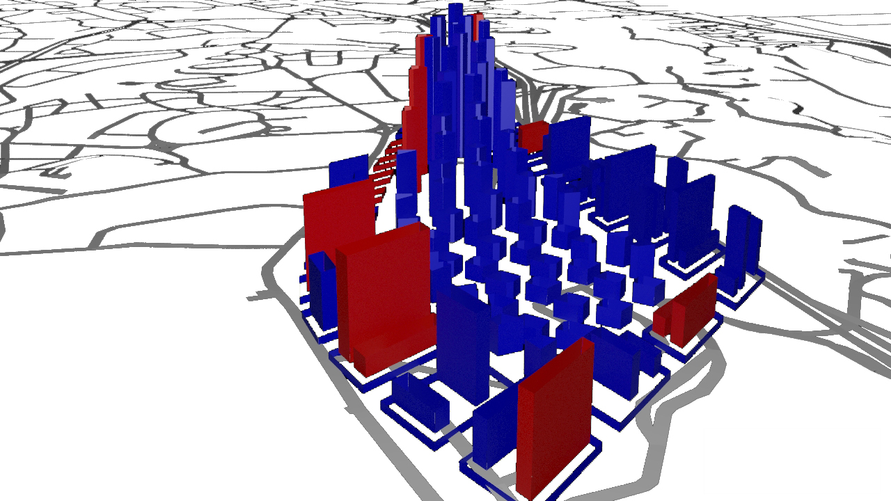

# Iteration 3
Since the significance of courtyard typology has been unearthed in the previous iterations, Iteration 3 identifies this as a possible microcosm of the overall development. As a result, Industrial blocks and Office towers are planned to surround the perimeter of the site. The sprawl of Residential blocks take place in the heart of the mini-city. 

**Urban Morphology of Model 2b**

***Residential***

| Floor Height (m)  | No. of Storeys | Street Width (m) |
| ------------ | ------------- | ------------- |
| 3 | 3 - 60 | 8 |

***Clean-tech Industrial*** 

| Floor Height (m)  | No. of Storeys | Street Width (m) |
| ------------ | ------------- | ------------- |
| 10 | 1 | 20 |

***Offices*** 

| Floor Height (m)  | No. of Storeys | Street Width (m) |
| ------------ | ------------- | ------------- |
| 3 | 1 - 40 | 5 |

***Retail*** 

| Floor Height (m)  | No. of Storeys | Street Width (m) |
| ------------ | ------------- | ------------- |
| 4 | 1 - 3 | 5 |

## Model 3b: Overall
The building blocks are designed with the same intention of an artificial ridge. Residential blocks are intensified nearer to the indicated MRT stations, while Industrial and Offices orients itself in the opposite direction. Learning from previous iterations, height of towers are purposefully randomised to allow for ‘breathability’, while allowing a greater amount of daylight and unobstructed views.

### Model 3b: Daylight Factor

There is a drastic decrease of ‘red’ zones since Iteration 1. The adjustments made to Model 3b include street expansions, randomised height of towers and a Residential tower block with an unorthodox building footprint. The polygon generated for the Residential blocks possess more surface areas than a rectilinear form, allowing the building to receive a greater amount of daylight. 

Sufficient distance between building blocks accompanied with a ‘mountainous’ typology eliminates the situation of building blocks sandwiched against each other.

### Model 3b: Solar Factor

A similar outcome as a result of the building typology adopted is seen in Model 3b. The ‘red’ zones occur at higher storeys of Residential blocks. 

Buildings blocks with longer facades in the East-West orientation faces a greater amount of solar gain, while blocks oriented toward the North-South orientation experiences a more neutral result. This is reflected in the image shown above. 

### Model 3b: View Factor

View Factor assessment returns a largely positive result with a majority of ‘blue’ zones. This is largely due to the careful planning of building block orientation and an expansion of streets. 

The small amount of ‘red’ zones occur at shorter Office towers that are sandwiched against tall towers. However, a positive thing to note is that all residential blocks have unobstructed views. 

## Model 3b: Performance Summary

Through the iterative process, the lessons learnt from previous models result in a largely successful scheme in the case of Model 3b. Since the liveability of residents remains the prime interest of this exercise, Model 3b is successful as a majority of Residential blocks have are ‘good’ buildings. 

| Good buildings  | Bad buildings | % Good buildings |
| ------------ | ------------- | ------------- |
| 116 | 18 | 87% |

