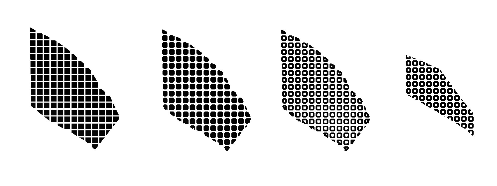
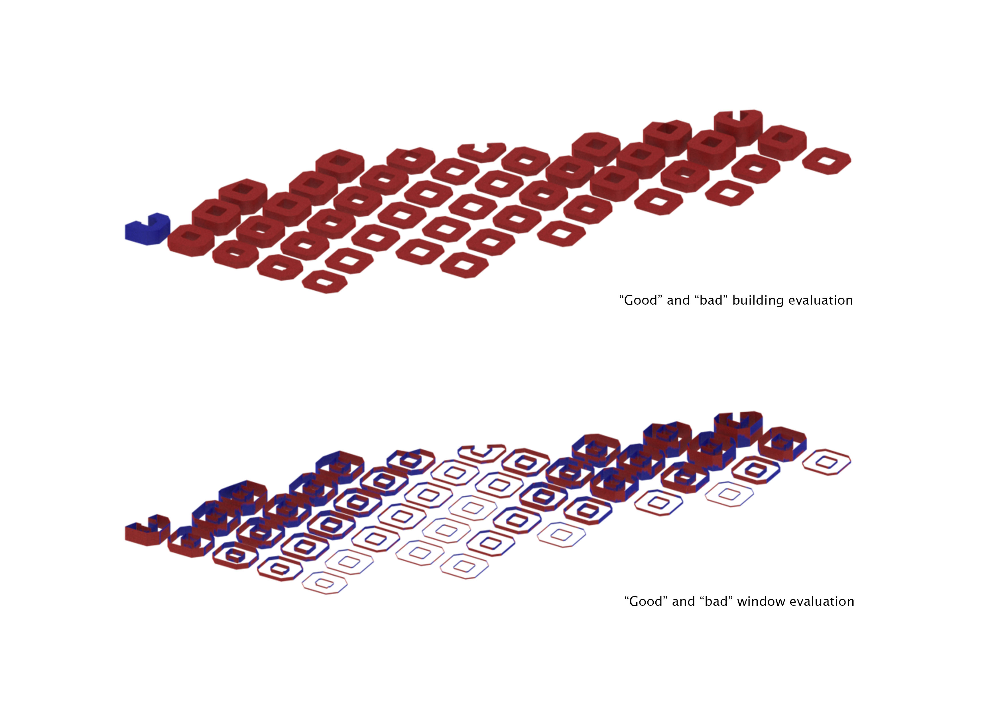
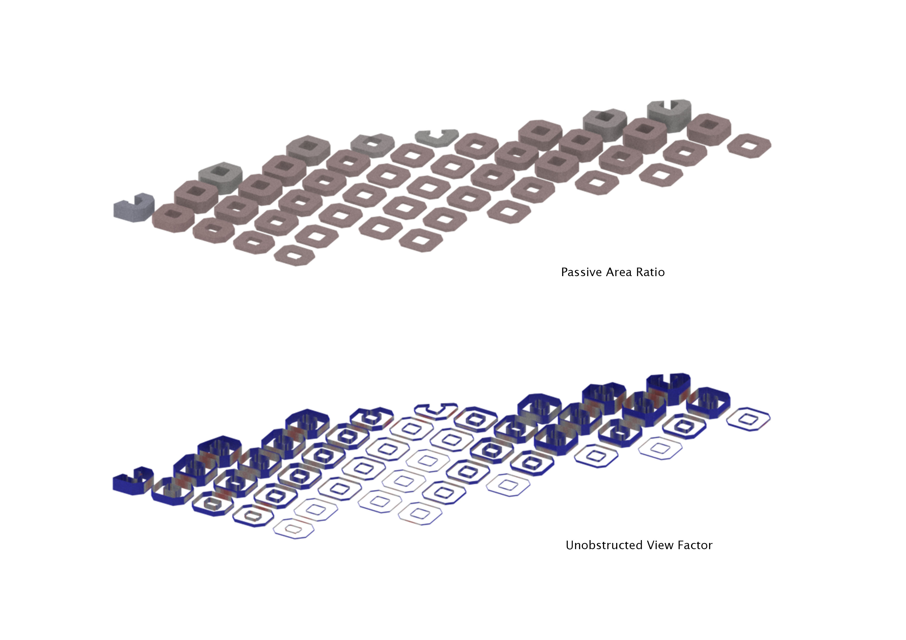
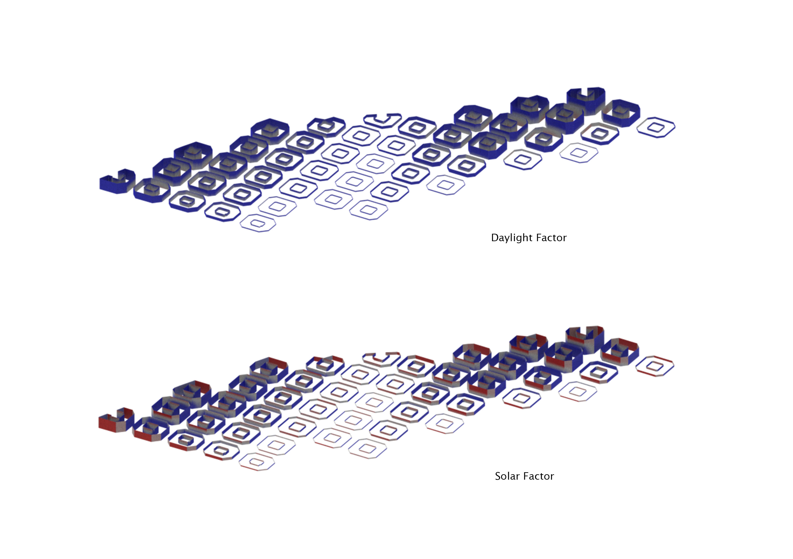
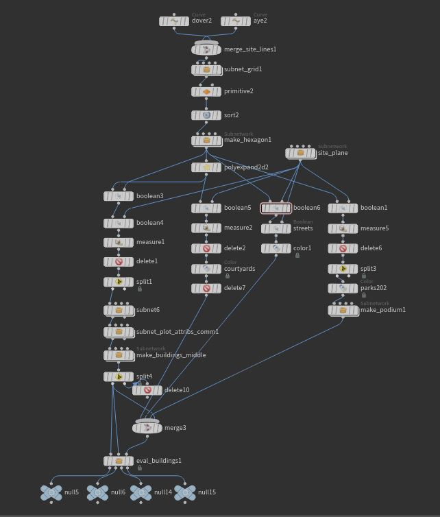

# Iteration 1a

An octogonal grid is first constructed. Then courtyards are punched into the individual building blocks, and plot areas less than 1000m2 are converted into parks. 

>Grid> Polyexpand> 'Make-Octogon'> Boolean Intersect (with courtyards)> Boolean Intersect (with site)
> 

**Final results**

Total number of buildings evaluated: 53

"Good" Building Ratio: 1.89%

"Good" Window Ratio: 35.85%

Passive Area Ratio: 1.89%

Unobstructed View Factor Ratio: 81.72%

Daylight Factor Ratio: 84.04%

Solar Factor Ratio: 70.46%

Conclusion

The results were astonishing as almost all the buildings were bad buildings. 
After going through the evaluation nodes I realised it was because the passive area ratio was very low. 
My buildings were too thick - so I explored ways of 'thinning' my building block down.

Houdini overall workflow

