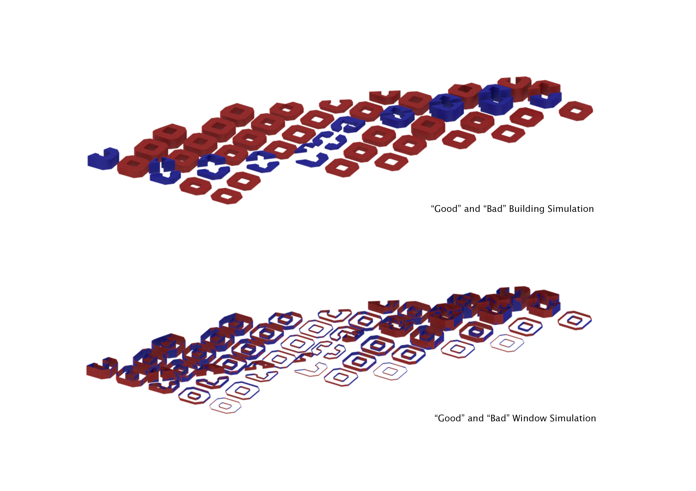
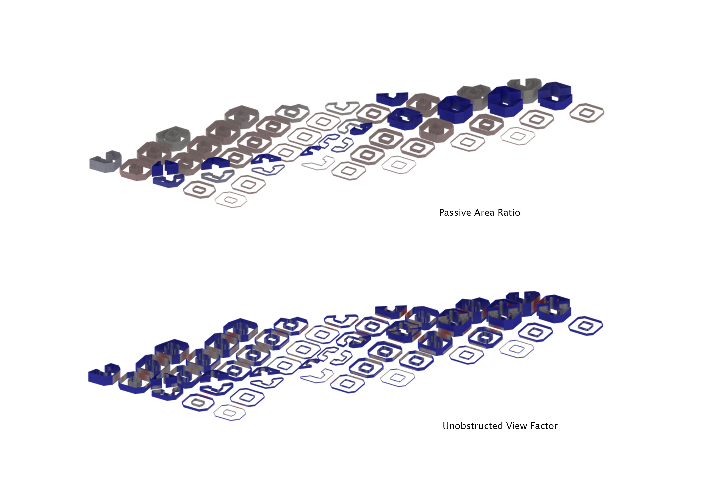
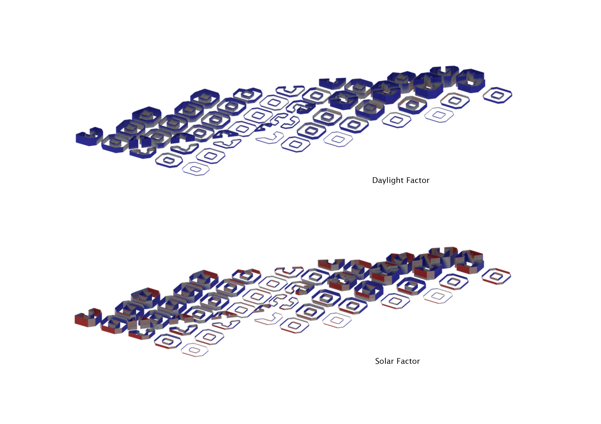

# Iteration 1b

>Grid> Polyexpand> 'Make-Octogon'> Boolean Intersect (with courtyards)> Boolean Intersect (with site)> Boolean Subtract (with road going through entire site)

**Final results**

Total number of buildings evaluated: 66

"Good" Building Ratio: 59.09%

"Good" Window Ratio: 36.36%

Passive Area Ratio: 33.33%

Unobstructed View Factor Ratio: 19.54%

Daylight Factor Ratio: 20.42%

Solar Factor Ratio: 29.31%

The results were showed that my building blocks in iteration 1a were in fact, too thick. The buildings along the road that cuts through the entire site are better buildings than the others, because they enjoy better passive lighting and hence, better windows. This concludes that in order to improve the conditions of the other buildings, I had to improve passive lighting into my buildings and give them better views (increase the distance between buildings).

This can be done by:
1) Increasing the size of the urban grid
2) Increasing the size of the inner courtyard

Houdini overall workflow:

