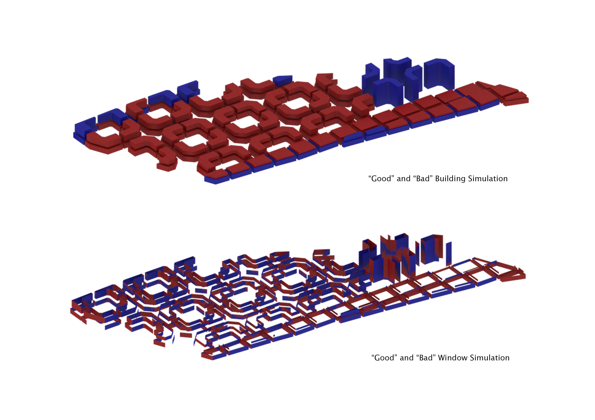
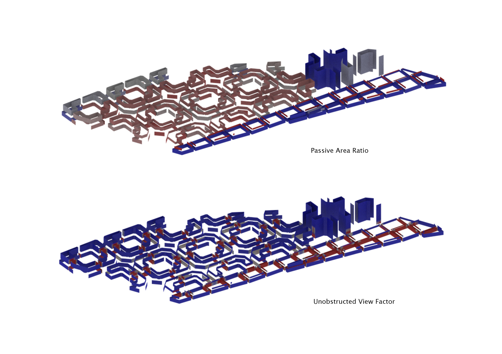
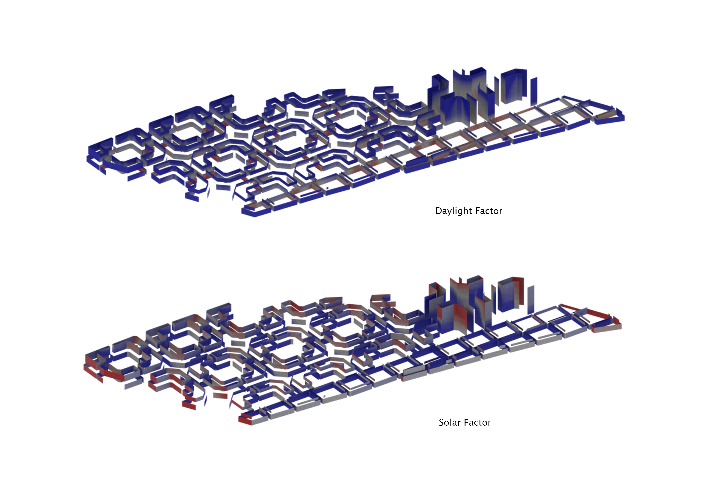

# Iteration 2

For iteration 2, other than decreasing the thickness of the buildings, I also separated the buildings into 4 different typologies - industrial, offices, residential and commercial.

>Grid> Polyexpand> Split> 'Make-Octogon'> Boolean Intersect (with site)> Boolean Intersect (with courtyard)> Split (different typologies)

**Final results**

Total number of buildings evaluated: 123

"Good" Building Ratio: 24.39%

"Good" Window Ratio: 59.64%

Passive Area Ratio: 33.41%

Unobstructed View Factor Ratio: 77.76%

Daylight Factor Ratio: 79.70%

Solar Factor Ratio: 74.95%

Conclusion

The Passive Area Ratio has improved a lot from iteration 1a and 1b, and so have the "good" building and "good" window ratios.
However, the buildings can still be further improved. As a large number of buildings with low passive area are industrial/offices, those buildings blocks can be further broken up to allow for better passive lighting into the building. 
The residential blocks should also be less east-west facing to reduce solar radiation into the buildings.

