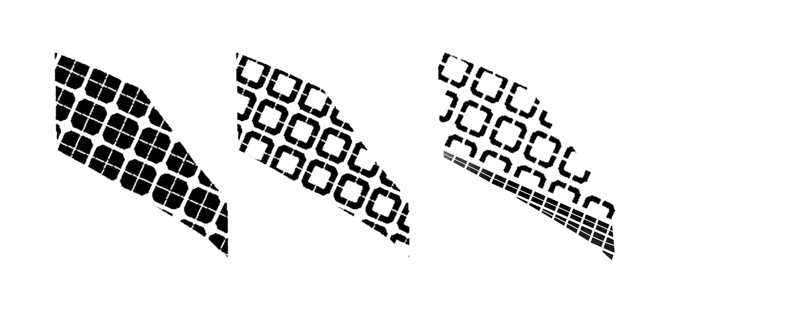

# Iteration 3a

For iteration 3a, the thickness of the industrial buildings are decreased, and the east-west facing sides of the residential blocks are decreased as well.

>Grid> Polyexpand> Split> 'Make-Octogon'> Boolean Intersect (with site)> Boolean Intersect (with courtyard)> Split (different typologies)

**Final results**

Total number of buildings evaluated: 161

"Good" Building Ratio: 87.58%

"Good" Window Ratio: 54.80%

Passive Area Ratio: 100%

Unobstructed View Factor Ratio: 77.80%

Daylight Factor Ratio: 79.29%

Solar Factor Ratio: 80.89%

Conclusion

The Passive Area Ratio has improved a lot from iteration 2 (it is now 100%), and so have the "good" building ratios. 

Houdini overall workflow:

