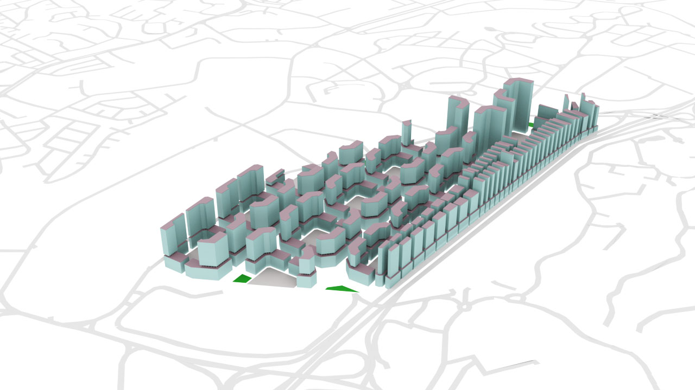

# Chaflán

**KOH Lisa**

El Chaflán, which means 'chamfer' in Spanish, refers to chamferring of the corners of a typical urban grid. Inspired by the urban layout of the city of Barcelona, this project seeks to discover the efficiency of such a plan (widths of streets and buildings are taken from that of Barcelona's), and ways to improve on it. It also seeks to understand how well such a plan could fit into the context of Singapore.
Through 5 iterations, (1a, 1b, 2, 3a, 3b), the octogonal urban planning of Barcelona was adjusted to achieve maximum efficiency (maximum number of "good" buildings), whilst considering the different typologies (residential, commercial, industry and offices). This resulted in a densely packed, low-rise industrial zone lined alongside the busy AYE, a cluster of shopping malls close to the MRT stations, and generously spaced mixed-use residential and commercial building blocks with individual courtyards.
