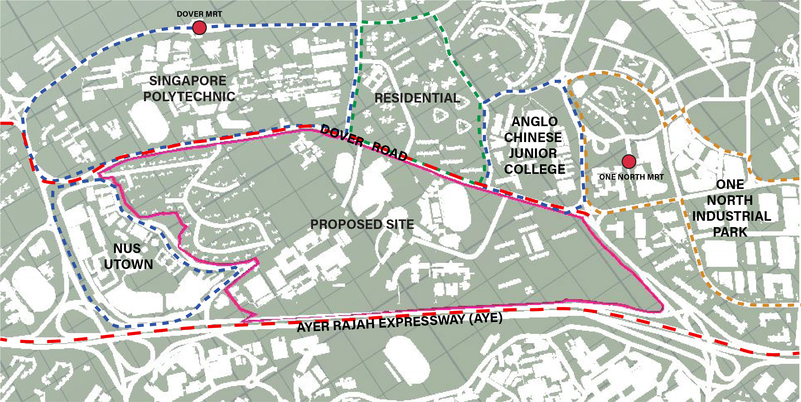

# Introduction

 *Proposed Site*

The proposed site is located between Dover Road to the north, Ayer Rajah Expressway (AYE) to the south and surrounded by educational institutions such as National Univerisity of Singapore, Angolo Chinese Junior College and Singapore Polytechnic.

The project's masterplanning is inspired by the New York City's Commissioners' Plan of 1811. The utilitarian rectangular grid plan of streets and lots have been viewed favourably for it's wayfinding and walkability. The clause for the gridded plan is ensure sufficent pavement width for pedestrian and narrower road width for cars.  The following iterations's zoning stratergy will be taking into account both the surrounding site conditions and the aspirations of a manhattan gridden plan.

