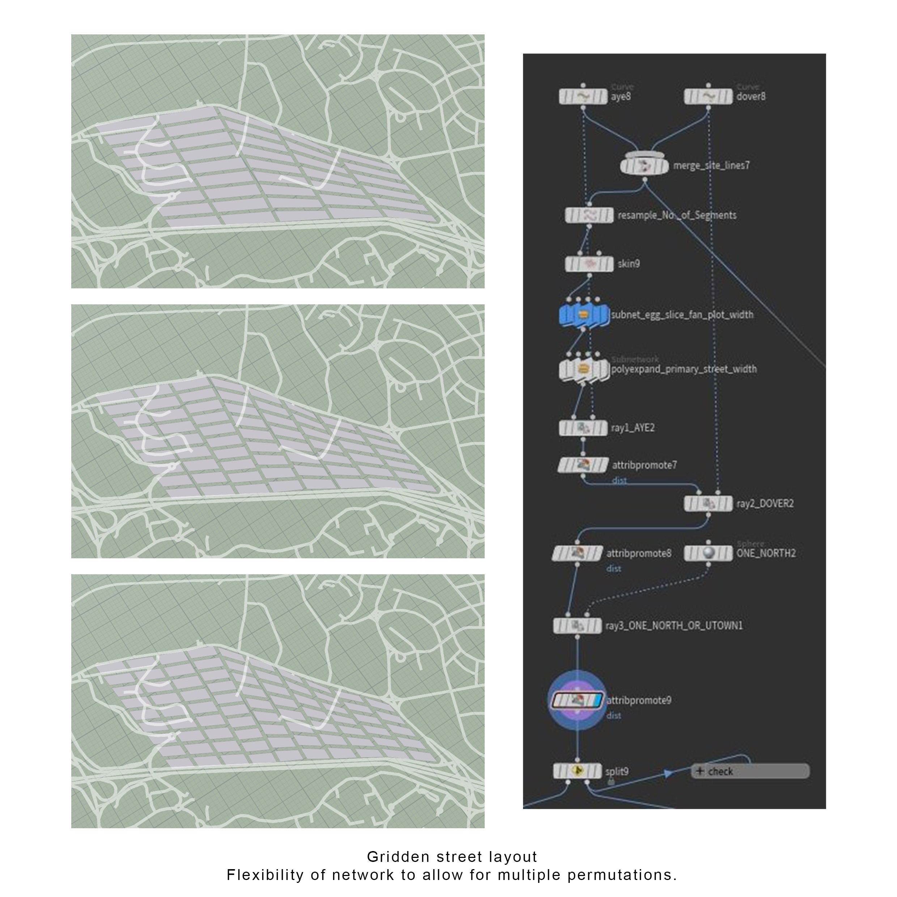

# Iteration 1

Iteration 1 starts off with a basic manhattan grid with single typology buildings distributed across the plots. This arrangement mainly explores the flexibility of the gridded system with a node arrangement that allows for quick subdivision of the overall proposed site.

The nodes arrangement are as follows:

 Adjustment to the resample node and subnet eggslice will divide the site down to relative widths and lengths accordingly.

*Iteration 1*

 The generic manhanthan grid are applied with the same residential, office and shops typology across all plots.
 
The results shows that there are 343 out of 552 good buildings, in other words 62.14% of good buildings. This could be attributed to the 56.83% view factor as a result of the close proximity of the plots hence the overall dismal good building number.

In subsequent iterations I will be varying the typology according to relative density to surrounding context as well as to explore mixed used typology within the gridden masterplan. 
