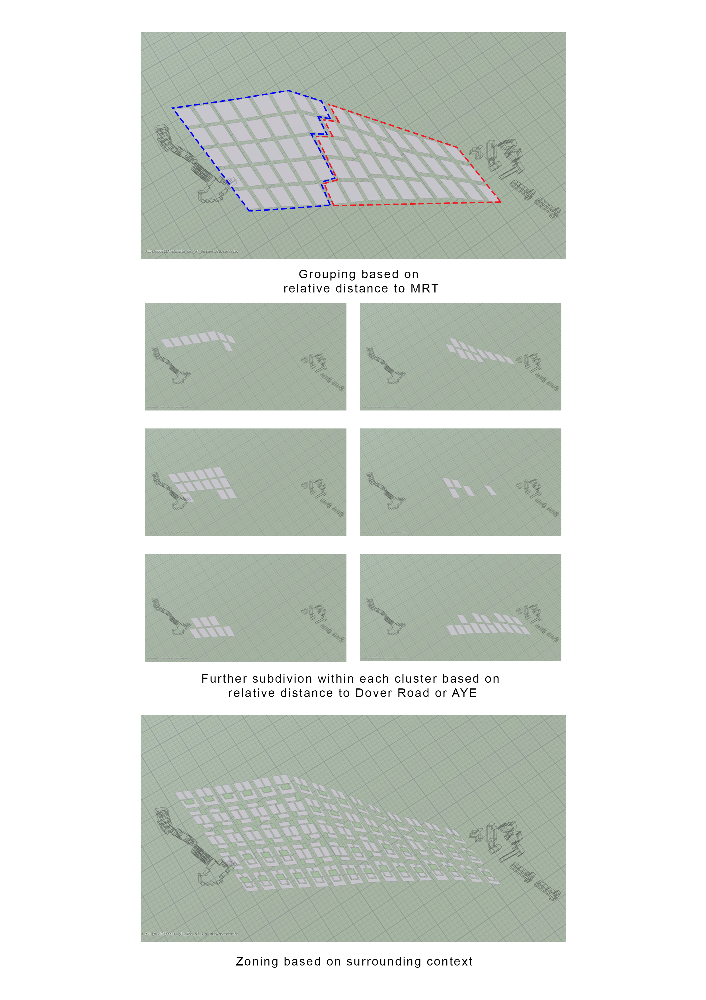
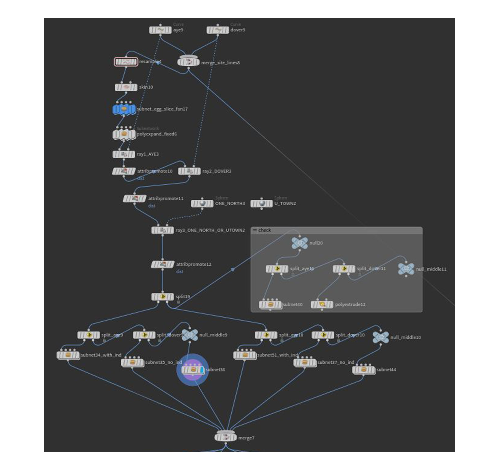
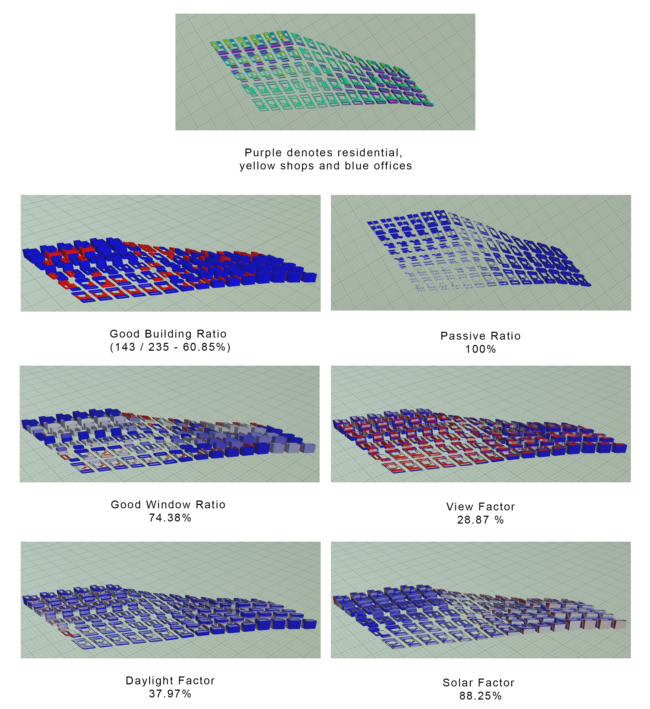
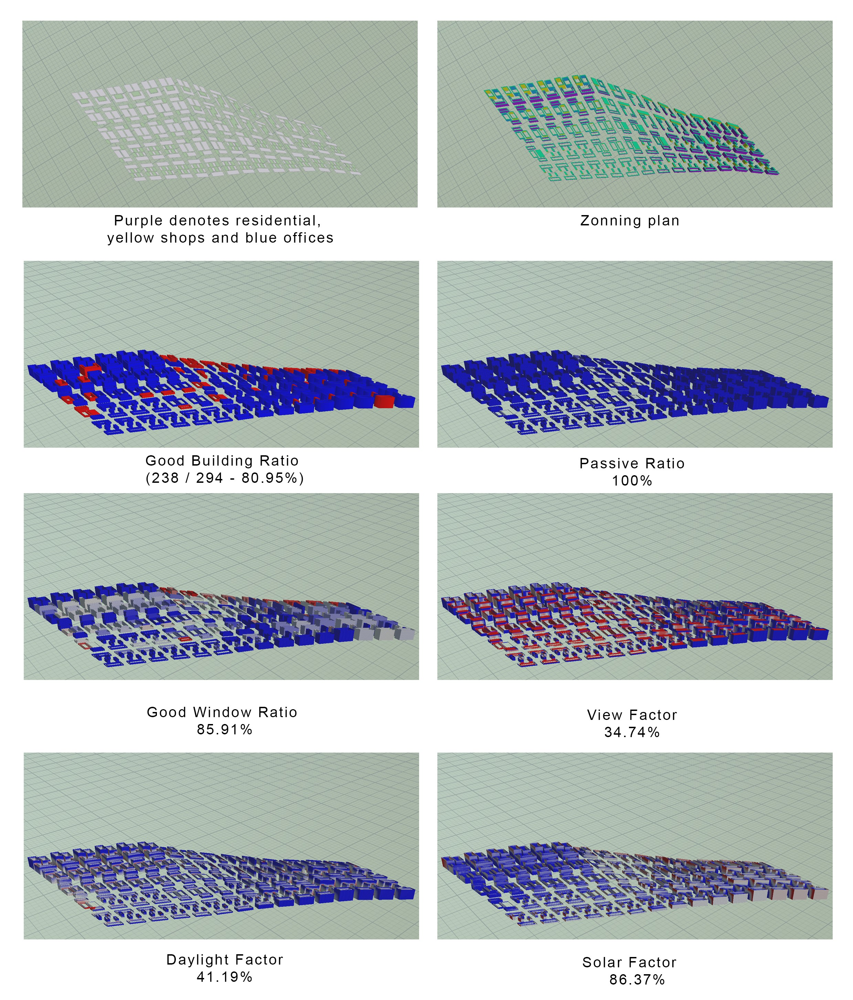

# Iteration 2

 *Iteration 2*

Iteration 2 introduces the idea of zoning into the manhattan grid, the clusters are divided into 2 parts. Mainly the concentration of live-work-play closer to UTown whilst having higher no. of office, shops and industrial closer to the One North Industrial Park. The density of the buildings are informed by the relative distance to the surrounding Dover and One North MRT. Therefore, the closer to the MRT the higher the density of the buildings. The plots are futher grouped into realtive distance to Dover or AYE.

The Network flow for the relative buidlings density is as such:

 *Iteration 2 network*

 *Iteration 2 stimulation*
  
In Iteration 2, while the results for the overall good building ratio was at a low of 65.11%, the view factor was at a low of 40.27% whist the daylight factor at 52.85%.  

Therefore in Iteration 2.1, there is an attempt to improve the stimulation by introducing courtyards to improve the good window ratio.

 *Iteration 2.1 stimulation*

In 2.1 stimulation, the overall figues for good window ratio and solar factor has improved but the view factor and daylight factor has gotten worse and this had resulted in the lower good building ratio of 60.85%

Therefor in Iteration 2.2 to improve on the view factor and daylight factor, the buildings are staggered to allow for a better view stimulation. The buildings are also divided into density based distribution across the site. 

 *Iteration 2.1 stimulation*

The results for the 2.1 stimulation proved to have an improved result for the view factor and daylight factor, bringing the total good building ratio of 238 out of 294, 80.95% of good buildings.

