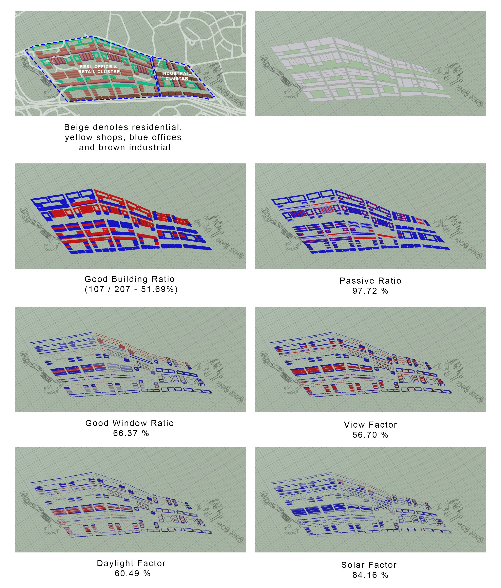
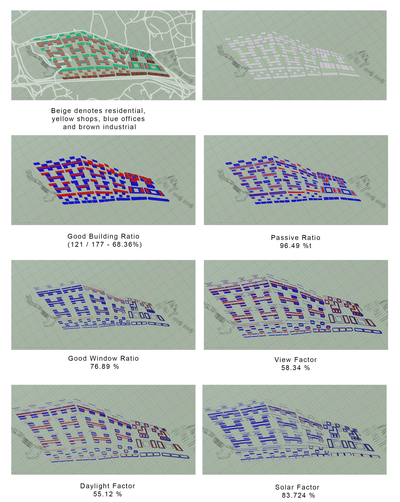
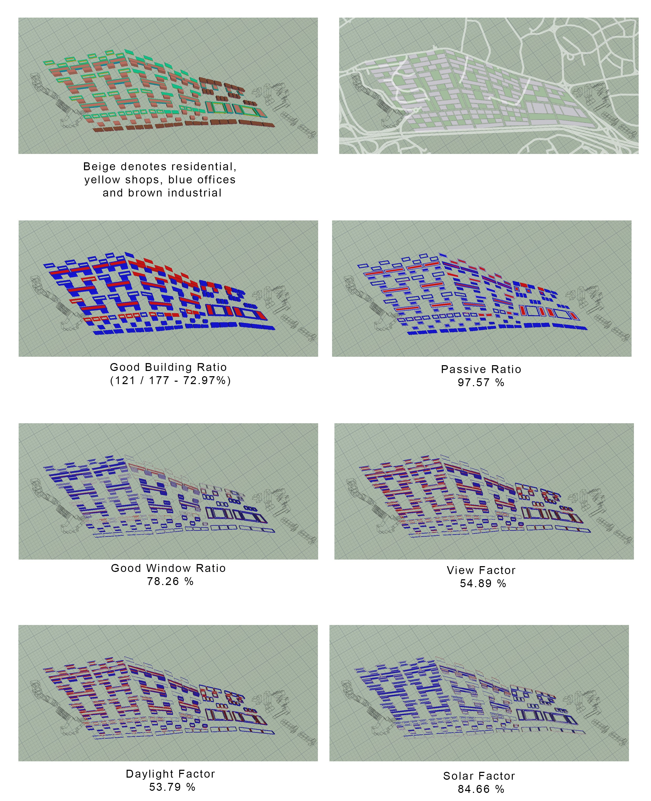

# Iteration 3

In Iteration 3, industrial is introduced as a noise buffer from the Aayer Rajah Expressway and the proposed site is split into two clusters, the cluster nearer to One North industrial park features larger buidling plots for industrial facilities while the cluster nearer to UTown features more residential blocks, parks and retail units. As much as possible the buidlings have their shorter side facing the east-west direction to reduce the overall solar radiation.

 *Iteration 3*
  
In iteration 3's stimulation, it was surprising to note that this iteration yielded the least good building, as it has the most spacing between the buildings it was expected to have better view factor and good window ratio. In the stimulation most of the retail shops are registered as bad buildings this is perhaps due to the thickness and relatively low height hence the retail shops are being obstructed by the surrounding taller buildings. 

 *Iteration 3.1*
 
 *Iteration 3.2*

In iteration 3.1 and 3.2 there was marked improvements to the overall good buildings and good windows. This is due to the changes made by reorganising the building layout as well as introducing a staggered formation to allow for more spacing between the buildings for better daylighting and views. Courtyards was introduced as well to improve the overall passive lighting.
